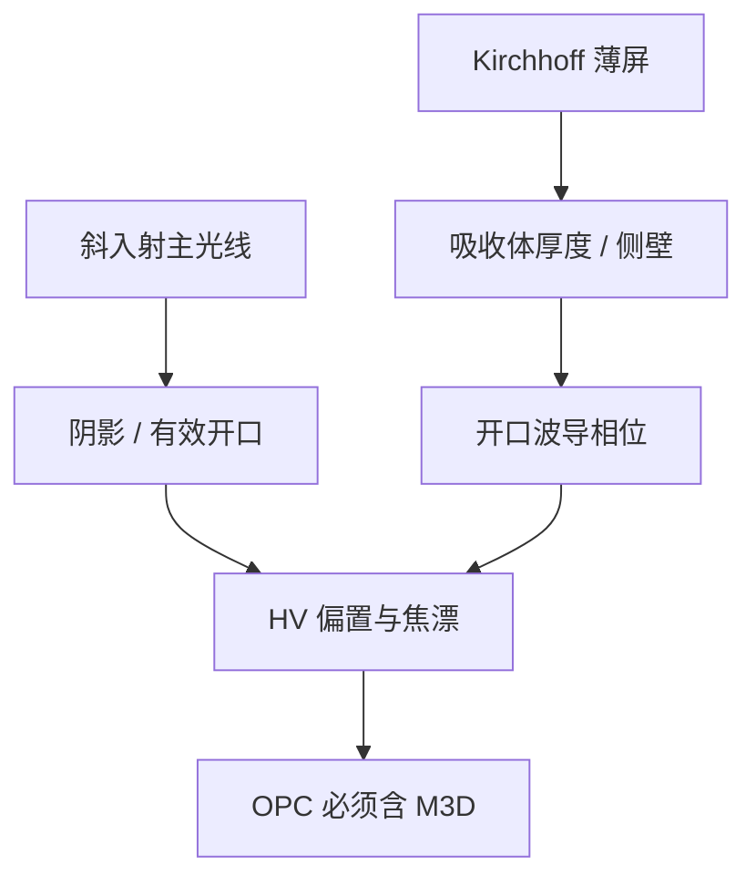

# 掩模 3D 效应

吸收体有厚度，开口是波导：斜入射带来阴影，左右边不等价，最佳焦距随图形漂移，Kirchhoff 薄屏不再是零误差。

<footer>—— 据 Mack、Levinson 对 thick-mask / EMF 效应的讨论；EUV 阴影亦见 ASML 与 Bakshi 的公开表述</footer>

[上一课](/litho/binary-attpsm)把二元与衰减掩模写成平面复透过率。缺口是：MoSi 或铬的厚度与波长同量级，光在开口里走的是电磁边值，不是乘一个 $t$。本课钉掩模三维（M3D）效应。把一层拆成两次曝光去换节距，留给[下一课](/litho/lele-multipattern)，不要在这里开始染色。

## 问题

薄屏假设下，正入射、无限薄、开口内外相位只由指定的 $t$ 决定。真实掩模：吸收体厚几十纳米，侧壁不垂直，DUV 投影侧主光线已有角度，EUV 更是反射式掠入射（掩模侧典型约 $6^\circ$）。光线被吸收体挡出一块阴影，有效开口随方位变；开口内的波导色散让 0/1 级的相位与 Kirchhoff 预测不同。

后果在晶圆上已经能看见：水平/垂直 CD 偏置（HV bias）、最佳焦距随节距和密度漂移、左右边不对称。OPC 若只用薄屏，会把这些系统误差修进错误的偏置里，换照明或换焦距就散。

### 阴影不是套刻

EUV 阴影让图形沿投影方向「看起来」平移并变窄，像套刻，根子在掩模物面。它随狭缝位置（主光线角）变，全场指纹与工件台 overlay 不同源。补偿在掩模吸收体摆放和 OPC 的 M3D 模型里，不在套刻标记的读数里消掉。

计算上用 RCWA、FDTD 或预计算的 M3D 库给每个衍射级一个厚掩模修正。全芯片仍靠紧凑模型，不是每处现场 FDTD。

## 方法

成像链在物体频谱处把 Kirchhoff 级振幅换成电磁计算的级振幅（含偏振）。矢量成像课已经要求 Jones；本课把琼斯矩阵的来源从「薄屏」换成「厚吸收体」。校准：用不同方位的线和孔测 HV 偏置与通过焦点的 CD，把差归因到 M3D，而不是只拧剂量。

减厚度、换吸收体材料（EUV 上谈低 $n$、低 $k$ 吸收体）是硬件方向，能减弱阴影，但检测、蚀刻选择比和缺陷是另一笔账。本课不选材料，只要求模型与膜系一致。

### 与 RET 的叠加

离轴照明加大掩模侧入射角，M3D 更明显。衰减相移的膜本身就是厚的相位元件，3D 与「6% + 180°」的标称值会同时偏离。因此 att-PSM 的标称透过率是膜系设计目标，有效成像透过率要靠电磁。

## 机制

斜入射时，吸收体迎光侧挡光、背光侧少挡，等效孔径平移。反射式 EUV 还走双程几何，阴影更重。波导：开口宽度接近波长时，传播常数随宽度变，相位不是 $\Delta n\cdot t$ 的简单光程。这会改干涉条件，于是最佳焦距变成图形相关——叠在镜头离焦和胶厚驻波之上，E–D 窗口的焦轴再被切一刀。

偏振：线栅开口对 s/p 透过率不同，掩模本身就是弱偏振器。高 NA 矢量效应有一部分在掩模上就已经发生，不只在晶圆侧大夹角。

全芯片不能处处 FDTD，OPC / ILT 用域分解、边查找表或代理模型去逼近 3D 衍射级。校正环里必须调用这套代理，否则边缘放置误差在离轴方向系统性偏。减薄吸收体减阴影、付光学密度，在 EUV 上还改缺陷可检测性，是多层缺陷课的接口。

MEF 在 3D 模型里会变：小 SRAF 的实际透过不再等于面积比。ILT 曲边在 3D 下尤其不能用 Kirchhoff 签字。

## 边界

本课不展开 LELE 套刻如何把两次阴影指纹叠在一起——下一课只在需要时引用「每次曝光自己的 M3D」。也不把掩模台倾斜的机械误差叫成 M3D。Pellicle 皱纹是另一层相位物。后课默认：低 $k_1$ 的 OPC/SMO 以含 M3D 为默认，薄屏只作教学零阶。

High-NA EUV 掩模侧角度更大，阴影按方位更重，半场并不自动取消 M3D。那是 EXE 课的附件，本课只把机制钉在「厚度 + 斜入射」。DUV 浸没的主光线角小于 EUV，但 MoSi 厚度仍够把 HV 偏置做进 OPC 表。

最佳焦距随图形漂移时，E–D 重叠窗口在焦轴上被 M3D 再切一刀。看起来像 $k_2$ 变差，根子在物体侧相位，不是镜头离焦公式改了。

## 小结

- 吸收体有厚度，薄屏 $t(x,y)$ 是零阶，不是量产误差为零。
- 斜入射阴影造成 HV 偏置与类似平移的指纹。
- 开口波导改相位，最佳焦距随图形漂。
- OPC 必须用厚掩模衍射级，不能只拧剂量。
- 下一课用多次曝光换节距，每次仍带自己的 M3D。
- 出处：Mack / Levinson 对 EMF / thick-mask；Bakshi 与 ASML 对 EUV 掩模阴影的公开讨论。
