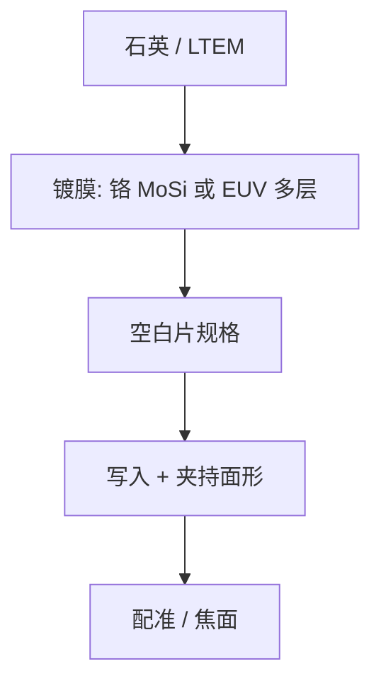

# 掩模坯与 LTEM 基板

写在膨胀的玻璃上，格子会在剂量里漂；低热胀基板把写入热与扫描热从配准预算里抠掉一截。

<footer>—— 对照 LTEM（低热膨胀材料）掩模基板与 SEMI 外形/坯料通称；EUV 坯见 SEMI P37 一类规范</footer>

[上一课](/litho/mask-registration)把放置误差收进套刻。缺口是误差有一截来自基板：石英热胀、平坦度、缺陷。本课钉掩模坯与 LTEM。铬与 MoSi 膜长在什么表面上，留给[下一课](/litho/chrome-mosi-films）。

## 问题

[6 寸外形](/litho/six-inch-reticle) 规定边长与厚度家族；本课补材料。DUV 透射版用合成石英；对热与配准更严的层用 Ti 掺杂石英一类 LTEM（low thermal expansion material），把热膨胀系数压到普通石英之下。EUV 反射坯是低胀玻璃 + Mo/Si 多层 + 覆盖层 + 吸收体，空白片缺陷规格按 SEMI P37 一类文件走——本课不抄条款毫米数，只钉：坯是光学元件，不是「一块玻璃」。

缺口是**基板合同**，不是再讲写栅。把 CDU 超差全写成 PEC，会漏掉坯的厚度均匀与应力在夹持后面形变。

### 空白片缺陷是掩模良率的起点

多层膜或铬下的坑、颗粒、相缺陷，写完图形也修不回完整布拉格反射。EUV 光化空白检验存在，正是因为非光化检测会漏掉打印缺陷。后课检验针对图形；本课先承认：坏坯不该进入写入队列。

LTEM 改善的是热致配准，不是折射率均匀到可以当透镜用。扫描机物镜是另一套玻璃。

## 方法

来料：平坦度、面形、热胀、缺陷图、膜厚（若已镀）。夹持状态要与扫描机和配准仪尽量一致，否则计量与使用是两张面形。EUV 背面导电层与静电吸盘是夹持的一部分，颗粒在背面会局部顶起——见 EUV 掩模台课，本课只把它标成坯的使用约束。

与写入热：电流越大、时间越短，热梯度越陡，LTEM 的价值越大；普通石英可能把配准墙提前。

## 机制

热膨胀把格子作径向或非均匀放大。扫描机可以补偿均匀放大，补偿不了写束扫描路径造成的瞬时非均匀温度场。LTEM 减小系数，等于减小这份瞬态。平坦度误差在投影里变成焦面与畸变项，与镜头像差不同源，却进同一张套刻/焦点图。

## 边界

不点名某品牌玻璃的 ppm/K 当作唯一真值。不把 EUV 多层周期误差写成 LTEM 的锅——那是镀膜。坯成本与交期会进最后的 [掩模成本](/litho/mask-cost-cycle)，本课不报价。

后课默认：基板是低胀、已规格化的坯；下一课在它上面长吸收体或相移膜。

## 小结

- LTEM 压热胀，服务写入与扫描时的配准；外形仍是 6 寸家族。
- EUV 坯是多层光学元件，空白缺陷必须光化视角检验。
- 夹持状态是计量的一部分。
- 出处：LTEM 掩模基板通称；SEMI 外形与 EUV 坯（P37 一类）规范结构。
