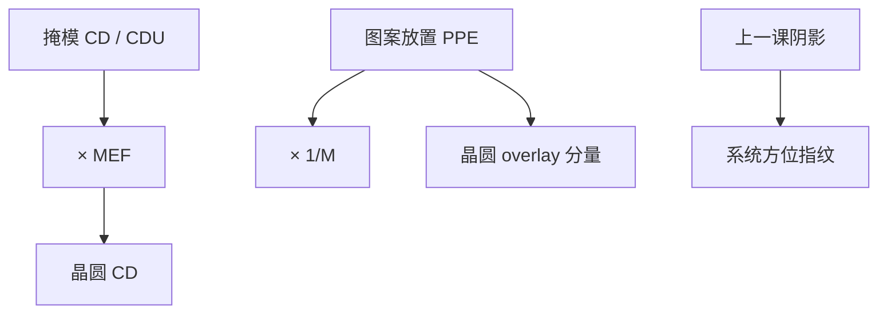

# 掩模 CD 与放置误差

晶圆 CD 与套刻预算里，有一截来自版上的线宽与图案放置，再经 MEF 放大；阴影是系统几何，这一课是掩模厂的随机与场内误差。

<footer>—— 据 SEMI 掩模规格与 mask shop 对 CDU、registration / PPE 的通称，以及 Mack 对掩模误差增强因子的表述</footer>

[上一课](/litho/mask-shadowing)把厚吸收体斜入射的阴影钉成系统指纹。缺口是版本身的制造误差：特征 CD、图案放置（PPE、registration）怎样写进晶圆。不要把阴影位移再叫一次套刻。多重图形从 [LELE](/litho/lele-multipattern) 另起课序，本课不染色。

## 问题

阴影给出可预测的方位偏置，OPC 可以按模型补。掩模厂写出的多边形还有：全局与局部 CD 偏差、线宽均匀性（mask CDU）、图案相对设计网格的放置误差。低 $k_1$ 下掩模误差增强因子（MEF / MEEF）常大于 1，版上 1 nm 可以变成晶圆上更大的一截。放置误差在晶圆上以 $1/M$ 缩小（DUV 透射典型 $4\times$），但仍进入 overlay 与同层相邻间距。

缺口因此是「掩模误差进晶圆」的预算语言，而不是再解麦克斯韦。没有这层，后课 LELE 会把两次版的 PPE 和扫描机 overlay 混成一个 $\delta$。

### Mask shop 通称

厂与客户合同里常见：CD 均值、CDU（范围或 $3\sigma$）、linearity、邻近相关 CD、registration / image placement、以及 PPE 作为局部放置。SEMI 掩模相关规范给出测量与数据交换的通称框架，具体纳米规格按层、按节点在采购文件里，不是教科书常数。本课不编某一 SEMI 条款的数字。

MEF 随节距、光瞳、胶和密度变。孤立 SRAF 的有效 MEF 可以很大：杆从「不印」翻成「印出」。不要用一个 MEF=2 打天下。

## 方法

预算拆开：CD 类误差 × MEF → 晶圆 CDU；放置类 × 缩小倍率 → 晶圆 overlay 的掩模分量。两台扫描机匹配时，还要加两张版之间的相对 registration。计量：掩模 CD-SEM / 光学检测给出版图；晶圆 CD-SEM 与套刻标记给出放大后的结果。拆源时用同一标记设计，避免把阴影不对称读成 PPE。

写入工具（VSB 或多束）的场拼接、充电、雾化是 PPE 的物理来源之一，本课只要求承认「版上有放置」，不讲电子束机。换版、换写场校准，PPE 指纹会变；晶圆侧会看成「这批 overlay 突然差」，根子可能在 mask shop 而不是扫描机。

### OPC 不能吸收随机 CDU

OPC 补的是模型可重复的邻近与 M3D。掩模随机 CDU 和局部 PPE 没有逐芯片的预畸变（除非做芯片专属修正，成本另论）。因此掩模规格必须进工艺窗：PV-band 要留出 mask CDU×MEF。把窗口算满名义版，上线后版一换就掉良率——本课不把这句话量化成百分比。

## 机制

光学上，开口宽度误差改变衍射级振幅比，空中像阈值处的边移动按 MEF 放大。放置误差让整段频谱带一个线性相位，像面图形平移；对套刻标记和器件图形若测量口径不同，表观 overlay 还会含标记结构因子。LELE 的相邻线若来自两张版，两张 PPE 之差直接变成局部节距，与扫描机 $\delta$ 同类、不同源。

$4\times$ 缩小让版上放置看起来「没那么毒」，但 MEF 对 CD 是放大；所以先进层往往是 CD 规格比放置更难买。EUV 反射掩模 $M$ 仍是 $4\times$（High-NA 另论），吸收体阴影与 PPE 要在同一张误差表里分列。

上一课的阴影位移若被 OPC 按模型补掉，剩下的才是 PPE 与随机 CDU。混在一个「掩模误差」桶里，APC 会拧错旋钮：补几何阴影要用方位偏置，补 PPE 要用写场校准。

不要用晶圆 overlay 的公开设备规格去反推掩模 registration 已经「免费」。设备规格通常不含掩模分量，或只在匹配语境里另述。

## 边界

本课不给 7 nm 掩模价格或良率。不发明 SEMI 条款号对应的纳米表。缺陷（针孔、相位坑）是另一张缺陷预算，不要和 CDU 混成一个 $3\sigma$。后课默认：凡写晶圆 CDU / overlay，先问掩模 CD×MEF 与 PPE×$1/M$ 是否已单列。

曲线 ILT 掩模的 CD 与放置计量口径与曼哈顿不同，合同语言仍是 CDU / placement，但量测算法必须声明。

## 小结

- 阴影是系统几何；本课是掩模厂 CD 与 PPE。
- 晶圆 CD 吃 MEF 放大；放置吃缩小倍率进入 overlay。
- SEMI / mask shop 通称规格按层采购，不编宇宙纳米数。
- OPC 吃得掉模型偏差，吃不掉随机 mask CDU。
- 出处：SEMI 掩模规格通称；mask shop CDU / registration 语言；Mack 对 MEF。
