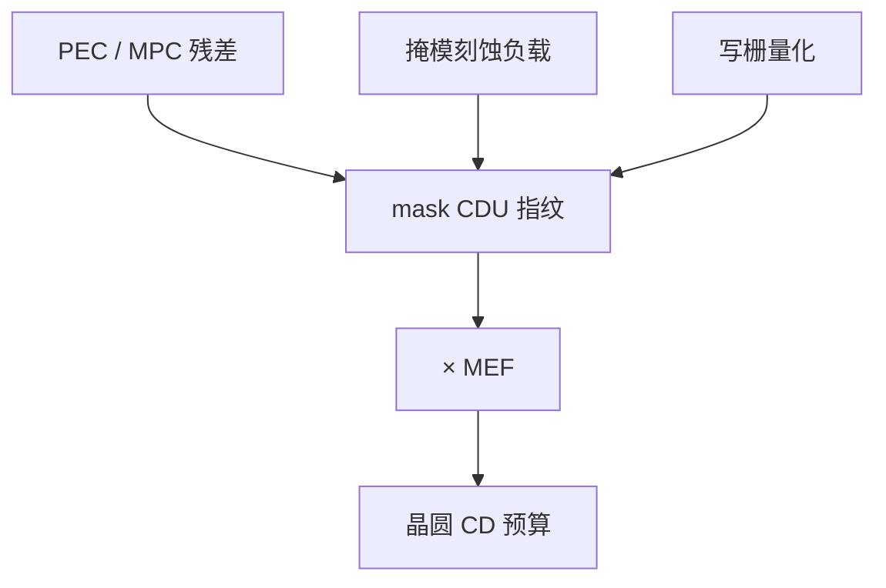

# 掩模 CD 均匀性

Mask CDU 是版上同一目标宽度的空间离散；晶圆看到的是它乘 MEF，不是掩模 SEM 那张图自己。

<footer>—— 对照 ITRS/IRDS 掩模误差预算与 MEF 放大的通称</footer>

[上一课](/litho/write-grid-shot-count)把边钉在写栅上。缺口是全场、全版的 CD 并不因此变平：PEC 残差、刻蚀负载、胶厚、雾化底板都会留下指纹。本课钉 mask CDU。图形放在哪（配准），留给[下一课](/litho/mask-registration）。

## 问题

[掩模 CD 与放置](/litho/mask-cd-ppe) 已把误差写成进晶圆的语言。本课补制造侧：CDU 要拆全局均值（可被剂量整体补偿）与空间变化（场内、版内、径向、疏密）。IRDS 一类路线图把 mask CDU 列进套刻/CD 总预算；先进节点 MEF 常大于 1，版上 1 nm 可以变成晶圆上更大的一截。

缺口是**空间指纹**，不是再定义 MEF。把整张版平均 CD 调到规格，不等于 CDU 合格——角上与中心仍可差出窗口。

### 疏密项与径向项要分

疏密相关 CD 指向 PEC/MPC；径向或写场拼接指向电子光学、充电与台。混在一个 σ 里，改核或改刻蚀都会打错药。测量必须带位置与局部密度标签。

报 mask CDU 时写清：二元铬还是 EUV 吸收体、ADI 还是 AEI、测量的是线还是孔。孔的 CDU 与随机打印是另一账。

## 方法

计量：掩模 CD-SEM 或光学掩模计量，按统计抽样覆盖阵列、SRAM、逻辑密度跳变。规格常分 intra-field、intra-mask。反馈：全局偏置改剂量基准；指纹进 PEC/MPC 或写模机校正图。不能靠晶圆 OPC「吃掉」一张每片都不同的掩模指纹——OPC 假定掩模可重复。

与写入时间权衡：加密采样、加遍数、降电流，CDU 往往变好，日历变差。量产点是预算交，不是实验室最好 CDU。

## 机制

MEF（mask error enhancement factor）把掩模边误差线性（一阶）映到晶圆。低 $k_1$、助条密集区 MEF 更大，所以 CDU 规格按层类型分，不能全厂一张表。雾化底板造成缓慢 CD 斜坡，像版上 flare；扫描机光学 flare 是另一项，分析要拆。

## 边界

CDU 不含空白片缺陷、不含 pellicle 热指纹（后者在上机后出现）。不编造某节点「mask CDU = 0.x nm」的宇宙常数——规格随层与代工厂包变，只引用路线图**结构**（有这项预算），不抄未公开的厂内数。

后课默认：尺寸均匀性已从写入/刻蚀收账；下一课处理位置——图形中心放错，套刻预算先被版吃掉一截。

## 小结

- Mask CDU 是空间变化，不是平均 CD；进晶圆时乘 MEF。
- 疏密项与径向/拼接项分源，才能决定改 PEC 还是改台。
- OPC 吃不掉每张版不同的指纹。
- 出处：ITRS/IRDS 掩模误差预算结构；MEF 与 mask CDU 的产线通称。
