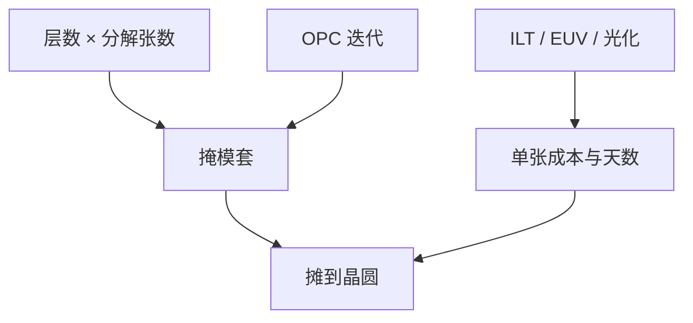

# 掩模成本与周期

先进层的钱与日子花在写、检验、光化鉴定和返工上；多重图形把张数乘上去，EUV 把单张难度乘上去。

<footer>—— 对照掩模成本结构与 TAPOUT 周期的公开产业讨论；不编造某层美元报价</footer>

[上一课](/litho/mask-haze)把寿命与再清洗钉进物流。缺口是把本门课收成账：一张版多少钱、多少天，以及高 NA 晶圆经济如何被「等版」卡住。本课钉掩模成本与周期。仿真课从[下一课](/litho/fdtd-mask)另起，用严格电磁去解释为何有些版必须那么难写。

## 问题

[高 NA 产能经济](/litho/high-na-throughput-economics) 算的是扫描机小时。掩模是另一条关键路径：空白片交期、MDP、写入、检验、修复、AIMS、 pellicle、运输、改版迭代。关键层单张周期以周计并不罕见；多重图形一层多张，改设计规则等于改一组版。EUV 减少张数，但单张写入与光化检验更贵。

缺口是**张数 × 单张难度 × 迭代次数**，不是给某厂报价单。把「EUV 省掩模」写成免费，会漏掉单张成本与光化工具产能。

### 不要引用无来源的美元

公开叙事可以谈结构（写模机折旧、空白片、人工、光化 AIMS 稀缺、ILT 数据），不可以把传闻「一张 EUV 版 xx 万美元」写成事实。本课只钉成本驱动项。

改一次 OPC 若强制重写全套分解版，周期按最慢那张走。DTCO 冻结规则的价值，有一截是少改版。

## 方法

成本分解：坯 + 膜、写入机时（家族公式见 [写入时间](/litho/mask-write-time)）、检验与 AIMS 机时、修复、 pellicle、合格率（报废摊到好版上）、物流。周期分解：排队 + 工艺 + 等待 AIMS/光化空白检验。产能规划按瓶颈机台（多束、光化检验）而不是按平均层。

与晶圆成本衔接：掩模摊销 = 总成本 / 用这套版所跑的晶圆数。工程样品少片时掩模主导；量大时扫描机与胶主导。节点初期经常落在前者。

## 机制

ILT 与曲线把 MDP 与写入从「可预测的曼哈顿小时」推进「数据墙 + 多束机时」。检验对曲边更慢。合格率随缺陷规格变严而降，摊销上升。雾化再洗占用同一套清洗/检验，等于动态加成本。这些项进 TAPOUT 日历，从而进产品上市，而不只进 COGS 表格。

## 边界

不编造节点良率或掩模价目表。成本课不替代扫描机折旧课——那是后门路线图课。本课结束掩模制造主干。

后课默认：读者知道版的数据链、物理链与经济链；下一门课用 FDTD 等严格方法解释掩模开口里的电磁，为什么 3D 与 MPC 必须存在。

## 小结

- 掩模账是张数、单张难度、迭代与合格率，不是一句「EUV 更贵」。
- 周期常被写入与光化鉴定排队主导；改版按最慢张。
- 少片时摊销主导晶圆成本，量大时扫描机主导。
- 出处：掩模成本结构与 TAPOUT 周期的公开产业讨论；本课不引用无来源报价。
