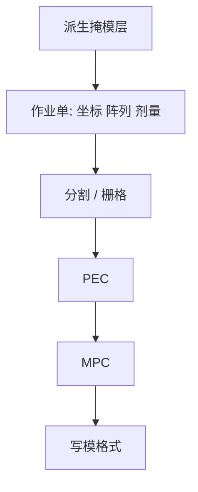

# 掩模数据准备 MDP

MDP 不是「把 GDS 拷到写模机」：它是作业单、分割、剂量图和机台坐标的合同，错一格就写错一场。

<footer>—— 对照 SPIE Photomask / BACUS 对 mask data preparation 的产线叙述</footer>

[上一课](/litho/layout-layers-flow)把设计层收成一张张派生明暗图。缺口是这张图还不能曝光：写模机要的是带剂量、带场拼接、带对准的作业。本课钉 MDP（mask data preparation）。矩形怎么切，留给[下一课](/litho/fracturing）。

## 问题

掩模厂同时接许多客户、许多机台家族（VSB 与 [多束](/litho/multibeam-mask-writer)）、许多膜系。MDP 的问题是把「客户多边形 + 技术文件」变成「这一台写模机今晚能跑的作业」：坐标系（版中心、扫描机对准键）、放大率（常见 $4\times$）、镜面翻转、芯片阵列、剂量基准、PEC 与 MPC 的版本号。缺任何一项，写出的版在扫描机上会对不准或 CD 整张偏。

缺口是**作业语义**，不是再列一层布尔。把 MDP 理解成压缩文件，会漏掉：同一 OASIS 在不同 jobdeck 下可以写出镜像或错位的场。

### 客户 OPC 与版厂 MDP 的分界

OPC/ILT 在晶圆坐标系里修边，目标是硅上轮廓。MDP 在掩模坐标系里准备可写数据，目标是版上吸收体。两者通过放大率与色调衔接。合同必须写清：谁做 MPC、谁做 PEC、残差算谁的 mask CDU。把版厂 MDP 叫做「第二次 OPC」，会与晶圆模型抢名。

作业单（jobdeck）是 MDP 的一部分。只交「一层 OASIS」而不交阵列、剂量与机台号，等于让版厂猜曝光场怎么铺。

## 方法

通称链条：输入检查（网格、自交、层完整性）→ 坐标变换与阵列 → 按机台做 fracturing / 栅格化 → PEC 剂量 → MPC 几何或剂量微调 → 输出写模格式与检验参考。每一步留校验和，以便 [die-to-database](/litho/mask-inspection-d2d-d2db) 知道比对的是哪一跳。

与高 NA 经济课的衔接：曲线层与碎助条让 MDP 墙钟和磁盘成为 TAPOUT 关键路径，不是只在写束上付钱。GPU 加速的是 OPC；MDP 的带宽与规则检查是另一条产能。

## 机制

放大率把晶圆纳米变成版上四倍几何（anamorphic 高 NA 则 x/y 不同，见 [变形放大](/litho/anamorphic-mask-mag)）。MDP 必须按扫描机列的放大写入，不能一律 $4\times$。翻转来自光路折转：透射 DUV 与反射 EUV 的「客户看到的芯片方向」对版厂是不同的镜像约定。

剂量基准把「设计里的 1/0」变成写模机的驻留时间。PEC 在此之上再按密度调制。没有 MDP 把基准锁死，后课的写入时间公式没有分母。

## 边界

MDP 不修复空白片缺陷，不替代 AIMS。它只保证数据与机台合同一致。专有写模格式若不能回放成几何，客户无法独立核对——这是 TAPOUT 风险，不是格式先进。

后课默认：作业语义已定；下一跳是如何把多边形切成 VSB 炮或等价片段。

## 小结

- MDP 把派生层变成带坐标、剂量与机台版本的可写作业。
- OPC 修晶圆边；MDP 准备版上数据。二者通过放大率与色调衔接。
- anamorphic 场不能一律按 $4\times$ 变换。
- 出处：SPIE Photomask 对 MDP 与 jobdeck 的产线论述；SEMI 掩模数据惯例。
