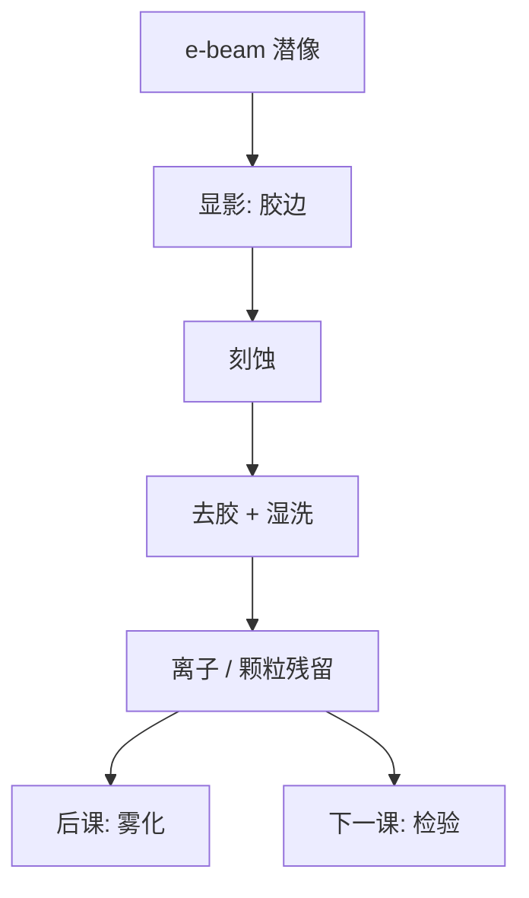

# 掩模显影与清洗

写束只把潜像放进胶；显影决定胶边，清洗决定哪些离子留下。雾化的种子往往在这一步，而不在扫描机。

<footer>—— 对照电子束胶显影、掩模湿洗与硫酸根残留的产线讨论</footer>

[上一课](/litho/mask-etch-sidewall)把吸收体边钉成带倾角的墙。缺口是墙前后的湿法：e-beam 胶显影、去胶、SPM/SC1 一类清洗。本课钉显影与清洗。图形缺陷怎么被看见，留给[下一课](/litho/mask-inspection-d2d-d2db）。

## 问题

掩模胶（化学放大或非化学放大 e-beam 胶）的显影对照晶圆轨道，但基板是 6 寸方、膜是铬或吸收体，设备与化学不同。显影残胶会变成刻蚀后的亮/暗缺陷；过显影吃 CD。清洗要去颗粒与金属离子，却不能毁 pellicle 区、不能把硫酸根/铵根留到曝光后结晶——那是后课 [掩模雾化](/litho/mask-haze) 的种子。

缺口是**湿法残差**，不是再讲 RIE 角。把缺陷全写成写入器脏，会漏掉显影槽与清洗台。

### 清洗越狠，雾化风险不一定越低

历史 SPM（硫酸双氧水）去有机很强，硫酸根残留加氨环境可在曝光下长铵盐晶体。改化学、加强漂洗、控制存储气氛，是雾化课的工艺源头，本课先钉：清洗规格含离子残留，不只含颗粒计数。

EUV 无传统有机 pellicle 时，清洗与搬运颗粒直接打到多层；有 pellicle 时，安装前的最后一次清洗仍决定膜下洁净。

## 方法

流程：后烘（若需要）→ 显影 → 硬烘 → 刻蚀 → 去胶 → 多步清洗 → 检验。CD 采样在显影后与刻蚀后都做，才能把胶偏置与刻蚀偏置拆开给 MPC。干燥方式（旋干、IPA）影响塌陷与水印，对照晶圆 [pattern collapse](/litho/pattern-collapse)，但掩模胶厚与附着力不同，不能直接抄晶圆表面活性剂表。

## 机制

化学放大胶的酸在 PEB 后决定溶解速率；e-beam 短程散射已经糊了潜像，显影阈值切在糊过的能量上——所以 PEC 与显影是一对。清洗的静电与 pH 决定颗粒再吸附；金属离子在石英与 MoSi 表面的吸附等温线决定雾化前体浓度。曝光（尤其 DUV 高剂量）提供能量让残留物种迁移、成核。

## 边界

不写具体药液浓度。不把晶圆 TMAH 显影课重讲一遍。清洗不修复空白多层缺陷。

后课默认：版在湿法后带着某一洁净与离子状态；下一课用光学比较来抓图形缺陷。

## 小结

- 显影定胶边，清洗定颗粒与离子；二者都进缺陷与 CD。
- 离子残留是雾化前体，颗粒计数不是清洗的唯一 KPI。
- ADI/AEI 成对测量才能拆 MPC。
- 出处：掩模 e-beam 胶显影与湿洗产线讨论；雾化与硫酸根残留的公开文献传统。
