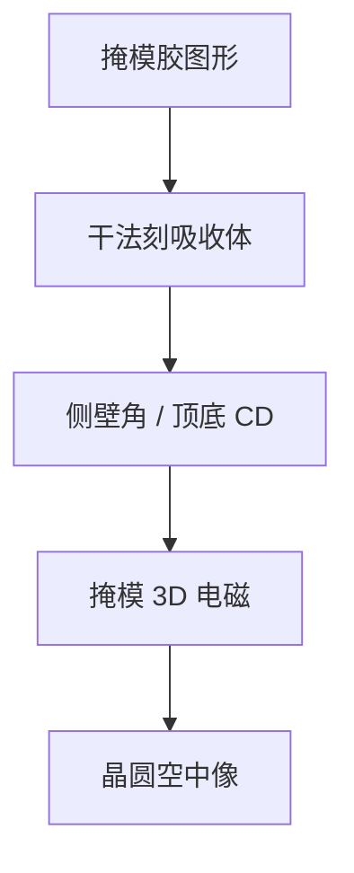

# 掩模刻蚀与侧壁

吸收体边不是数据里的直墙：干法侧壁角改变有效光学边缘，掩模 3D 从这里进入晶圆模型。

<footer>—— 对照掩模干法刻蚀、侧壁角与 mask 3D 的公开讨论</footer>

[上一课](/litho/chrome-mosi-films)选定铬或 MoSi（及对照 EUV 吸收体）。缺口是图形如何从胶转到膜：横向偏置、微沟槽、侧壁角。本课钉掩模刻蚀与侧壁。胶的显影与版清洗，留给[下一课](/litho/mask-develop-clean）。

## 问题

[MPC](/litho/mpc) 用紧凑核去追 AEI CD。本课补核下面的剖面：铬/MoSi/Ta 化合物的反应离子刻蚀是各向异性加聚合物，侧壁常有几度倾角，顶 CD 与底 CD 不同。电磁仿真若当直墙，AIMS 与晶圆会对不齐——尤其 EUV 厚吸收体与斜入射。

缺口是**三维边**，不是再拟合一次二维偏置。把侧壁写成「美观」，会漏掉它是成像变量。

### 微负载与微沟槽

密区与孤立区侧壁角可以不同；铬/石英界面可能出现微沟槽，改变边缘相位。二维 MPC 修顶 CD 时，这些剖面残差留给严格电磁或经验 3D 模型。全芯片 OPC 仍用紧凑近似，但校准要用能看见剖面的计量（截面、AFM、散射）。

过刻石英会做出台阶相移，有时是故意（交替相移），有时是缺陷。本课不把 altPSM 工艺从头讲一遍，只标：侧壁与过刻改变相位边。

## 方法

工艺：胶做掩、干法刻膜、去胶、量顶/底 CD 与角。EUV 吸收体更厚，深宽比更高，侧壁与脚（footing）对阴影更敏感。MPC 与写剂量不能单独补偿角：角主要由刻蚀化学与过刻时间定。换腔等于换 3D 模型版本。

与晶圆 [掩模 3D](/litho/mask-3d-effect) 衔接：输入剖面来自本课，不是来自设计多边形。

## 机制

离子辅助刻蚀在法向快、侧向被聚合物抑制，于是墙有倾角。开口窄时中性基与离子通配变，ARDE 同类效应在掩模纳米尺度出现，密助条根部可能刻不尽或过刻。反射 EUV 里，倾角改变的是吸收体阴影宽度随方位的函数，SMO 光瞳因此与剖面耦合。

## 边界

不写某气体配方。不把晶圆 Fin 刻蚀与掩模铬刻蚀写成同一腔。侧壁改善不替代空白片缺陷控制。

后课默认：吸收体边是带角的三维物体；下一课胶显影与清洗如何在刻蚀前后引入残胶、离子与雾化隐患。

## 小结

- 掩模干法给出倾角边；顶 CD ≠ 光学有效边。
- 剖面进入 mask 3D；二维 MPC 只追一层 CD。
- EUV 厚吸收体让侧壁与阴影强耦合。
- 出处：掩模 RIE 与 mask 3D 剖面的公开讨论；Mack/Levinson 掩模三维效应论述。
