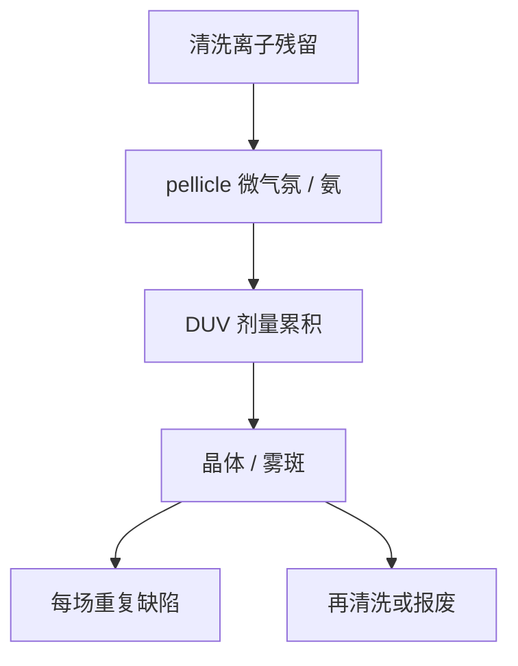

# 掩模雾化

铵盐晶体在曝光下慢慢长：昨天 AIMS 合格的版，可以在剂量累积后变成渐进缺陷。

<footer>—— 对照 photomask haze / progressive defects 与硫酸根–铵根化学的公开文献传统</footer>

[上一课](/litho/aims-mask-qualification)用打印视角放行了版。缺口是时间：DUV 高剂量曝光、残留离子、 pellicle 微环境会在膜上或石英上长雾（haze）。本课钉掩模雾化。雾化管理要进周期与钱，留给[下一课](/litho/mask-cost-cycle）。

## 问题

渐进缺陷不是写入器当场写错，而是存储与曝光中成核生长：历史上典型的是硫酸根残留遇氨形成硫酸铵晶体，在 193 nm 下加速。雾斑吸收或散射，CD 缓慢漂移，检验昨天还干净。EUV 环境是真空与氢，化学不同，但仍有碳污染、锡、氢致损伤等「时间相关」掩模变化——不要把 DUV haze 化学直接抄到 EUV，只保留「渐进」这一类问题。

缺口是**寿命化学**，不是再做一次出货 AIMS。把 CD 漂移全写成扫描机剂量，会漏掉版在变。

### Pellicle 是反应器也是屏障

膜减少颗粒打印，却圈出一小体积气体。残留、胶挥发、框胶出气在此浓缩。无膜则与腔体气氛交换，污染物种不同。清洗课留下的离子，在这里变成可观测雾。

雾化对策是化学与物流：漂洗、存储氮气、控制氨、定期再洗或限制曝光剂量，而不是加一层 OPC。

## 方法

监测：周期回厂检验、晶圆上「突然」的重复缺陷图（每场相同位置）。确认是雾则清洗或报废，不能靠修复针去刮晶体了事——根在表面化学。预防：改清洗、换 pellicle 材料与胶、控制 fab 氨背景。剂量记账：高曝光层的版寿命按脉冲数管理。

与产能：关键层版若频繁下线再洗，等于掩模厂产能被 fab 曝光计划占用——成本课要算这次循环。

## 机制

成核需要过饱和离子与能量。193 nm 光子提供光化学路径，晶体一旦超过打印阈值就进重复缺陷。空间上常从高剂量区或残留斑开始，不像随机颗粒那样每片不同位置。这与随机颗粒的 yield 模型要分开：雾化是系统性、时间相关的。

## 边界

不把某一化学计量式写成唯一雾种——还有有机雾、其他盐。不编造「多少 mJ 必雾」的阈值。EUV 碳污染走真空课，本课只作对照。

后课默认：掩模在 fab 里有时间相关失效模式；下一课把写入、检验、修复、清洗、寿命收成成本与周期。

## 小结

- 雾化是渐进缺陷，出货 AIMS 不能保证寿命内干净。
- DUV 经典路径与硫酸根/铵及曝光有关；pellicle 微环境会浓缩前体。
- 对策是清洗、气氛与剂量寿命，不是 OPC。
- 出处：photomask haze 文献传统；193 nm 渐进缺陷的公开讨论。
