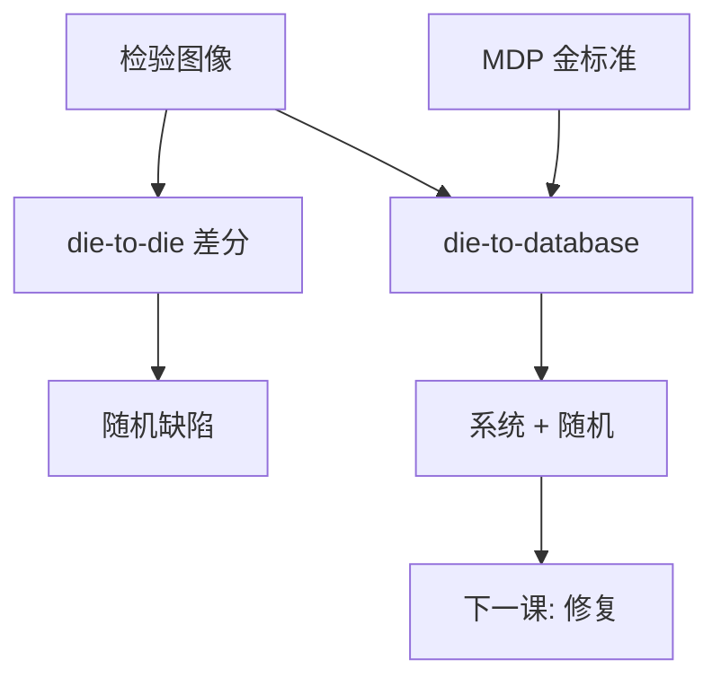

# die-to-die 与 die-to-database

Die-to-die 只能看见两颗之间的差；金标准在数据库时，才能抓住整版都错的系统图形。

<footer>—— 对照掩模光学检验 D2D / D2DB 的产线通称</footer>

[上一课](/litho/mask-develop-clean)交出清洗后的版。缺口是缺陷要被检出：亮场/暗场光学、与谁比。本课钉 die-to-die（D2D）与 die-to-database（D2DB）。检出之后怎么修，留给[下一课](/litho/mask-repair-ebeam）。

## 问题

重复芯片阵列可以用相邻 die 相减（D2D）：随机颗粒、针孔、多余铬会在差分里冒出来。整版系统性的 fracturing 错、层映射错、剂量整场偏，D2D 看不见——两颗一样错。D2DB 把图像与 MDP 金标准比对，能抓系统误差，但对准、渲染与曲线边更吃计算，误报也更多。

缺口是**比较算子**，不是再买一台显微镜。把「检验通过」写成「与设计一致」，在只跑 D2D 时不成立。

### EUV 与光化

DUV 透射检验波长往往不是 193 nm；打印行为靠模型或后课 AIMS。EUV 多层缺陷更需要光化视角（空白片已有光化检验传统）。本课钉逻辑：非光化 D2DB 会漏相位/多层缺陷，也会把不打印的噪声当缺陷。

曲线掩模的金标准必须是曲边算法。用曼哈顿渲染去比 ILT 边，合法曲率会变成「缺陷风暴」。

## 方法

产线常 D2D+D2DB 分层：大面积重复走 D2D 保产能，关键与非重复（标记、唯一 ID）走 D2DB。灵敏度与 nuisance 是一对：过灵则修复队列炸，过钝则漏杀手缺陷。分类规则要与打印阈值（后课 AIMS）对齐，而不是与像素差对齐。

数据：D2DB 的 database 必须声明是 OPC 后、MPC 后、哪一网格——与 [MDP 校验和](/litho/mask-data-prep) 同一条链。

## 机制

光学检验是部分相干成像，分辨率低于写栅。缺陷传递函数对针孔、桥、半透明残留不同。差分阈值随局部对比变：密线区噪声高，阈值若全局固定会漏或误报。这与晶圆缺陷检测同构，尺度在掩模 4× 几何上。

## 边界

检验不替代扫描机上的颗粒（pellicle 后）。不编造某机台的 nm 灵敏度表。D2DB 通过 ≠ AIMS 打印合格。

后课默认：缺陷清单已按 D2D/D2DB 列出；下一课用电子束或纳米机械去修可修的那些。

## 小结

- D2D 抓随机差；D2DB 才能抓整版系统错。
- 金标准必须与 MDP 版本一致；曲线要用曲边比对。
- 非光化检验会漏相位/多层打印缺陷。
- 出处：掩模检验 D2D/D2DB 产线通称；SPIE Photomask 检验论述。
