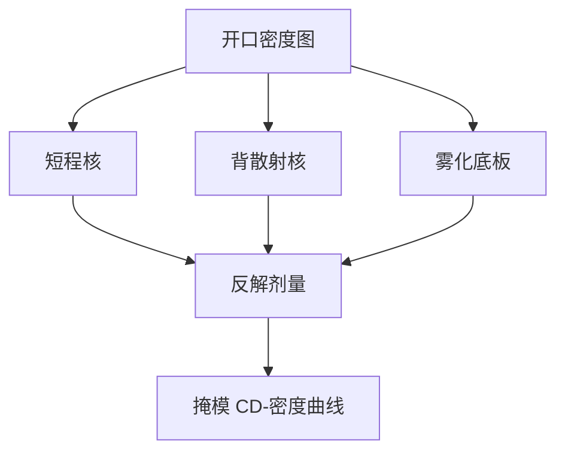

# 电子束邻近校正细节

双高斯核把前向与背向拆开；雾化是更平的第三层。细节错了，密度相关 CD 会在 PEC「已经打开」之后仍在走。

<footer>—— 对照电子束 PEC 双高斯 / 雾化模型的通称；基础见写掩模邻近校正文献</footer>

[上一课](/litho/mask-write-time)把写入小时钉成家族公式。缺口是剂量图本身：通称 PEC 课已经说了「调剂量不调多边形」，本课补核的阶次、校准与过校正。网格与炮数如何量化这张图，留给[下一课](/litho/write-grid-shot-count）。

## 问题

[电子束 PEC](/litho/ebeam-mask-pec) 给出短程、长程、雾化三层图像。细节是：短程（前向散射 + 束斑）决定边锐与小助条能否存在；长程（背散射）核宽随加速电压与衬底 Z 变；雾化（腔体二次电子）更接近全版底板。三层若用一个有效高斯去拟合，疏密交界会出现无法用一层 MPC 修掉的斜坡。

缺口是**核与校准集**，不是再定义一次 PEC。把「PEC on」当成 CDU 已合格，会漏掉：核半径用错时，校正把误差搬到另一种节距。

### 过校正振荡

反解剂量是病态的：短程核把高频放大。正则不足时，密区剂量被砍过头，下一轮密度图又反过来，CD 随迭代摆。这与晶圆 OPC 振荡同构。工程上限制剂量动态范围、平滑密度图、分短/长程分别收敛。

EUV 吸收体与 DUV 铬的背散射不同。换膜系等于重测核，不能只改 MPC 表。

## 方法

双高斯（或三高斯）拟合曝光测试：孤立/密集线、倒比、大面积垫。雾化用全版或大窗曝光单独标定。写入时卷积密度图得到本底，再按阈值模型求每炮或每像素剂量。多束路径在栅格上做同一件事，只是 primitive 从炮换成像素。

与写入时间的耦合：PEC 动态范围大 → 平均剂量或遍数涨 → 日历涨。为了赶货而缩小 PEC 范围，等于把残差推给 mask CDU。

## 机制

入射电子在胶中损失能量（前向），一部分从铬/石英或 EUV 多层回来（背向）。背向电子在微米量级叠加本底，本底与周围开口率成正比。显影阈值切在「本地 + 本底」上，故同样数据宽度在密区更胖。PEC 求的是让有效能量对齐的入射剂量。加速电压升高，背向核往往变宽，长程项更重——这是写模参数，不是晶圆 NA。

版边缺邻居，长程卷积要 pad 或改边界条件，否则边框 CD 像「写出来的 flare」。这与 [6 寸有效区](/litho/six-inch-reticle) 直接相关。

## 边界

不发明核的微米半径表，不写某厂软件名。不把化学放大胶的酸扩散与电子核写成同一个 σ。PEC 细节不替代掩模检验。

后课默认：剂量图按多层核来；下一课问这张图落在多细的地址栅上、VSB 要多少炮才能实现它。

## 小结

- PEC 细节是短程 / 背向 / 雾化分核，不是一开开关。
- 过校正会振荡；动态范围与写入时间耦合。
- 版边要单独处理长程核；换吸收体要重测。
- 出处：电子束 PEC 双高斯与雾化校正通称；写掩模邻近文献。
