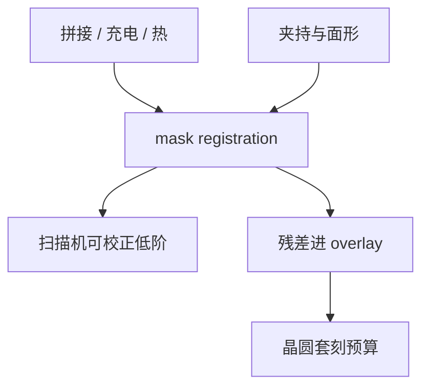

# 掩模配准

配准是版上图形相对理想格子的放置误差；缩小倍率之后它直接进入晶圆套刻，不能等扫描机再「对准掉」。

<footer>—— 对照 mask registration / image placement 与套刻预算分摊的通称</footer>

[上一课](/litho/mask-cdu)把尺寸指纹收成 CDU。缺口是中心线放在哪：写场拼接、充电偏转、基板应力、台镜都会让图形离开设计格子。本课钉掩模配准。数据课序到此收束；下一课序从[坯与 LTEM](/litho/mask-blank-ltem) 换到物理基板。

## 问题

扫描机对准的是掩模对准键相对晶圆标记。键本身若相对芯片阵列有放置误差，或阵列内部相对键有畸变，套刻正确数仍会印错。配准（registration / image placement）度量的就是这张版坐标系误差。$4\times$ 光学把版上误差除以四落到晶圆（anamorphic 则按轴），但仍占 overlay 预算的一截，尤其多重图形同层两张版的相对配准。

缺口是**放置**，不是再量一次 CD。把套刻超差全部写成扫描机或晶圆应力，会漏掉掩模厂的格子。

### 两张版的相对配准

LELE 或切线层的两张掩模若配准指纹不相关，同层套刻会多一项「版对版」。配对写、配对计量、甚至规定同一写入器，是产线对策，不是光学 RET。

EUV 反射掩模的夹持与背面颗粒会改面形，从而改投影配准。计量要声明夹持状态是否与扫描机一致。

## 方法

掩模配准工具（光学衍射或专用配准仪）在版上测标记阵列，拟合平移、旋转、放大、正交，以及高阶多项式。可校正项写入扫描机掩模校正文件；不可校正残差进 overlay 预算。写模侧：场拼接校准、充电补偿、热模型与基板选择（下一课 LTEM）一起压残差。

与 CDU 的分工：CDU 是宽度，配准是中心。充电可以同时改两者：落点偏了是配准，局部剂量变了是 CD。

## 机制

电子束在绝缘或充电胶上积累电荷，束被偏转，放置随写顺序变——所以写策略（从内向外、接地层）是配准工艺。LTEM 基板减的是曝光热致膨胀；普通石英在写束热负载下格子会漂。投影到晶圆时，扫描机可以吃低阶（放大、旋转），吃不干净写场拼接的高频拼接缝。

## 边界

配准不修复吸收体缺陷。高阶校正若每张版不同，扫描机配方管理会膨胀——这是控制课的伏笔，本课只钉误差来源。不编造 nm 规格表。

后课序默认：数据与写入误差已有语言（CDU、配准、炮数）；下一课问基板本身是什么玻璃、为什么热胀系数要低。

## 小结

- 掩模配准是图形放置误差，经倍率进入晶圆套刻。
- 同层多张版的相对配准是多重图形的隐藏项。
- 低阶可进扫描机校正；拼接与充电残差往往不可完全吃掉。
- 出处：mask registration 与 overlay 分摊通称；写模充电/拼接公开讨论。
