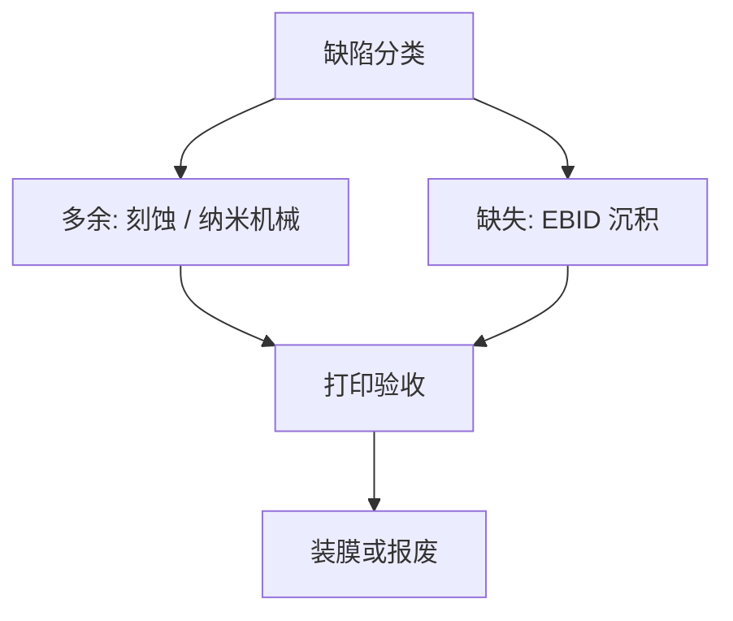

# 掩模修复：电子束与纳米机械

多余的吸收体可以切掉，缺的可以沉积；修复本身是一次局域图形化，CD 与透射必须回到打印窗口内。

<footer>—— 对照 e-beam 气体辅助修复与纳米机械（nanomachining）的掩模厂通称</footer>

[上一课](/litho/mask-inspection-d2d-d2db)给出缺陷清单。缺口是哪些能修、用什么刀。本课钉电子束修复与纳米机械。修完要装薄膜，留给[下一课](/litho/pellicle-mount-inspect）。

## 问题

亮缺陷（缺铬/缺吸收体）与暗缺陷（多余材料）的工艺相反：前者要沉积（碳、金属等前体，电子束诱导），后者要去掉（气体辅助刻蚀或金刚石针纳米机械）。修完的补丁在光学上很少与原膜完全一样：透过、相位、三维形状不同，所以必须用打印视角验收（后课 AIMS），不能只看 SEM「看起来平了」。

缺口是**局域再图形化**，不是检验灵敏度。把所有缺陷当报废，周期与成本炸；把所有缺陷当可修，会留下打印残差。

### EUV 与 DUV 的刀不同

EUV 多层一旦被挖穿或氧化，不是表面补一块铬能恢复布拉格反射。[EUV 掩模修复](/litho/euv-mask-repair) 有专门约束；本课通称仍适用「沉积/去除 + 打印验收」，但多层损伤往往不可修或只能降级使用。

纳米机械适合相对大的多余铬；极小的针孔更常走电子束。选择按缺陷尺寸、膜系与是否已装 pellicle（装后更难修）。

## 方法

流程：分类 → 选工具 → 修 → 再检验 → AIMS（关键缺陷）。剂量与针轨迹要补偿邻近：修复束自己也有 PEC 问题。多次修复在同一点会累积损伤与污染，有次数上限。

与 CDU：大面积修复改变局部开口率，长程 PEC 意义下的环境变了——通常可忽略，除非修的是大垫或大缺口。

## 机制

电子束诱导沉积（EBID）靠二次电子裂解吸附前体，沉积分辨率受束斑与散射限制，补丁边缘是新的 3D 物体。气体辅助刻蚀用束活化反应物种去掉材料，过刻会伤石英，引入相位坑。纳米机械是应力与切削，可能在石英上留划痕或应力双折射——AIMS 会看见。

## 边界

修复不提高写栅分辨率，不消除雾化前体。已装 pellicle 的版修复成本更高，常先判定报废。不写某工具商标的束流表。

后课默认：可打印的修复已经做完；下一课把 pellicle 装上并检验膜与安装。

## 小结

- 暗缺陷去除、亮缺陷沉积；补丁必须打印验收。
- 多层 EUV 损伤往往不可用表面补丁恢复。
- 修复是局域图形化，有损伤与次数上限。
- 出处：e-beam 掩模修复与 nanomachining 产线通称；SPIE Photomask 修复论述。
