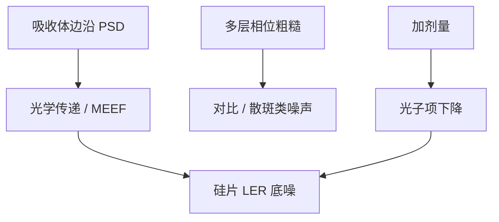

# 掩模粗糙度

胶的 LER 不全是光子和酸。掩模吸收体边沿的粗糙经光学传递，成为硅片上抹不掉的低频底噪。

<footer>—— 据 Naulleau 对 mask roughness 与 LER；Mack 边缘粗糙框架</footer>

[上一课](/litho/mask-3d-best-focus-shift)把三维电磁写成平均焦移。缺口是边沿的随机：掩模粗糙度（mask roughness / mask LER）。修复能否在不毁掉多层的前提下改这块边，留给[下一课](/litho/euv-mask-repair）。

## 问题

BF 偏移是确定的、图形相关的。掩模粗糙是随机的、沿边沿的高度与位置涨落。EUV 的光学传递函数对掩模高频仍有一定响应，尤其低 $k_1$ 时掩模误差增强因子（MEEF）大，掩模上 1 nm 的边沿噪声可以在硅片上放大。Naulleau 把 EUV LER 预算拆成：光子散粒、胶化学、以及掩模贡献——后一项不随剂量消失。加剂量压随机，掩模底噪会露出来。

缺口是把掩模 LER 从胶随机里分开，而不是再讲一次 RLS 三角。空白多层的相位粗糙（表面高度）与吸收体线边粗糙是两桶：前者更像散斑/对比噪声，后者更像边沿位置噪声。

DUV 掩模粗糙相对 $k_1$ 往往可忽略。EUV 短波 + 高 MEEF 把它抬成一等项。不要用「掩模厂 CD 合格」代替粗糙频谱合格。

## 方法

计量：掩模 SEM 或 AFM 得边沿 PSD；光化显微镜看打印后的传递。规格按频段：低频进 CDU/套刻，中高频进 LER/LWR。写入：电子束邻近、抗蚀剂和干法侧壁共同决定吸收体 PSD；多层沉积决定相位粗糙。OPC 不能「画平」随机边沿，只能避免把高 MEEF 图形放在粗糙最敏感的节距上。

与照明：极子改变传递函数，某些频率被放大。SMO 若只优化平均 NILS，可能选中对掩模粗糙更敏感的瞳——预算要联立。

### 空白相位粗糙与线边要分桶

多层表面高度的随机相位在亮场像散斑，吸收体 LER 在边沿像位置噪声。修空白用再抛或筛选坯；修线边用写入与干法。混成一个「掩模粗糙 nm」会拧错旋钮。光化显微镜比 DUV SEM 更接近打印，相位项尤其如此。

## 机制

成像是掩模频谱乘 TCC。边沿位置的随机相位/振幅调制出现在硅片边沿的随机位移。短波长让同样的物理粗糙对应更高的光学频率；部分相干又决定哪些频率进像。相位粗糙相当于随机的弱相位物，贡献类似散斑，在亮场更明显。修复若用沉积补边，可能引入新的局部粗糙峰——下一课的代价。

Naulleau 的公开论述强调：EUV LER 不能单靠胶和剂量解释。掩模贡献要用光化验证，而不是只信 DUV 掩模 SEM。

## 边界

本课不写电子束或气助修复的工艺窗口，下一课才写 EUV 特有的修复约束。不重写掩模厂 e-beam 写入课。加剂量压胶随机之后，掩模 PSD 会成为 LER 地板，要尽早用光化确认。出处：Naulleau mask roughness；Mack LER；MEEF 通识。

## 小结

- 掩模边沿与多层相位粗糙构成不随剂量消失的 LER 底噪。
- 高 MEEF 和 EUV 传递把掩模 PSD 放大到硅片。
- 下一课：修缺陷时如何避免把粗糙和相位坑修得更糟。
- 出处：Naulleau；Mack。
