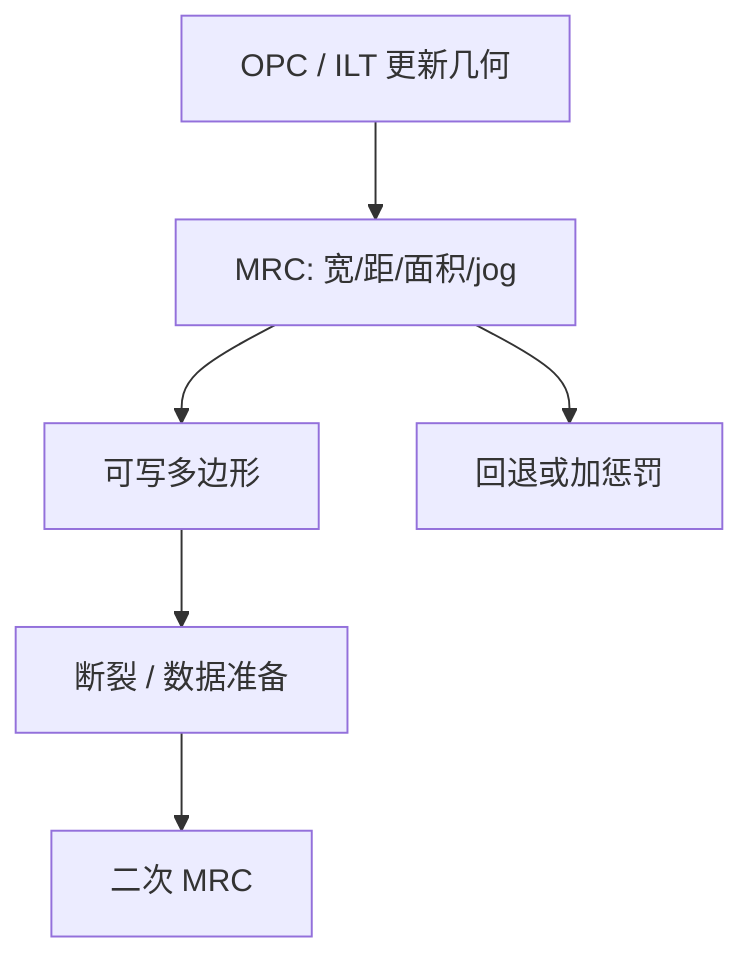

# 掩模规则检查 MRC

光学逆给出的多边形，只有落进掩模厂能写、能蚀、能检的几何集合里，才是一张订单；这个集合叫掩模规则。

<footer>—— 对照掩模厂（mask shop）对可写性约束与 MRC 的工程通称</footer>

[上一课](/litho/ilt-regularization)把逆问题的稳定解写成平滑、鲁棒与向可制造集合的投影。缺口是这个集合的语言。掩模厂不读损失函数，只读宽度、间距、面积、jog、尖角——掩模规则检查（Mask Rule Check, MRC）。OPC 或 ILT 若在 MRC 上爆掉，版被拒收，窗口数字作废。本课钉曼哈顿/多边形 MRC。曲线掩模把规则改写成曲率语言，留给[下一课](/litho/curvilinear-mrc)。

## 问题

电子束写入、吸收体蚀刻、缺陷检测，都有最小可分辨的几何。碎片切得太短、衬线太尖、SRAF 太细或太近，光学上可能有益，写入上会变成剂量不足的窄条、蚀刻后断裂、或检测误报。MRC 是掩模厂与晶圆厂之间的合同：最小宽度/间距、最小面积、最小 jog 长度、内角半径、SRAF 打印风险规则等。

计算光刻若把 MRC 只当优化结束后的过滤器，会在 TAPOUT 前夜发现成千上万违例，再手工或脚本「拍平」，把上一课辛辛苦苦正则掉的窗口又吐回去。缺口是：MRC 必须进迭代（投影或惩罚），而不是事后质检。

### MRC 不是 DRC

设计规则检查（DRC）保证硅上拓扑与库合同：最小晶体管间距、通孔覆盖。MRC 保证**掩模上**的绘制可制造。DRC 干净但 OPC 后 MRC 爆掉，掩模厂仍拒收。两条规则集、两套坐标系（常有 4× 倍率）、两种失败后果。不要把「设计过了 DRC」写成「版能写」。

倍率要把晶圆纳米换成掩模纳米再比规则。High-NA 变形光学两个方向倍率不同，MRC 的「最小宽度」必须按轴声明，不能用一张各向同性表。

## 方法

规则以掩模厂工艺手册为准：VSB 与多束、二元与衰减、EUV 吸收体厚度，各有一套。计算侧在每次边移动或像素更新后做增量检查，违例则回退、合并碎片、或加惩罚。SRAF 另表：太靠近主图形会印出，太细写不出，落在两堵墙之间。

签核顺序通常是：DRC → OPC/ILT（内含 MRC 投影）→ 再跑全芯片 MRC → 热区人工或局部再优化。掩模数据准备（断裂成电子束炮或位图）还会引入新的 jog 与缝，二次 MRC 要在断裂之后再跑一次，否则优化器看到的多边形与将要写的几何不是同一张。

### 与 EPE 的冲突如何仲裁

某一碎片为了 EPE 想变窄，MRC 不许。仲裁优先级：不可写则不可出货，EPE 必须改用邻边、助条或放宽设计。把 MRC 权重调到接近零，等于把拒收留给掩模厂——日历上更贵。

## 机制

VSB 按矩形炮填充：过窄的条需要过小的成形孔径或过多微炮，剂量与位置误差上升。蚀刻有微负载，孤立细条与密细条的 CD 偏置不同，规则里的「最小宽度」其实是蚀刻后仍不断的宽度。检测算法对直角边训练，尖角和亚分辨率锯齿会触发误报或漏报。MRC 是这三条工艺链在几何上的交集，不是单一光学常数。

投影到 MRC 集合，会改变掩模频谱的高频。透镜本会滤掉一部分高频，所以「拍平尖角」对空中像的伤害往往小于对写入的伤害——这正是允许（甚至鼓励）丢掉无用锐角的原因。但最小间距若被强制拉大，助条可能失效，窗口真的掉，那是规则与光学的真冲突，要改规则或改照明，而不是再切碎边。

报告「OPC 后 MRC 干净」时写清：是否含断裂后、是否含 SRAF、规则版本对应哪家掩模厂。用 A 厂规则签核、向 B 厂下单，是常见事故。

## 边界

MRC 不保证晶圆 CD，只保证掩模可加工。规则过宽，等于把 RET 的收益剃光；过窄，掩模厂良率崩。规则随写入器世代变，VSB 年代的最小宽度不能直接套到多束曲线上——那是下一课。EUV 吸收体与 DUV 铬/MoSi 的蚀刻偏置不同，不能共用一张 MRC 表。修补（e-beam repair）之后也要再过 MRC，补丁本身可以制造新的 jog 与尖角。

后课默认：可制造集合已经用多边形 MRC 定义过；曲线还要把「边平行间距」升级成曲率与颈宽。

规则版本号必须写进掩模订购单，与 OPC 所用投影集合一致。

ILT 正则里的 MRC 投影，若用的是过时规则，会把解投影到一个掩模厂已经不再接受的集合上。规则版本必须进 TAPOUT 合同。

## 小结

- MRC 是掩模厂可写性合同：宽度、间距、面积、jog，不是 DRC。
- 必须进入 OPC/ILT 迭代，不能只当前夜过滤器。
- 断裂之后要二次检查，写入几何与优化多边形可能不一致。
- 与 EPE 冲突时，不可写优先于名义轮廓。
- 出处：掩模厂 MRC / 可写性约束的工程通称。
