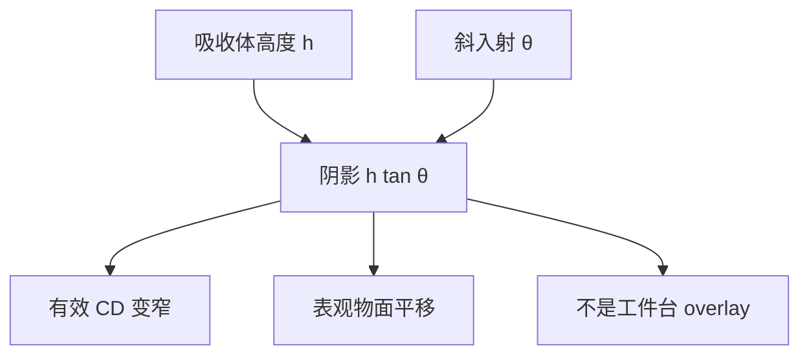

# 掩模阴影

吸收体有高度，主光线不垂直：迎光侧多挡一截，有效开口变窄并像在物面平移。这是几何阴影，不是工件台套刻。

<footer>—— 据 DUV 离轴与 EUV 反射掩模 3D 的公开讨论（Mack / Levinson 的 thick-mask 语境，以及 ASML 等对 EUV 吸收体阴影的表述）</footer>

[上一课](/litho/kirchhoff-vs-emf)比较了薄屏与严格电磁：级振幅何时必须解麦克斯韦。缺口是斜入射下最显眼的那一项几何——厚吸收体投下的阴影。HV 偏置与「假套刻」位移要从阴影图画清楚，再把残差交给求解器。掩模 CD 与放置误差如何进晶圆，留给[下一课](/litho/mask-cd-ppe)。

## 问题

上一课的 EMF 库会自动含阴影，但产线语言仍要把阴影单独钉死：否则计量上看到的左右 CD 差、沿扫描狭缝的 CD 指纹，会被写成 overlay 或剂量。DUV 上，[离轴照明](/litho/off-axis-illumination)让掩模侧主光线已有角度；EUV 上，反射式照明典型约 $6^\circ$ 入射，吸收体再走一截高度，阴影更重。

缺口因此是「厚度 × 斜入射」的几何，而不是再论证 Kirchhoff 失败。没有这张图，下一课的 PPE 会和阴影位移缠成一个纳米数。

### 阴影不是 overlay

图形沿投影方向看起来平移并变窄，像套刻，根子在物面有效孔径。它随狭缝位置（主光线角）变，全场指纹与工件台编码器无关。补偿在吸收体偏置、OPC 的 M3D、有时在掩模台小倾角策略里，不在套刻标记读数里消去。上一课已警告过这一点；本课把它画成入射–高度三角形。

EUV 公开讨论里的约 $6^\circ$ 是照明几何量级，不是每台每场的精密常数。狭缝两端角度再变，阴影指纹沿场变化。

## 方法

几何一阶：有效宽度约减 $h\tan\theta$ 量级（$\theta$ 为掩模侧入射角，$h$ 为吸收体高度），方位决定哪条边是迎光侧。DUV 透射：离轴极让左右边不对称。EUV 反射：光束进、出各经过吸收体附近一次，阴影与多层膜衍射叠在一起，不能只用透射铬的直觉。减薄吸收体、换低 $n$/$k$ 材料是硬件方向，检测与光学密度另账，本课不选膜。

OPC：按方位与狭缝位置给不同偏置，而不是全局加一个 CD。照明一换（更离轴），$\theta$ 变，阴影表要重做。

### DUV 与 EUV 不要共用一张表

浸没 DUV 的掩模侧角通常小于 EUV 的 6° 量级，但 MoSi 厚度仍够在强偶极下做出可测 HV。EUV 几乎总要把阴影当一阶。High-NA EUV 掩模侧角度更大、半场扫描，阴影按方位更重，那是 EXE 附件；本课只钉机制。

## 机制

迎光壁挡住一部分入射（EUV 上还挡反射回程），背光壁少挡，等效孔径既窄又偏。严格电磁会修正边缘场，所以「$h\tan\theta$」只是点名机制，OPC 仍用上一课的级库而不是纯几何。通过焦点时，阴影与波导相位一起让左右边的最佳焦距分裂，E–D 窗口在焦轴上再被切一刀。

扫描狭缝里主光线角连续变，同一设计条在场左右 CD 不同。这与透镜畸变、扫描同步是不同源，拆指纹时要分开。SRAF 更窄，相对高度更大，阴影可让杆的一侧「更不印」、另一侧接近印出。

上一课的求解器切换在这里变成：纯几何 $h\tan\theta$ 用来点名和做 sanity check；签字仍用电磁级振幅，因为边缘场会改「有效 $h$」。只拿三角形去 OPC，曲边和细杆会系统残。

把阴影位移喂进套刻校正，会把物面系统误差写进工件台，换层或换照明后残差爆。计量上阴影走 CD / 不对称，overlay 走标记。

## 边界

本课不把掩模 CD 均匀性、写场对准、图案放置误差算进阴影——那些是掩模厂误差源，下一课经 MEF 进晶圆。也不把 pellicle 皱纹、多层膜缺陷叫成阴影。LELE 两次曝光各带自己的阴影指纹，叠加规则在多重图形课，这里不染色。

不要编吸收体纳米厚度或某节点良率。公开表述停在：EUV 斜入射 + 厚吸收体 ⇒ 阴影一阶；DUV 离轴同样机制、通常更弱。

表观平移随 $\theta$ 变，故随极方位变。偶极层的阴影方向与 C-quad 层不同，OPC 偏置不能共用。

## 小结

- 厚吸收体加斜入射产生几何阴影：有效 CD 变窄并表观平移。
- 不是套刻；随狭缝角与照明方位变。
- DUV 离轴与 EUV 反射都有，EUV 通常更重。
- 一阶可用 $h\tan\theta$ 点名，定量仍走 EMF 级库。
- 掩模 CD / PPE 下一课。
- 出处：thick-mask / EUV mask 3D 公开讨论（Mack、Levinson；ASML 等对 EUV 吸收体阴影）。
