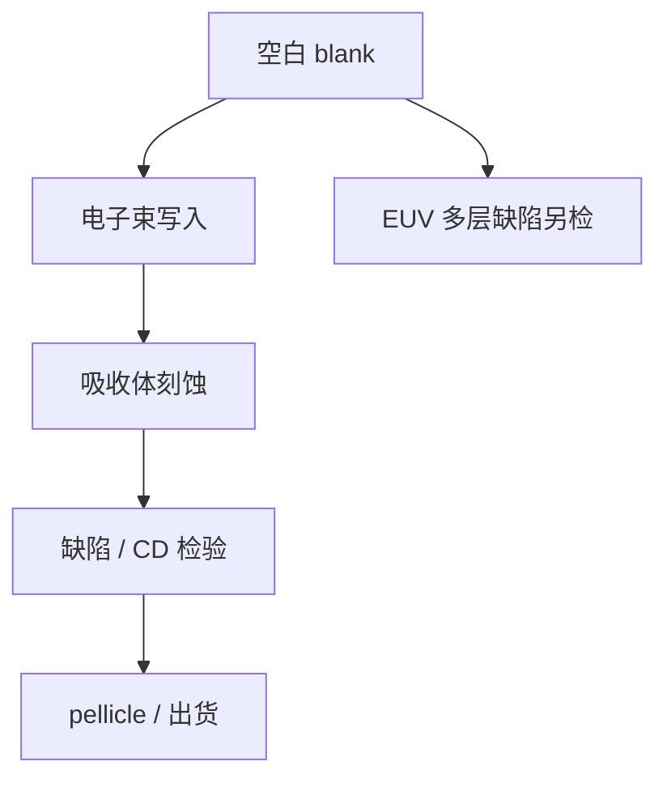

# 掩模厂流程

空白版进厂，电子束写出图形，再刻、检、贴膜出厂。这是掩模厂的状态机，不是把胶和镜头再国产化一遍。

<footer>—— 对照 SEMI 掩模制造流程的公开分段：blank、write、inspect，以及 pellicle 出货</footer>

[上一课](/litho/china-litho-supply-chain)把扫描仪自主拆成胶、光源、镜头和许可档位。缺口是掩模这条平行工业：晶圆厂下单的是一张合格的版，不是国产替代百分比。本课按空白–写入–检验走一遍，不重写 JSR 或蔡司。胶供应商名单留给[下一课](/litho/resist-vendors）。

## 问题

[光刻流程](/litho/litho-process-flow)把掩模当成 4× 物面。晶圆厂不生产这张版。掩模厂从空白（石英 + 铬 / MoSi，或 EUV 的 Mo/Si 多层 + 吸收体）开始，用电子束（VSB 或多束）写入抗蚀剂，显影后刻吸收体，再检验、修缺陷、贴 pellicle。任一站的缺陷都会在晶圆上变成重复打印。

国产替代课容易把「版也能做」写成整机故事的附录。本课只问流程站：谁提供 blank、谁写、谁检。站与站的供应商可以和扫描仪完全不同，许可税号也不同。

### 写入不是光学曝光

掩模上的图形尺度是晶圆的四倍，但仍要纳米级 CD 和套准。写的是电子束抗蚀剂，不是 ArF 胶。多束机把时间从图形复杂度里解开，见[多束写掩模](/litho/multibeam-mask-writer)；本课不重复炮数公式，只把它放进流程位置：write 在 blank 之后、etch 之前。

EUV 空白的多层缺陷不能靠后面刻吸收体消掉。blank 检验是独立站，不是光学版的 STARlight 换个名。

## 方法

公开分段可以写成：blank 资格 → 涂胶 → e-beam 写入 → 显影 → 吸收体刻蚀 → CD / 套准计量 → 缺陷检验（光学或电子）→ 修理 → pellicle → 出货计量（含 AIMS 一类空中像确认，按层要求）。SEMI 相关标准给的是接口与保证项，不是某一家的内部食谱。

DUV 透射版与 EUV 反射版在 blank 和检验分叉，写入原理同类。逻辑曲线 ILT 把 write 和检验的数据量抬高，流程站不变，瓶颈从「铬好不好刻」变成「数据能不能写完、检完」。

### 不要用替代率描述掩模厂

blank 来自 HOYA、AGC 一类公开供应商；写入工具来自 NuFlare、IMS 等；检验大量来自 KLA、Lasertec。国内掩模厂可以在成熟 DUV 上跑通同一条状态机，先进 EUV blank 与检验仍按公开短板读。本课不编合格名录，只禁止把「会写铬版」说成「EUV 掩模链已闭环」。

## 机制

掩模误差因子把 blank CD 和写入误差放大到晶圆。检验的是掩模缺陷会不会在成像阈值下打印，不是晶圆随机缺孔。修理（补镀或挖）改变局部透过率，可能引入新的相位/CD 问题，所以先进层越来越靠「写对 + 检到」而不是靠修。pellicle 把颗粒焦外，改变的是使用期缺陷，不改变 write 站已经写下的图形。

计算光刻把 OPC 数据交给 write；掩模厂不负责把错误的 OPC 变成正确的晶圆，只负责把给定数据写成合格版。闭环在晶圆厂热区 SEM，不在掩模厂良率口号。曲线掩模把 MRC 从边间距改成曲率与颈宽，检验算法跟着改语言，流程站仍是 blank–write–inspect，只是数据体积和检时上涨。

掩模厂周期以天计，晶圆曝光以秒计。ILT 曲线化首先打的是这一段周期，不是扫描机 wph。

## 边界

不要重讲出口管制清单上的胶与镜头。不要发明国产掩模机的写速度。本课不是中国供应链第二集。下一课才回到抗蚀剂厂商——那是晶圆上的胶，不是掩模电子束胶，名字相近、工厂不同。

出处：SEMI 掩模制造流程的公开分段；掩模 blank / 写入 / 检验的产业公开分工。不把未认证的 EUV 空白写成量产。

## 小结

- 掩模厂状态机：空白 → 写入 → 刻蚀 → 检验 → pellicle。
- 与扫描仪胶/光源/镜头供应链平行，不是国产替代重讲。
- EUV blank 缺陷与 DUV 铬版检验不是同一站。
- 晶圆胶供应商下一课，勿与电子束胶混厂。
- 出处：SEMI 掩模流程；公开 blank / writer / inspection 分工。
