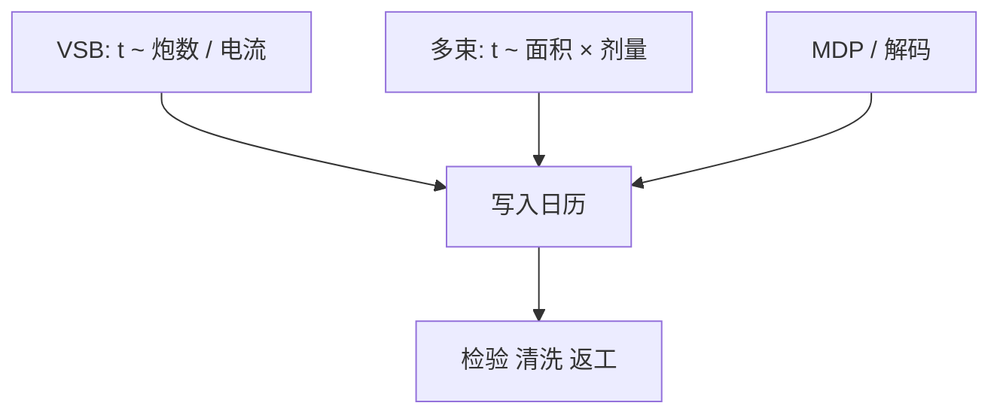

# 掩模写入时间与产能

VSB 的日历跟炮数走；多束的日历跟面积与剂量走。同一张 ILT 版，换家族等于换哪堵墙先撞上。

<footer>—— 对照电子束掩模写入产能与多束对复杂度解耦的公开论述</footer>

[上一课](/litho/curvilinear-data-volume)把曲线层的体积钉成栅格账。缺口是体积还要变成写模机小时：掩模厂的瓶颈机台、客户的 TAPOUT 日历、以及「改一版要等多久」。本课钉写入时间。PEC 核怎么吃进这些小时，留给[下一课](/litho/mask-pec-detail）。

## 问题

[多束写掩模](/litho/multibeam-mask-writer) 已经声明家族差异。本课把它收成产能公式。VSB：时间近似正比于炮数 / 电流，再加场间移动、校准与雾化校正开销。多束：时间近似正比于曝光面积 × 剂量 / 总束流，图形复杂度进入的是数据解码，不是主项。胶灵敏度、加速电压、多层扫描（为了降粗糙或做灰度）把同一公式再乘系数。

缺口是**可预测日历**，不是再夸一次曲线漂亮。把写模机 wph 理解成晶圆扫描机 wph，单位都错：一张关键层版可以写十小时量级，厂里同时只有有限台写入器。

### 剂量不是免费的 CD

为了 CDU 或 PEC 动态范围加剂量、做多遍扫描，写入时间几乎线性涨。EUV 厚胶或低灵敏度胶更明显。产能规划若只按「层数 × 平均 8 小时」而不按剂量与多遍，会在 EUV 与 ILT 层上集体误期。

简单接触层用 VSB 可能更快：单炮面积大。用全厂多束去写稀疏版，是买错组合。对照上一课：复杂度尾部才是多束的产能理由。

## 方法

排产：按层类型分家族（曼哈顿 VSB / 曲线多束），用历史炮密度或开口率预测时间，再加检验与清洗队列。返工（CD 超差、缺陷修复后再写）必须进周期，不能只报一次通过。与 [高 NA 经济](/litho/high-na-throughput-economics) 衔接：晶圆 wph 再高，等版的日子仍在关键路径上。

数据就绪是隐藏前置：MDP 没跑完，写入器空转。曲线层的解码带宽若低于曝光带宽，多束会从面积墙退回数据墙。

## 机制

电子束电流受库仑效应与分辨率约束，不能靠「把电流开到最大」无限缩短时间。多束用空间并行换时间；总电流仍受光学与抗蚀剂加热限制——写太快会热漂移，配准变差。因此写入时间与 [mask registration](/litho/mask-registration) 在同一张物理预算里：不是越快越好。

## 边界

不编造某型号的小时数表。公开叙事只支持家族公式与量级，不支持把竞品规格抄成宇宙常数。写入时间不包含空白片交期与 pellicle 安装。

后课默认：产能公式已按家族分开；PEC 的计算与多遍扫描如何改剂量图，下一课补细节。

## 小结

- VSB 时间跟炮数走，多束时间跟面积与剂量走。
- 多遍与低灵敏度胶几乎线性拉长日历。
- 过快写入会以热漂移换配准；日历与 overlay 预算耦合。
- 出处：VSB / 多束掩模写入产能的公开论述；SPIE Photomask。
