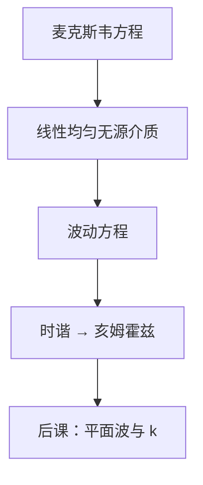

# 麦克斯韦方程到波动方程

无源、均匀介质里，电场与磁场各自满足同一波动方程；波速由介电常数与磁导率决定，不是另给的经验常数。

<footer>—— 据 Jackson, Classical Electrodynamics 对 Maxwell 方程线性化与波动解的整理</footer>

本课是光刻栏第一课。后课默认已经读完本课：均匀介质里的光是满足麦克斯韦方程的电磁扰动，以有限速度传播，时谐场满足亥姆霍兹方程。本课不从「什么是光刻机」起笔，也不从分辨总问题起笔。投影、掩模、抗蚀剂最终都落在场如何传播；先把场方程收成波动方程，折射率、平面波、界面与透镜才有根。

## 问题

口语里常说「193 nm 光」「EUV 13.5 nm」，但波长、相位沿路径如何累积，都必须从场方程读出来。若一开始就把问题写成「怎样印出细线」，$\lambda$ 还没有在方程里对应任何量，后面的孔径与干涉会变成无根符号。缺口因此不是产线参数，而是：从麦克斯韦方程出发，说明光在均匀介质里以波的形式走，且波速由材料常数决定。

真空中 $c=1/\sqrt{\mu_0\varepsilon_0}$。进入线性介质，同样形式，只把 $\varepsilon$、$\mu$ 换成介质值。后课把 $n=\sqrt{\varepsilon_r\mu_r}$ 写成折射率，并在 [单色波、折射率与光程](/litho/em-wave-index) 里把光程钉死；本课先保证波动方程本身成立。光学这十三课只铺到 [标量衍射的适用边界](/litho/scalar-diffraction-bound)，不把成像主线提前讲完。

### 不是从分辨公式起笔

$\mathrm{CD}=k_1\lambda/\mathrm{NA}$ 是成像主线在光瞳与部分相干都就绪之后的产线判据。本课连 $\lambda$ 在波动方程里对应什么都还没固定，不能提前写判据，也不能把光刻机当黑箱来介绍。

本课用 SI 制。$\varepsilon$、$\mu$ 为真空值乘相对值。光学频段通常 $\mu_r\approx 1$，于是 $n\approx\sqrt{\varepsilon_r}$。吸收与复介电常数本课不引入。

## 方法

无源区（$\rho=0$，$\mathbf{J}=0$）的麦克斯韦方程：

$$
\nabla\cdot\mathbf{D}=0,\quad \nabla\cdot\mathbf{B}=0,\quad
\nabla\times\mathbf{E}=-\frac{\partial\mathbf{B}}{\partial t},\quad
\nabla\times\mathbf{H}=\frac{\partial\mathbf{D}}{\partial t}.
$$

线性、均匀、各向同性：$\mathbf{D}=\varepsilon\mathbf{E}$，$\mathbf{B}=\mu\mathbf{H}$。对 $\mathbf{E}$ 取旋度，用恒等式 $\nabla\times(\nabla\times\mathbf{E})=\nabla(\nabla\cdot\mathbf{E})-\nabla^2\mathbf{E}$ 与无源条件 $\nabla\cdot\mathbf{E}=0$，得

$$
\nabla^2\mathbf{E}-\mu\varepsilon\,\frac{\partial^2\mathbf{E}}{\partial t^2}=0.
$$

$\mathbf{H}$ 满足同样形式。波速 $v=1/\sqrt{\mu\varepsilon}$；真空中 $v=c$。时谐约定 $\mathbf{E}(\mathbf{r},t)=\mathrm{Re}\{\mathbf{E}(\mathbf{r})e^{-i\omega t}\}$ 代入，得亥姆霍兹方程 $\nabla^2\mathbf{E}+k^2\mathbf{E}=0$，$k=\omega\sqrt{\mu\varepsilon}=\omega/v$。后课平面波就是这个方程在无限均匀介质里的特解。

## 机制

波动方程说明：扰动不是瞬时传到远处，而是以有限速度 $v$ 传播。光源、投影物镜里的玻璃、浸没液体，在波长尺度上常可先当成均匀块，本课方程在这些块的内部成立。界面上场不连续，切向 $\mathbf{E}$、$\mathbf{H}$ 的匹配留到 [菲涅尔反射与透射](/litho/fresnel-coefficients)。

电场与磁场耦合成横电磁波，但无源均匀区里每个 Cartesian 分量仍满足标量波动方程。这是后课大量用标量 $U$ 处理衍射的许可证——许可证有边界，在本课程末课才收。矢量偏振在掩模边缘与多层膜处必须请回来，那是后课，不是本课的起点。

## 边界

本课不处理色散、吸收与导电损耗：实 $\varepsilon$、$\mu$ 给出实波速。金属趋肤深度、EUV 多层的强吸收，是材料缺口。也不展开边界条件：反射透射系数不在本课推导。几何光学的光线是短波极限，本课尚未引入透镜。

均匀假设在纳米图形边缘会破。特征与波长可比时必须回到波动，不能只画光线——那是 [标量衍射的适用边界](/litho/scalar-diffraction-bound) 的题目。下一课 [平面波与波矢](/litho/plane-wave-k) 只问亥姆霍兹的特解长什么样。

后课默认：无源均匀介质里光满足波动方程；时谐场用 $e^{-i\omega t}$，波数 $k=\omega/v$。

## 小结

- 光刻栏从麦克斯韦方程在无源均匀介质里推出波动方程开始，不从机台或分辨公式开始。
- 波速 $v=1/\sqrt{\mu\varepsilon}$；时谐场满足亥姆霍兹方程，$k=\omega/v$。
- 后课默认已读完本课；界面、偏振、透镜与衍射都建立在这条链上。
- 光学课只铺到标量衍射边界；单色波与光程由后一课程再钉。
- 出处：Jackson, *Classical Electrodynamics*；Born &amp; Wolf, *Principles of Optics* 第 1 章。
