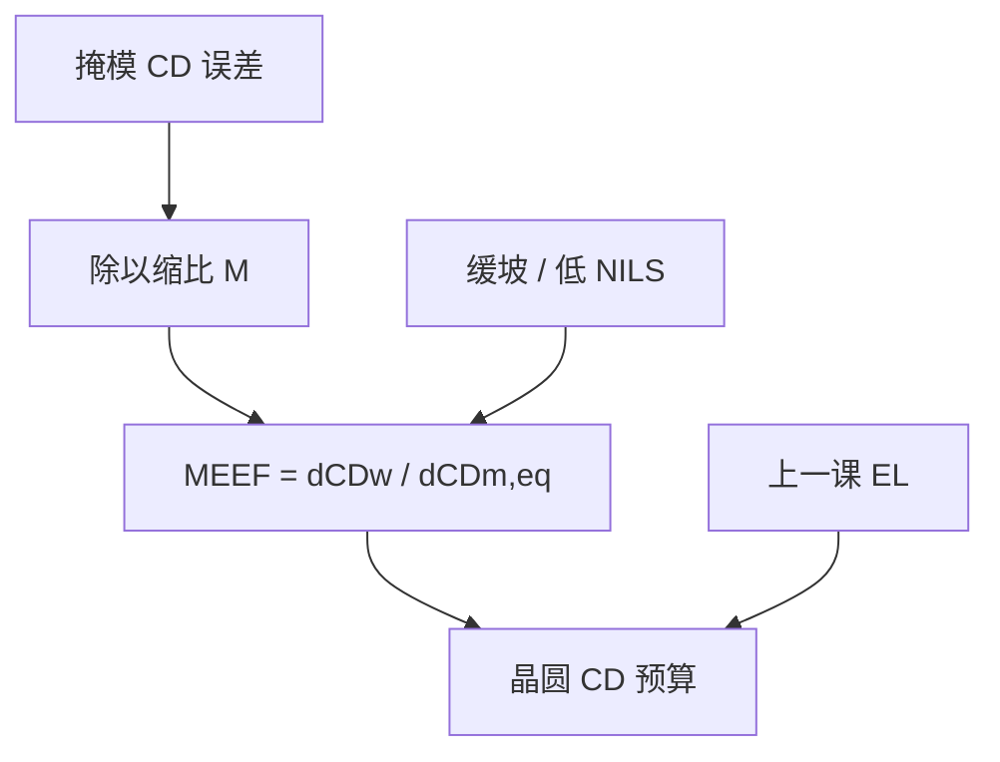

# 掩模误差增强因子 MEEF

剂量轴已经用 EL 量过了；掩模线宽若再漂一纳米，晶圆上往往漂得不止缩比后的那一纳米。

<footer>—— 据 Schellenberg 对 RET / 掩模误差因子的讨论，以及 Wong, Resolution Enhancement Techniques in Optical Lithography</footer>

[上一课](/litho/exposure-latitude)把 $k_1$ 窗口的剂量轴写成 EL。缺口是另一条误差通道：掩模 CD 并不等于设计值，而低通成像会把这点误差**放大**到晶圆。本课钉掩模误差增强因子

$$
\mathrm{MEEF}=\frac{\partial\mathrm{CD}_\mathrm{wafer}}{\partial(\mathrm{CD}_\mathrm{mask}/M)},
$$

$M$ 是投影缩比（常见 $4\times$，即像方看到的掩模 CD 已除过 $M$）。光学邻近如何按邻域系统地偏置，留给后课 OPE。不要把 MEEF 写成又一个 $k_1$：它是导数，不是分辨率工作点。

## 问题

EL 问的是剂量还能漂多少。掩模厂的 CD 均匀性、写入噪声、蚀刻偏置是另一笔预算。若成像是理想缩放，晶圆 $\Delta\mathrm{CD}$ 等于掩模 $\Delta\mathrm{CD}/M$，MEEF$=1$。靠近截止时，空中像斜坡变缓，掩模开宽一点，进瞳的级权重非线性地变，晶圆 CD 动得更凶，MEEF$\gt 1$。缺口因此是这条导数，而不是再报一次 EL。

接触孔、线端、SRAF 附近往往比一维密栅更差：二维频谱对开口尺寸更敏感。只量线栅 MEEF 会低估层风险。

### 缩比必须写进分母

口语有时把掩模纳米直接去除晶圆纳米，忘掉 $4\times$。那样会把 MEEF 虚高四倍。定义必须用**像方等效**的掩模 CD，即 $\mathrm{CD}_\mathrm{mask}/M$。OPC 碎片的移动量也按这一侧比较。

MEEF 随节距、占空比、照明和偏振变。报一个层的「MEEF=2」而不写图形，与报 $k_1$ 不写层别同样无意义。

## 方法

仿真：把掩模目标边整体外推或内缩一小段，再算晶圆 CD（阈值或胶模型），取差商。硅片：用刻意偏置的掩模模块或写入剂量矩阵，回归斜率。规格上，掩模 CD 公差 $\times$ MEEF 必须小于晶圆 CD 预算里分给掩模的那一截——其余分给 EL、焦深、计量。

SMO / OPC 若只最大化 NILS 或 EL，可能把 MEEF 抬到掩模厂接不住。因此增强因子必须进目标函数，与上一课的剂量轴并列，而不是优化完再惊讶。

### 与 NILS、EL 的关系

NILS 低，边对**任何**让相对阈值或频谱微变的量都敏感：剂量是 EL，开口宽度是 MEEF。两者同源（缓坡），不是同一个数：改变剂量是乘在 $I$ 上；改变掩模是改 $T(\mathbf{f})$，再经 TCC 双线性。相移膜、助条让 $T$ 的导数更绕，MEEF 可以局部很大甚至变号。

MEEF$\lt 1$ 偶尔出现在某些孤立图形或过修正区，不表示「掩模越随便越好」：均匀性仍在，只是斜率小于缩放。

## 机制

物体频谱对开口宽度的导数，经光瞳低通之后，像面斜坡对开口的响应可以大于几何缩放。$k_1$ 越低、一级越贴瞳边，这份非线性越强——与窗口课「靠近地板时二维先死」一致，本课只把它读成掩模公差。TCC 双线性意味着邻线也进导数：邻近图形的掩模误差会串到本线 CD，这是 OPE 课的系统版；MEEF 通常先报「本图形均匀偏置」的对角项。

矢量 TM 把 NILS 再削一截，MEEF 往往更差。控偏振可以同时改善 EL 与 MEEF，仍要分别验收。

### 后课默认的接口

说到掩模公差能否支撑这一层，先问 MEEF，再乘掩模厂能力。说到 OPC，边移动的收益必须用 MEEF 加权，避免在高增强区猛修。OPE 是系统邻近偏置，MEEF 是误差放大；后课不要把两个名字写成一个旋钮。

## 边界

MEEF 不含套刻、不含 EUV 掩模 3D 阴影的全部取向差——除非仿真已把它们算进 $\mathrm{CD}_\mathrm{wafer}$。也不要把写入器的纳米数直接当 $\mathrm{CD}_\mathrm{mask}$：测量偏置与 tone 要声明。本课不编造未公开的掩模厂纳米指标或某代节点「MEEF 上限」。

EL 再宽也买不回 MEEF：剂量均匀补偿不了掩模场内的空间相关误差。

## 小结

- $\mathrm{MEEF}=\partial\mathrm{CD}_\mathrm{wafer}/\partial(\mathrm{CD}_\mathrm{mask}/M)$，分母必须是像方等效掩模 CD。
- 低通、低 NILS 时 MEEF 常大于 1；孔与线端往往更差。
- 与 EL 同源（缓坡）但通道不同：一个改剂量，一个改物频谱。
- RET / OPC 必须把 MEEF 放进目标，否则窗口数字不可制造。
- 后课 OPE 谈系统邻近偏置，不替代本课的误差放大。
- 出处：Schellenberg 对 RET 与掩模误差因子；Wong, *Resolution Enhancement Techniques in Optical Lithography*；Mack / Levinson 的产线定义。
