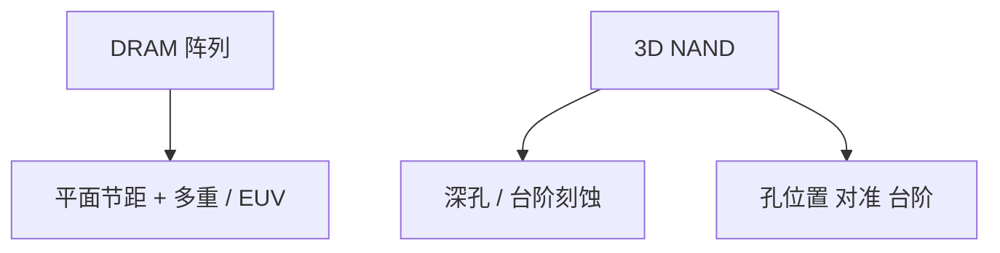

# 存储器光刻：DRAM 与 NAND

DRAM 仍在平面上挤半节距，浸没 + 多重是主路径；3D NAND 把负担交给深孔刻蚀，光刻更多是对准与台阶。

<footer>—— 对照 DRAM 与 3D NAND 图形化负担转移的公开论述</footer>

[上一课](/litho/foundry-roadmap-compare)对比逻辑代工。缺口是存储。本课钉 DRAM 与 NAND 的光刻角色。3D NAND 负担如何具体转移，留给[下一课](/litho/3d-nand-litho-shift）。

## 问题

DRAM：电容与字线/位线在平面周期上，ArF 浸没加 SADP/SAQP、套刻极严，EUV 插入是成本交叉问题，阵列周期性对掩模 CDU 与热点极敏感。NAND：3D 堆叠后，关键变成沟道孔、台阶、字线切割的深宽比刻蚀与沉积，光刻分辨率压力相对逻辑/DRAM 平面密线不同。

缺口是**产品类改瓶颈机台**，不是同一套 CPP 故事。把存储 capex 也写成「全是 EUV」，会错。

### 阵列 vs 外围

DRAM/NAND 外围逻辑仍可能走类似逻辑的金属光刻；阵列才是产品特征。规划要拆。

存储厂的浸没台数与逻辑厂 mix 完全不同，交叉模型要换输入。

## 方法

分阵列/外围列层策略。DRAM 盯半节距与套刻；NAND 盯孔 AR、对准、键合（若有）。EUV 对 DRAM 的交叉按公开插入叙事理解，不编层数。

## 机制

比特密度：DRAM 靠平面 F²；NAND 靠层数 × 平面孔密度。后者让刻蚀/薄膜的边际回报在一段时间内高于缩孔节距。光刻仍定义孔位置与套刻，但不总是分辨率英雄。

## 边界

不给各厂堆叠层数当永远数。不把 DRAM EUV 插入当已完成或永不。本课不展开电容介质物理。

后课默认：NAND 的主墙在刻蚀；下一课专门写光刻负担如何转移。

## 小结

- DRAM：平面节距与套刻，浸没多重/EUV 交叉。
- 3D NAND：分辨率压力让位于深孔刻蚀，光刻管位置与台阶。
- 阵列与外围策略不同。
- 出处：DRAM/NAND 图形化负担的公开论述。
