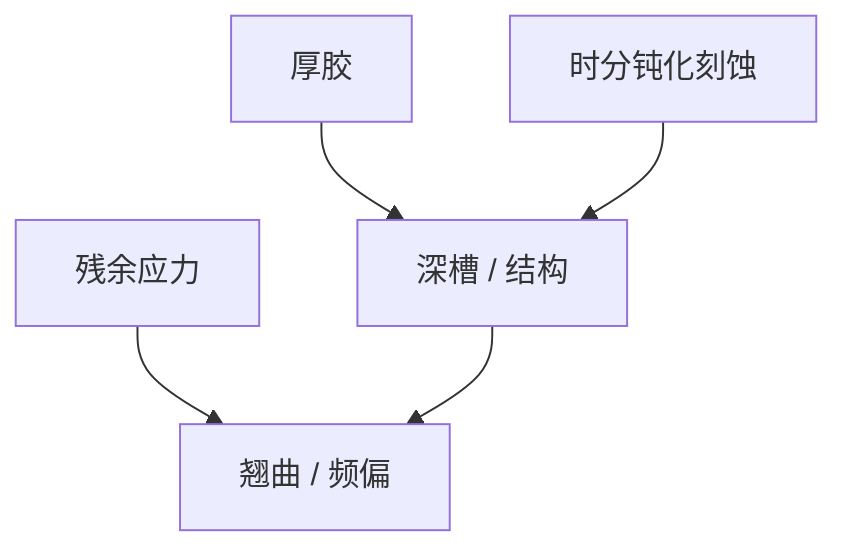

# MEMS 图形化

MEMS 要的是深槽、厚胶和释放后的三维；分辨率往往不是墙，深宽比、残余应力和双面套刻才是。

<footer>—— 对照 MEMS 光刻与 Bosch 深硅刻蚀的通称</footer>

[上一课](/litho/photonics-patterning)把目标函数换成损耗。缺口是力学器件。本课钉 MEMS 图形化。灰度把第三维写进胶厚，留给[下一课](/litho/grayscale-litho）。

## 问题

惯性传感器、喷墨、射频 MEMS：胶厚可达数十微米，曝光用接触/接近式或专用投影，DOF 与侧壁垂直度关键。深硅常用 Bosch 时分钝化（各向异性课对照过）。双面光刻对准、释放孔、残余应力导致的翘曲，比 MMP 更像封装面板问题。LIGA 的 X 射线厚胶是尼奇。

缺口是**厚胶三维**，不是先进节点 k1。用 EUV 随机语言谈 MEMS 会错对象。

### 与 CMOS-MEMS 集成

共集成时前道光刻污染 MEMS 释放，或 MEMS 形貌破坏后道光刻焦深。集成顺序是 DTCO。

接触式光刻的颗粒打印在厚胶 MEMS 上仍致命，只是杀手尺寸不同。

## 方法

工具：接触对准机、厚胶步进器。工艺：多层套刻、释放、超临界干燥（塌缩课同族）。计量：剖面、应力、动静态电学。灰度下一课可服务斜面与透镜。

## 机制

厚胶吸收与显影前沿给出倾斜侧壁，除非工艺针对垂直。Bosch 扇形波纹进力学疲劳。应力与光刻图形密度通过结构刚度耦合——布局即力学。

## 边界

不把所有 MEMS 当 Bosch。不进入某传感器设计。X 射线 LIGA 仅尼奇。

后课默认：MEMS 常要三维胶轮廓；下一课灰度曝光故意把剂量写成高度。

## 小结

- MEMS 光刻墙在厚胶、深宽比、应力与双面套刻。
- Bosch 与释放工艺定义侧壁，分辨率其次。
- 与 CMOS 共集成是顺序 DTCO。
- 出处：MEMS 光刻与深硅刻蚀通称。
