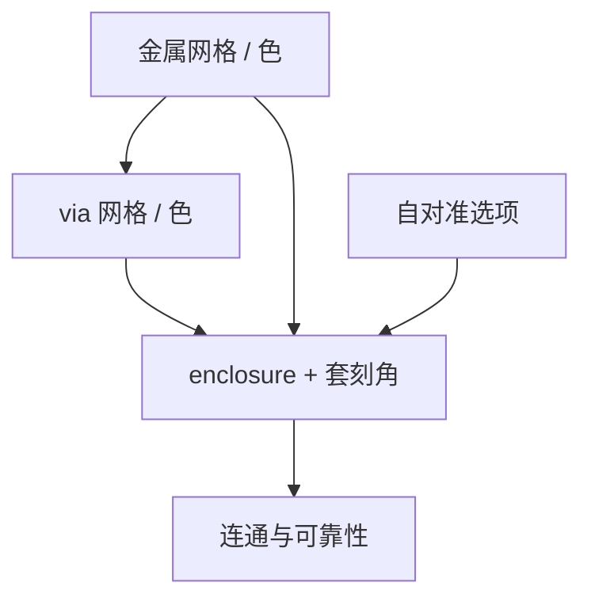

# 金属与 via 协同

via 不是贴在金属上的独立孔；覆盖、着色和套刻把上下金属与通孔收成同一张可印网格，分家优化会把电学开路写进 LRC 绿灯。

<footer>—— 对照互连 DTCO、via coverage 与多重图形着色的公开讨论</footer>

[上一课](/litho/sram-cell-patterning)把 SRAM 收成独立合同。缺口是互连：金属线宽、via 尺寸、enclosure 与颜色必须一起选，否则覆盖规则与 tip 规则互相打架。本课钉金属–via 协同，并结束「仿真、模型与验证」门。胶形如何变成硅与介质里的槽和孔，交给下一课程第一课[等离子体基础](/litho/plasma-basics）。

## 问题

via 覆盖（enclosure）来自套刻加 CD：下层金属太窄或 via 太大，位移后 via 落在介质上，开路或高阻。[套刻预算](/litho/overlay-budget) 已分解数字；本课问网格：via 是否落在金属中心网格、是否自对准、是否允许 via 跨 jog。多重图形下，via 色与上下金属色的约束构成三维冲突——不是单层冲突图能看完。

缺口是**协同网格**，不是再讲一次接触孔成像。金属层 LFD 若不管 via，布线器会画出「金属可印、via 无法覆盖」的合法 DRC。反向亦然：via 先冻尺寸，金属再收 tip，密度在交界处死。

### 自对准 via 换的是掩模还是工艺

自对准通孔用介质或硬掩模把 via 锁到金属槽，套刻项下降，换来切线或填槽的刻蚀难度。这是助推器逻辑在 BEOL 的版本。不能自对准时，覆盖规则直接吃 overlay 与 CDU，金属不能再按纯光学最小宽度设计。

最终判据是电学连通与可靠性（电迁徙、介质击穿），不是 via 顶视圆。LRC 覆盖检查是代理，TEM 抽样才看见剖面偏离。

## 方法

联合变量：金属节距与取向、via 网格、分解色、enclosure、是否自对准。评估：覆盖 PV（含套刻角）、via 打开随机窗、金属 tip 与 via 落点冲突、着色三维约束。输出：一套互连设计规则 + OPC 保持集（含 via-metal clips）。与 [EPE](/litho/edge-placement-error) 衔接：via 相对金属边的 EPE 是本课的签核量，不是再定义 EPE。

仿真账单：via 层与金属层必须同版本核，分开校准会在覆盖上出现假绿。

保持集要含：网格对齐 via、线端 via、jog 旁 via、SRAM 局部互连。只校准密线中心 via，LRC 会在时钟网格和标准单元销钉上假绿。BEOL DTCO 把覆盖写成 EPE 的几何化，本课要求校准 clips 覆盖这些 EPE 角。

## 机制

覆盖余量 $\approx$ (金属宽度 − via 宽度)/2 − overlay − CDU 组合。网格对齐使平均 enclosure 最大；jog 让 via 落到线端，enclosure 被 tip 缩短吃掉——于是 tip 规则与 via 规则必须联立。着色：via 不能同时与「错误色」的上下金属冲突。协同失败的典型症状是逻辑 LRC 绿、SRAM 或时钟网格红，或电学 via 链良率差而 CD 报表好看。

## 边界

本课不写等离子体化学，只声明转印将改 enclosure 的 AEI 值。不重写 LOB。不发明某节点 via 尺寸表。全芯片仿真仍用紧凑核；via 三维剖面抽检用 3D 胶/刻蚀，不进 OPC 内循环。

后课默认：互连规则是金属–via 联立合同。下一课程从等离子体把胶浮雕变成槽与孔的物理开始，校准过的刻蚀核将在那里找到腔体对应物。

## 小结

- 金属与 via 必须同一网格、同版本核、联立 enclosure。
- 自对准用工艺难度换套刻余量。
- jog 与 tip 是覆盖的隐形杀手。
- 出处：BEOL DTCO 与 via coverage 公开讨论；EPE 与套刻预算的几何化。
