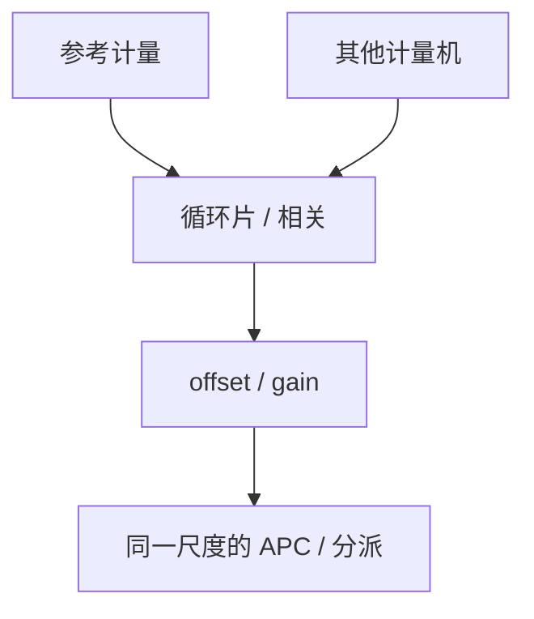

# 计量匹配

两台 CD-SEM、两套套刻机报的纳米差一截偏置时，APC 会把机台差当成工艺漂移去补。匹配是让法律量可比，不是把硬件调成同一序列号。

<footer>—— 对照计量机匹配 / correlation；SEMI 对量测相关与工具匹配的通称</footer>

[上一课](/litho/lot-disposition-rework)用计量做放行。缺口是：放行与 APC 若混用未匹配的机台，限会跳、控制器会振荡。[机台匹配](/litho/tool-matching) 已谈扫描机指纹；本课钉**计量侧**匹配。边缘场与部分场为何特别难量、难补，留给[下一课](/litho/edge-field-partial）。

## 问题

CD-SEM 算法、电压、收缩、套刻的 IBO/DBO 与建模，都给出带偏置的数。黄金片或相关片在机台间循环，估偏置与斜率。不匹配：同一批在 A 机合格、B 机超规格，分派抽签；APC 在 A 学到的剂量传到 B 计量时反号。

缺口是**参考层级**，不是再讲边缘检测。要有参考机（或参考算法版本），其余报偏差。算法升级等于新机，要重新相关，控制图换版。

### 匹配不是校准到真值

没有真空里的真 CD。匹配是机台间相对，外加与电学或 TEM 的周期性锚。把 SEM 匹配到「设计 CD」是类别错误。OCD 与 SEM 相关尤其要声明材料栈，换硬掩模即失配。

套刻匹配含标记类型。IBO 与 DBO 的差不是匹配能消掉的物理， holistic 要选一种当回路主量。

## 方法

循环：监控片定期跑多机，估 offset/gain，超限则锁机待修。与 APC：补偿值必须带「按参考机尺度」。与 SPC：控制限在参考尺度上建，单机用匹配后的数。TEM/截面做低频锚，样本少，只校正慢偏置。

匹配片的图形与材料栈要接近产品，否则 OCD/SEM 相关在产品上失真。算法或食谱升级当天重跑循环片，并冻结 APC 直到新 $a,b$ 写入——这是计量侧的「事件重置」。

## 机制

观测 $y_i = a_i y_\mathrm{ref} + b_i + \varepsilon$。匹配估 $a,b$。斜率 $a\neq 1$ 时，规格带宽在该机上被缩放，必须改限或禁该机进回路。噪声 $\varepsilon$ 进抽样不确定度，过匹配（把噪声当偏置每天改）会把随机写进 APC。

offset/gain 把各机拉到参考尺度。斜率不为一时，规格带宽被缩放，不能只加一个偏置就进回路。

## 边界

不匹配扫描机光学（那是 tool matching）。不把未公开的相关残差当规格。本课不写虚拟计量模型训练。

后课默认：所有回路与分派用匹配后的尺度。下一课边缘与部分场往往是匹配最差、抽样最少的区域。

## 小结

- 计量匹配让 APC 与分派共用尺度，算法升级即新机。
- 无绝对真 CD；TEM 只做低频锚。
- 斜率不为 1 时不能只加偏置。
- 算法升级当天重跑循环片并冻结 APC。
- 出处：计量相关与 tool matching 通称；SEMI 量测相关。
