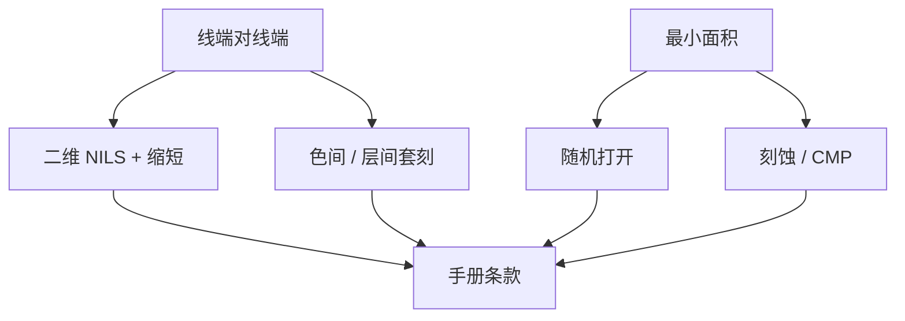

# 最小面积与 tip-to-tip

线端对线端不是「宽度规则转 90 度」；二维失对比加套刻，把 tip-to-tip 收成比线宽更严的一条独立合同。

<footer>—— 对照线端缩短、二维成像与先进节点金属 tip 规则的公开讨论</footer>

[上一课](/litho/design-rule-origin)把规则读成失效模式。缺口是二维专项：最小面积（孔、岛、via 垫）和 tip-to-tip（线端对线端）往往先于一维节距成为密度瓶颈。[二维成像](/litho/2d-imaging-contacts-lineend) 与 [线端缩短](/litho/line-end-shortening) 已讲光学；本课钉它们如何变成手册条款，并接到单元轨道。标准单元轨道高度，留给[下一课](/litho/standard-cell-track-height）。

## 问题

一维线空靠离轴照明还能撑；线端是有限长物体，空间频率铺开，NILS 低，OPC 加锤头仍在离焦下缩短或桥向对端。[套刻](/litho/litho-overlay) 再把两端所属的不同曝光或不同层错开，tip-to-tip 有效间隙被吃掉。最小面积则来自：孔的随机打开、刻蚀打穿、CMP 碟形、以及电学接触电阻。面积规则看起来像 DRC 多边形面积，来源却常是随机窗而不是均值 CD。

缺口是**两条规则为何独立**，不是再推一次线端光学。把 tip-to-tip 设成「两倍最小间隔」是类别错误：间隔服务的是平行边，tip 服务的是两端对撞。

### 面积不是像素计数

最小 via 面积在 EUV 常被随机缺孔推高：均值 CD 合格仍有打开失败。岛状金属最小面积还受刻蚀负载与 CMP 侵蚀。DRC 面积是代理；真正规格在缺陷率或电阻分布。PWQ 对孔阵列的鉴定比量一条线更接近这条规则的本意。

多重图形里 tip-to-tip 可能落在同色或异色。异色 tip 吃套刻，同色 tip 吃光学。规则表必须分列，不能一行糊弄。

## 方法

光学：对 tip 与孔做 PV-band 与随机窗，而不是只用线宽 Bossung。套刻：把层间/色间位移加进 tip 间隙。输出：分情况的 min T2T、min area、via enclosure。LFD 用这些数约束布线器的 jog 与切断。与着色课衔接：不可染色的 tip 邻域优先改拓扑，而不是收紧全球 T2T 让密度崩盘。

SRAM 和逻辑往往两套 tip 规则，因为单元内图形更密、更重复，允许专用 OPC 与专用豁免——下一课轨道与再下一课 SRAM 会用到。

## 机制

线端缩短把设计 tip 间隙在胶上再吃一截；刻蚀可能再吃或因聚合物反冲。规则必须对着 AEI 或电学，声明轮廓。最小面积：打开概率随面积与 NILS 走，随机课已有 z 因子；规则取的是「缺陷率可接受」的面积阈值，再加计量余量。

## 边界

不把某节点未公开的 T2T 纳米数写成标准。本课不重写接触孔成像全文。曲线 ILT 可以改善 tip，但不自动取消规则——可写性与 MRC 仍在。

后课默认：T2T 与面积是独立条款，分同色/异色。下一课看这些条款如何决定标准单元有几条轨。

## 小结

- tip-to-tip 由二维光学加套刻共同收紧，不是线宽规则的旋转。
- 最小面积常锚在随机打开与转印，而不是均值 CD。
- 同色/异色、逻辑/SRAM 必须分列。
- 出处：线端缩短与二维成像传统；Levinson / Mack 对工艺规则与窗口的叙述。
