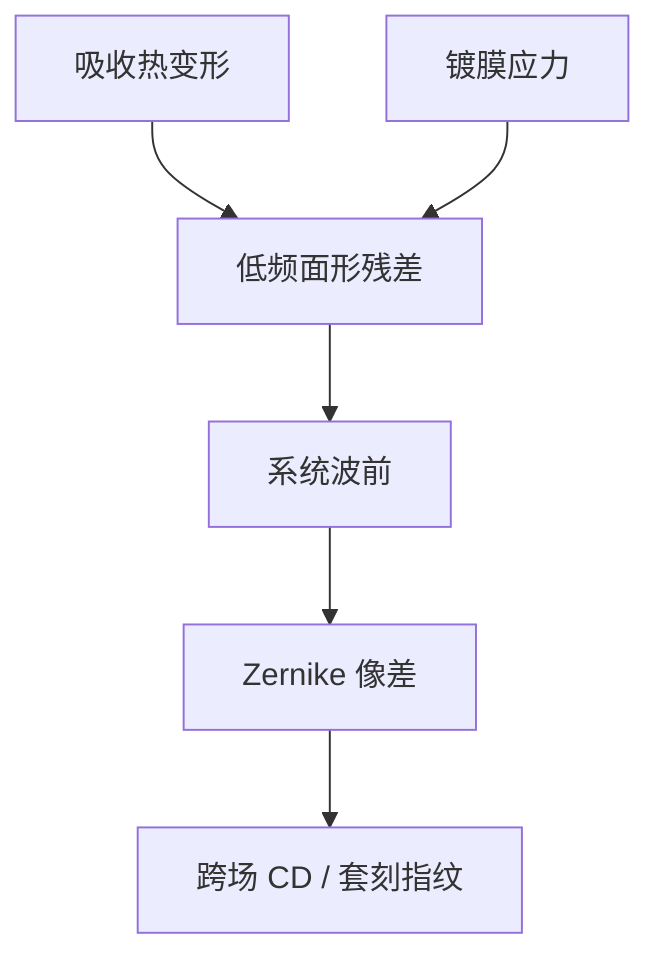

# 镜面形状误差

低频面形是镜子「长得不像设计的那张二次曲面」。它改波前和场曲，不改 TIS 那一桶，但 High-NA 的公差以皮米计。

<footer>—— 对照 Zeiss 对 EUV 投影光学面形与波前的公开要求；Bakshi 系统光学</footer>

[上一课](/litho/multilayer-roughness-scatter)把高度谱的中高频写成散射。缺口是低频端：形状误差（figure error）。蔡司装调盯的首先是这张面：投影六镜把亚纳米波前乘进空中像，像差进 Zernike，不进 flare 核。中频那一段专门有名字，留给[下一课](/litho/msfr)。

## 问题

散射课用 PSD 分段。低频对应空间波长从镜子口径量级到大约毫米以上，用面形干涉仪或可见光/EUV 波前传感器看。误差表现为离焦、像散、彗差和更高等，跨场扫描时变成 CD 与套刻指纹。EUV 全反射、无透镜补偿，每一面的面形都直接进投影波前；NA 从 0.33 到 0.55，对同一波前误差的瑞利容忍更紧。

缺口是把 figure 从「抛光得好不好」落到成像预算，而不是再写一遍 TIS 公式。热漂移也是面形：瓦级吸收让基底膨胀，运行中的 figure 不等于出厂图——[镜头热补偿](/litho/lens-heating-compensation) 的 EUV 版发生在真空反射镜上。

面形合格、MSFR 超标：像差好看、对比差。反过来：晕斑小、场曲大。分频就是为了不让一个 RMS 掩盖两种病。

## 方法

出厂：干涉测量面形，减设计面，残差进 Zernike 或自由面系数。镀多层之后还要再测——膜应力会把 figure 拉弯，必须在镀膜应力和基底刚度之间预补偿。装调：六镜（High-NA 更多或变形组）用刚体自由度把系统波前收到规格，补偿不了的高阶留给单镜返工。

运行：功率、氢和污染改变局部吸收，面形慢漂。传感器用衍射或刻蚀标记看像差，执行器是镜体位移/倾斜，行程有限。收集镜的椭球面形同样有 figure 项，但它首先改 IF 共轭和光瞳均匀，投影镜才直接改硅片空中像。

### 镀膜应力是出厂面形的一部分

多层有压应力。镀完若不预补偿，刚体面形会弯出像散和更高阶。离子束修形可以在镀前把基底修成「镀完才对」的反变形。运行中氢和热再改应力，预补偿不是一次完工。后课 MSFR 不管这些低频弯，装调也补偿不了中频纹。

## 机制

波前误差 $\Delta W \approx 2\,\Delta z\cos\theta$ 量级（反射），高度误差被双程放大。13.5 nm 的 $2\pi$ 相位对应的高度只有数纳米；分配到六面、再扣掉可补偿的刚体项，单镜公差落到皮米–亚纳米。这是 Zerodur 或同等超低膨胀基底、离子束修形的理由。像差进 TCC，NILS 和焦深一起掉；与散射不同，OPC 的 flare 核修不了彗差造成的左右不对称。

Zeiss 公开把 EUV 光学说成原子量级面形合同。不要把可见光镜头的 λ/20 习惯直接换算到 13.5 nm——双程反射和短波把数字再削一截。

## 边界

本课不把中频的「小角度散射 vs 像差」灰色地带写完，那正是下一课 MSFR。不写掩模坯的面形——掩模厂另课。运行热面形与出厂干涉图要分开管，不能用一张补偿表打天下。出处：Zeiss EUV optics；Bakshi 投影光学；ASML 对波前与像差控制的公开讨论。

## 小结

- Figure 是低频形状误差，进波前与像差，不进 TIS 桶。
- 镀膜应力和热负荷让运行面形偏离出厂；补偿行程有限。
- 下一课专攻夹在面形与高频抛光之间的 MSFR。
- 出处：Zeiss；Bakshi；ASML 波前公开材料。
