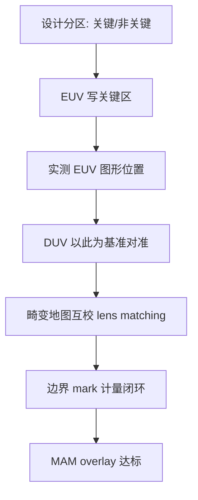
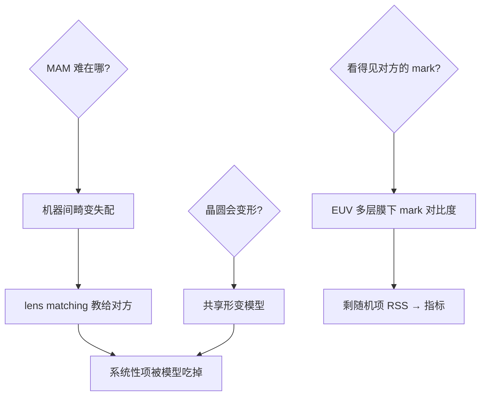

# mix-and-match-overlay

同一层图形，关键区域交给 EUV、其余交给 DUV——混合匹配省的是钱，考的是两台机器之间的套刻。

<footer>—— 据 ASML Mix-and-Match 工艺方案； imec 混合光刻路线图评估</footer>

[掩模版与场域极限](/litho/reticle-field-limit)讲一台机器内的疆界，本课讲两台机器接力：**混合匹配（mix-and-match, MAM）**——同一晶圆层由不同光刻机分区域完成。缺口是把「套刻」从同机指标升格为跨机契约。它是 EUV 时代控制单位成本的核心手段之一。本课不做套刻计量学全貌。

## 问题

EUV 光刻机的产能（约 160-200 wph）与折旧构成先进节点的成本大头，但许多层的图形只有局部复杂（cell 内），其余是稀疏大块。全层 EUV 是浪费。缺口：**关键区域 EUV + 其余 DUV 的分区拼接**——前提是两台机器写的图形在同一层内互相对准到几个纳米。这比层间套刻难：同一层的两个部分失配会直接图形断裂/短路。

术语翻译：mix-and-match = 分区混合光刻，同一层由 ≥2 台光刻机接力；BC（border/cut 区域）= 两机器负责区的交界；MAM overlay = 跨机器的场内套刻指标，通常比同机套刻紧 20–40%。

数字实例：某 3nm 层 EUV 覆盖率 40%（关键 cell 区）、DUV 覆盖 60%。EUV 产能翻倍需求降至 0.4 倍整层——按 180M 美元机价与 15 年折旧，单层光刻成本降约 35%；代价是 MAM overlay 指标从 2.5nm 收紧到 1.8nm 级。

## 方法

执行四要素：**分区规划**——关键/非关键区域的边界在设计阶段划定，边界落在图形简单处；**基准对齐**——DUV 机台以 EUV 已写图形的实测位置为基准做场内对准（先进对准方案用光栅/专用 mark）；**匹配校正**——两机的畸变地图互校（lens matching），把系统性错位按场域网格修正；**计量闭环**——边界区放密集套刻 mark，测得的 MAM overlay 喂回各机平台校正。顺序多变体：EUV-first（DUV 填空，最常用）与 DUV-first（EUV 打关键补丁，用于关键层小面积图形）。

直觉类比：像壁画接龙——大师（EUV）画面部（关键 cell），助手（DUV）补衣褶背景（大块简单图形）；助手动笔前先量好大师画好的五官坐标（基准对齐），两台「透视习惯」（畸变）不同的手要事先校准（lens matching），交界处一遍遍回看（计量闭环）。

## 机制

套刻误差的来源分解决定 MAM 的难度构成：**机器间失配**（两台的镜头畸变、平台网格不同）是 MAM 特有项，靠 lens matching 把 EUV 的畸变地图「教」给 DUV 对准算法抵消；**晶圆形变**（工艺热预算导致的翘曲）两机各自补偿但基准不同步——先进方案的解法是共享同一套晶圆形变模型；**对准标记质量**——EUV-first 时 DUV 要看见 EUV 层的 mark，mark 在多层膜下的对比度是计量工程。收敛机制：计量-校正闭环让 MAM overlay 收敛到「两机共模误差 + 各自随机项的 RSS」——系统性项被模型吃掉后，剩下的就是光刻平台的本征稳定性。

常见误区：把 MAM overlay 当层间套刻处理——同层失配直接撕裂图形，指标更紧、闭环更密；另一误区是「分区越多越省」——每加一台机器加入接力，多一份失配源与产能协调成本，实际分区数通常 ≤2-3。

## 边界

MAM 的边界由「关键区域的可分性」决定：SRMA 阵列式规则图形天然易分区，随机逻辑的边界犬牙交错则收益骤降。EUV 单机产能提升（High-NA 与 faster stages）持续侵蚀 MAM 的成本论据——MAM 的份额是「EUV 产能 × 层数 × 设计可分性」的函数。High-NA 场域减半后，MAM 与 stitching 的组合（关键小区 High-NA + 大面积 low-NA）成为 imec 路线图上的活跃方案。与[晶圆边缘排除区](/litho/wafer-edge-exclusion)的接续：分区规划时边缘低良率区优先派给 DUV——好的分区策略顺手把边缘损失也消化了。

直觉类比：MAM 像合资装修——贵的木工（EUV）只做客厅造型墙，刷漆铺砖（DUV）交给普通工人；两个工种各干各的不难，难的是「墙面的分界线处」瓷砖与木饰面严丝合缝——所以先量木工的实际尺寸，再让瓦工按此放线。

## 小结

- MAM = 同层分区跨机接力，省 EUV 产能、考跨机套刻。
- 三大机制项：lens matching 消畸变、共享形变模型、mark 对比度。
- 分区可分性决定收益；High-NA 时代 MAM×stitching 活跃。
- 出处：ASML MAM 方案资料；imec 混合光刻路线图；SPIE Overlay 计量会议文集。
