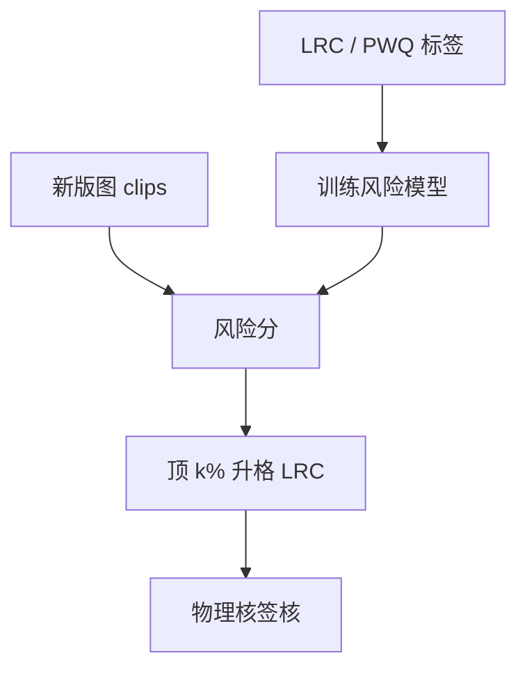

# ML 热点预测

学习模型可以给全场 clips 打风险分，让严格前向与人工复检先看见高分者；它预测的是排序，不是另一套麦克斯韦。

<footer>—— 对照计算光刻中机器学习热点检测的公开讨论；与 [ML OPC](/litho/ml-opc) 的前向近似分工</footer>

[上一课](/litho/lrc-orc)要求过程角全场检查。缺口是墙钟与漏检权衡：角一多，LRC 尾延迟炸；角一少，新拓扑漏。本课钉机器学习热点预测：用历史 LRC/PWQ 标签训练，给新版图 clips 打分。[分解着色](/litho/decomposition-coloring-conflict) 下一课回到确定性规则冲突，不在这里用网络代替染色。

## 问题

[ML OPC](/litho/ml-opc) 已经声明学习模型最多近似前向，签核仍要物理核。热点预测更窄：输入局部多边形（或密度图），输出「是否像会在 PV-band 越界」。它服务**调度**——先仿真高分 clips、先修高分单元——而不是颁发绿灯。

缺口是**标签与漂移**，不是网络结构竞赛。换胶、换光源、换分解，标签分布移位，旧模型会把真热点打到低分。把预测当 LRC 替代，等于用过期残差图签核。

### 排序不是判决

AUC 好看只说明相对顺序有用。规格是绝对的：某一 clip 在离焦 40 nm 是否桥连，仍要核或硅。把 softmax 阈值写进 DRC 手册，版本无法审计。允许的用法：匹配课的模板不够时，用模型挖「不像旧杀手、但高风险」的新物种，再送 LRC。

训练集约等于 PWQ 失败点加 LRC 历史。类别极不均衡。报准确率无意义，看召回与校准曲线，并留时间外保持集。

## 方法

特征：密度图、几何描述子、或图像化 clips。标签：LRC 越界、PWQ 缺陷、有时 AEI 失败。协议：与 OPC 模型同节点同层训练；工艺改版即重训或至少重校准。部署：全场滑动窗打分 → 顶 k% 升格全角 LRC 或严格 EMF。与图形匹配互补：匹配高召回已知拓扑，ML 补分布外的相似形。

禁止：用预测 CD 替代计量；用预测套刻替代对准。那是虚拟计量课的范围，且仍不能当法律量。

部署后要盯校准：每周用新 LRC 标签画可靠性图，一旦低分里出现 PWQ 真杀手，立刻关自动调度、回退到全角抽样。计算光刻里 ML 热点检测的公开讨论，几乎都把「辅助排序」写进摘要，把「替代签核」留在未发表的愿望里。

## 机制

局部可印性大致是邻域算子，故卷积神经网络或图网络能拟合「这类 jog 在该核下危险」。它拟合的是核+历史的复合，不是成像物理。域偏移来自核更新和设计风格漂移（新库、新轨道）。校准曲线一旦变平，调度仍可参考，判决必须关掉。

## 边界

本课不进入限价簿，也不把 Transformer 训练当光刻签核。不发明 arXiv 编号或未公开的「全芯片 ML 替代 LRC」。随机光子缺陷的标签噪声大，ML 召回不可当随机窗。

后课默认：ML 只排序；绿灯仍是 LRC。下一课处理多重分解里确定性的着色冲突——那不是预测问题。

## 小结

- 热点预测给 clips 排序以调度仿真，不替代 LRC 判决。
- 标签与工艺版本绑定；漂移则模型作废。
- 与模板匹配分工：已知拓扑对学习补新物种。
- 出处：计算光刻 ML 热点检测公开讨论；ML OPC 课已划的签核边界。
