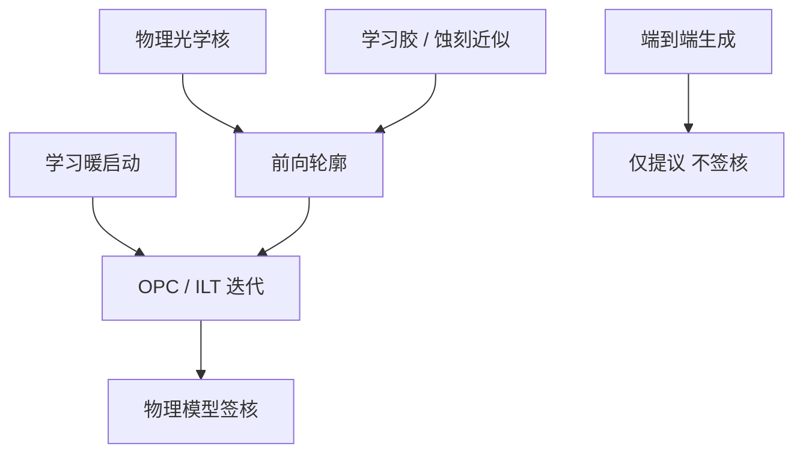

# 机器学习 OPC

学习模型可以逼近昂贵的前向核或给逆问题一个靠近的初值；签核仍然要落在校准过的物理成像上，否则幻觉会被刻进掩模。

<footer>—— 对照计算光刻中机器学习替代胶/成像算子的公开讨论</footer>

[上一课](/litho/computational-litho-gpu)把全芯片 OPC/ILT 收成同一物理合同下的 GPU 墙钟下降；AI 只被点名为暖启动或胶近似，不能当签核器。缺口是把这条轨写清楚：学什么、在哪一段替换、如何拒绝域外。本课钉机器学习 OPC。学到的修正如何反馈到单元库与设计规则，留给[下一课](/litho/dtco-patterning)。

## 问题

前向核贵在反复求空中像与抗蚀剂轮廓。紧凑胶/蚀刻模型本就是拟合物，不是第一性原理，用网络拟合更多计量在概念上并不犯规。危险是外推：新胶、新硬掩模、新随机配方，网络给出光滑错轮廓，[ILT](/litho/ilt-curvilinear) 会把错当目标去反演。端到端「版图进、掩模出」更难保证 MRC 与 PV-band。

因此问题不是「要不要 ML」，而是：哪一段算子允许被学习替代，哪一段必须物理收口。GPU 解决的是同一模型的吞吐；ML 改变的是模型本身的成本与失效模式。两条加速不要混成一句「AI 光刻」。

### 三类替换，签核权不同

算子替代：光学仍用 TCC / 掩模 3D，网络只近似胶或蚀刻偏置——最容易对上计量点。暖启动：网络给出接近的边或 SRAF，物理 OPC/ILT 少迭代几轮。端到端：直接生成掩模，MRC 与窗口难保证，公开讨论里多半停在研究或提议器。量产叙事集中在前两类。

不要把生成模型直接画掩模理解成 cuLitho。上一课的 GPU 路径是物理核映射；本课的 ML 是另一条、必须声明替代了哪一段前向。

## 方法

训练数据必须覆盖剂量、焦点、掩模误差角与层别，否则网络背下某一层的指纹。签核协议是：在计量点上对物理模型或硅数据的 EPE 分布；域外（新节距、新胶）拒绝或回退全物理。MRC 投影仍在物理循环里做，不让网络输出免检。

加速指标是隔夜窗与窗口，不是「推断毫秒」。若暖启动省下的迭代被域外回退吃掉，墙钟不降。与多束数据准备的耦合不变：ML 只会更早把队列堆到掩模厂，若写入与检测跟不上。

### 随机与均值

多数公开 ML-OPC 拟合的是均值轮廓。缺孔是极值统计，见[光子预算](/litho/photon-shot-budget)。用均值网络去「预测缺陷」需要专门的尾部数据，通常没有。机器学习不自动进入随机签核。

## 机制

胶/蚀刻紧凑模型是从计量回归出来的响应面。神经网络是容量更大的响应面。容量大，插值更好，外推更野。物理光学核提供的归纳偏置（低通、TCC 正定）被端到端丢掉之后，网络可以用通带外纹理降低训练 loss，正好踩进 ILT 的零空间——上一课正则要压的那种纹理。所以「先学习再 ILT」若无 MRC/平滑，会比纯物理 ILT 更会过拟合。

算子替代保留光学偏置，只在本来就是经验的那一段加容量，失败模式接近「换了一套紧凑胶模型」，工厂有校准流程可套。这是它更接近量产的原因。

计算光刻的「正确」以晶圆计量为准。网络与 CPU 参考的比特不一致不可怕；可怕的是在未校准域里给出看起来光滑的 EPE。

## 边界

ML-OPC 不降低校准实验成本：训练仍要硅数据。它不提高 NA，不取消 MRC。出口管制与数据保密使「用别厂数据预训练」往往不可行，每家代工厂自己的层指纹很难共享。把某一会议演示的倍速写进所有层的计划，会在最重的 EUV 3D 层上再次超期。

后课默认：ML 可以加速或近似前向，签核仍是物理合同；设计规则与库如何为这种修正链让路，是 DTCO 的题目。

引用 ML-OPC 时写清：替代的是胶、蚀刻还是端到端，训练域覆盖哪些扰动，签核是否仍跑物理 PV-band。只报推断速度，无法规划 TAPOUT。

## 小结

- 机器学习 OPC 宜做胶/蚀刻近似或暖启动，签核仍用校准成像。
- 端到端生成难进量产，因为 MRC 与窗口没有物理合同。
- 训练域外必须拒绝；否则 ILT 会把幻觉正则成「干净」纹理。
- 均值网络不覆盖随机悬崖；缺陷仍要剂量与胶。
- 出处：计算光刻中机器学习替代前向模型的公开讨论；GPU 物理加速见上一课。
