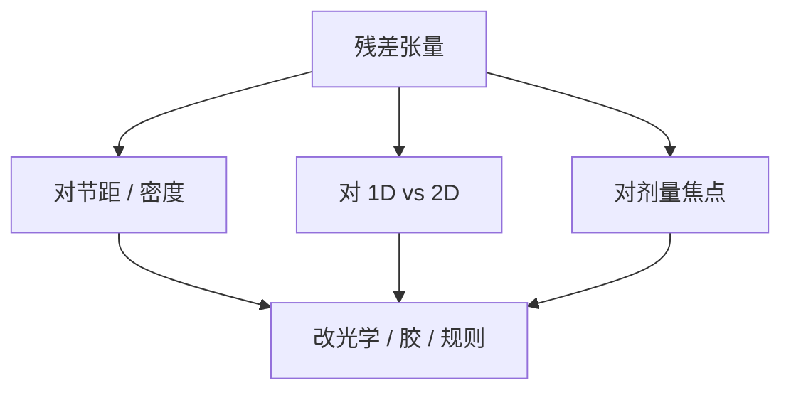

# 模型残差分析

RMSE 一个数会把「光学核半径错了」和「二维没见过」平均掉；残差要按节距、取向和邻域切开看。

<footer>—— 对照 OPC 模型残差诊断与通过节距误差指纹的产线通称</footer>

[上一课](/litho/test-patterns-gauges)给出有结构的测量。缺口是拟合结束后如何决定：加项、改光学、还是承认某类图形不进 OPC 而进设计规则禁止。本课钉残差分析。轮廓从 2D 边升级到 3D 胶形，留给[下一课](/litho/3d-resist-model）。

## 问题

总 RMSE 合格时，某一节距族仍可有纳米级系统偏，正好落在产品金属节距上。残差分析把误差对通过节距、密度、方位、线端、孔、剂量、焦点作图。正弦状通过节距残差常指向 TCC/光学半径；焦点不对称指向 3D 或像差；只在二维爆指向 gauge 缺失或紧凑模型阶次不够。

缺口是**诊断**，不是再跑一次最小二乘。把残差当随机噪声去加 ML 修正，会在未抽样处编造假安全。

### 空间相关不是更多胶项的许可证

相邻 gauge 残差相关，说明缺的是平滑的物理核，不是再加一个局域经验项。经验项会在产品上以另一种相关出现。

残差必须分 ADI/AEI。刻蚀负载的残差不该用胶项去背，否则换腔体时「胶模型」一起漂。

## 方法

图：residual vs pitch、vs isolation、Bossung 残差、向量 EPE 图（二维）。统计：按层、按扫描机、按掩模。行动：超光学规格 → 回严格 EMF 或照明文件；超胶规格 → 改模糊/阈值；超刻蚀 → 进刻蚀核；某族无药 → 禁止或改 SMO/规则。

与热点：残差图上的族应与 LRC 热点清单重叠；不重叠则计量与仿真不在同一轮廓定义上。

## 机制

前向模型是光滑算子，系统残差也光滑，除非计量跳变（SEM 配方边界）。因此「棋盘噪声」更像计量，不该进光学核。EUV 随机会在重复测量的方差里，不该进均值模型残差的偏差项——要拆 bias/variance。

## 边界

分析不自动修复。保持集很小时代入产品是赌博。不把某次 TAPOUT 的残差表当作物理常数。

后课默认：2D 轮廓残差已被切开诊断；下一课问胶还有厚度方向的形——侧壁与顶损失——2D EPE 是否够签核。

## 小结

- 残差按节距、维度、窗口切开，才能决定改哪一层模型。
- 相关残差指向缺核，不指向无限加经验项。
- ADI/AEI、bias/variance（随机）要拆。
- 出处：OPC 模型残差诊断产线通称。
