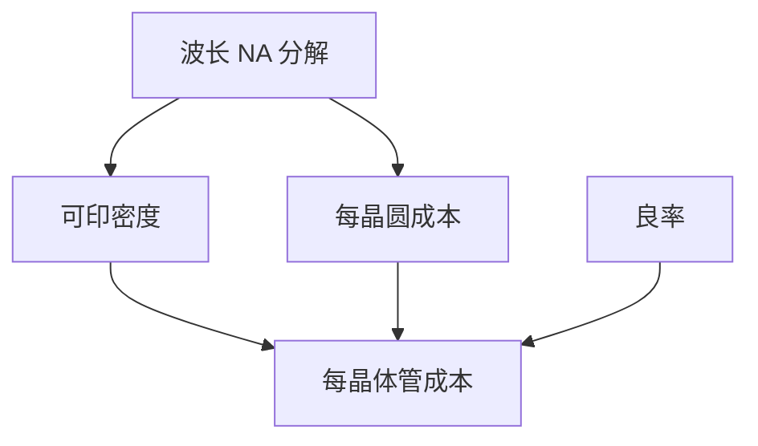

# 摩尔定律的光刻视角

晶体管变便宜，长期靠的是可印密度上升；当单次光学到顶，多重、EUV 与助推器接过「每两年」这根棒，账单改记在步骤与随机上。

<footer>—— 对照 Moore 原文的经济命题与其后光刻接棒（RET、浸没、多重、EUV）的产业史</footer>

[上一课](/litho/fab-capex)说明支票变大。缺口是为什么还要开：密度经济。本课钉摩尔定律的光刻视角。谁能卖这些机台（单一来源），留给[下一课](/litho/supply-chain-single-source）。

## 问题

Moore 1965 年的观察是组件成本随集成度降。光刻是把更多组件印进同一面积的主杠杆。波长与 NA 的台阶（g/i 线 → KrF → ArF → 浸没 → EUV）加上 $k_1$ 与分解，构成时间轴。本课不重推瑞利，只钉：每个台阶都是「继续让面积成本下降」的工程，而不是自然定律保证永远下降。

缺口是**经济命题 vs 分辨率公式**。把摩尔当物理定律，会在随机悬崖上假装还有下一代波长自动出现。

### Dennard 之后

电压与频率缩放停得比密度早。光刻仍在挤密度，功耗与设计（助推器、架构）接过另一部分。密度度量课已警告口径。

「摩尔死了」的讨论常混：成本每晶体管、性能、还是节点名。光刻视角只负责可印密度与层成本。

## 方法

读历史：每代光刻如何推迟「面积成本上升」。读现在：交叉课的层策略是否还能让每晶体管成本降。读未来：Hyper-NA 之后课。与 IRDS：表是需求，摩尔是经济愿望，二者可脱节。

## 机制

每晶体管成本 ≈ 每晶圆成本 /（密度 × 良率 × 面积利用率）。光刻同时进分子（层成本）与分母（密度、良率）。多重提高密度也提高分子；EUV 可能降分子中的步骤、抬随机对分母的威胁。净效果是经验问题，不是口号。

## 边界

不预测摩尔是否继续。不把 CPU 性能当光刻成就。本课不讨论非光刻的 3D 封装全史——后课会遇键合。

后课默认：密度经济依赖可交付工具链；下一课工具链高度集中的风险。

## 小结

- 摩尔是成本–密度经济命题；光刻用波长、NA、分解、助推器接棒。
- 每晶体管成本同时含层成本与良率，多重与 EUV 两边都动。
- 不是保证永远下降的物理定律。
- 出处：Moore 1965 经济观察；光刻世代接棒的产业史。
