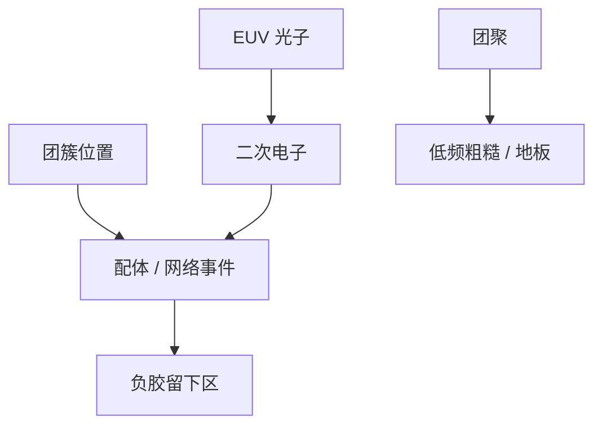

# 金属氧化物胶的随机机制

没有长程酸，随机并不消失：团簇吸不吸到、配体断不断、二次电子走多远，换成另一组可数对象。

<footer>—— 据 Inpria 等对锡氧 / MOR 的公开原理；Naulleau 对材料离散的一般论述</footer>

[上一课](/litho/chemical-stochastic-mitigation)的抑制清单默认 CAR 的 PAG/碱。[锡氧胶](/litho/tin-oxide-resist) 已把成像换成配体解离与金属–氧网络。缺口是随机：MOR 的泊松源是什么、核剩什么、缺陷长什么样。本课钉 MOR 随机机制。干法显影（含部分 MOR 栈）留给[下一课](/litho/dry-resist-develop)。

## 问题

CAR 的可数对象是光子、酸、碱、链。MOR（锡氧笼等）是光子、二次电子、纳米团簇、配体状态。吸收截面高，同样 $E$ 下入射光子可以更少仍够事件——S 角看起来好。团簇数密度若低，每个「像素」很大，R 角被粒子尺寸钉死，低频粗糙来自团聚。没有 $G_a$，有效模糊更接近 $G_e$ 与团簇半径，PEB 不再是同一颗酸核旋钮。

缺口不是重写锡氧化学，而是：OPC 与 MC 必须换抽样对象。把 CAR 的 PAG 泊松模型改个剂量标尺，会把团聚地板认成光子项。

### 负胶工作点改悬崖口令

多数锡氧公开叙述是负胶：曝光区留下。欠剂量则图形缺失（该交联的没连上），过剂量则桥（不该连的连上）或难显影。桥/断口令与正胶 CAR 相反，拓扑仍是连通性。缺陷率曲线照画，只是剂量轴两侧含义要改。

铪、锆氧是同一族其他点。本课用锡氧当代表，换金属等于换吸收边、沾污门与团簇统计，不是换百科。

## 方法

拆实验：加剂量，若 LCDU 按 $1/\sqrt{E}$ 降，光子/电子项在；若很快地板，查团聚与涂布。降后烘：若谱几乎不动，说明没有 CAR 式 $G_a$。换底层：灵敏度与底部缺陷动，电子界面项在。MC：抽团簇位置与每个簇的吸收/配体事件，不要抽「连续酸场加噪声」。

沾污与颗粒是系统缺陷，会伪装成随机。重复曝光对拍仍然有效。

## 机制

高 Z 位点优先吸收，事件集中在簇上。簇间电子可以串话，$G_e$ 造成邻近相关，不是白噪声。网络逾渗：要留下一条线，簇必须连成渗流路径；欠剂量时渗流失败，表现为断或缺，比高斯 CD 更陡——又一次极值。这是 MOR 的 RLS：R 受簇尺寸，L 受簇统计与 $G_e$，S 受锡吸收。

薄胶 + 自身硬掩模减轻倒塌，体积 $V$ 更小，相对涨落更大，必须靠更高吸收补 $N$。High-NA 薄膜预算与随机在这里绑死，不是「金属胶自动更好」。

引用 MOR 随机结果必须写：胶厚、底层、极性、测的是 LER 还是缺孔、沾污是否在合同内。只报「比 CAR 更敏」与只报 loss 同类。

## 边界

不编配体结构、不编 wt% 锡。不把实验室 LER 当量产随机窗。下一课干法显影可以与 MOR 搭配，但干法本身是显影噪声与选择比的另一章，湿法 MOR 仍适用本课团簇机制。

## 小结

- MOR 随机源是团簇 + 二次电子 + 光子，不是 PAG 酸计数的改名。
- 无长程 $G_a$；后烘不是 CAR 那颗核。
- 负胶悬崖口令翻转；逾渗使尾更陡。
- 高吸收买 $N$，团聚买地板；MC 要换抽样对象。
- 出处：Inpria 等公开 MOR 原理；Naulleau；主干[锡氧胶](/litho/tin-oxide-resist)。
