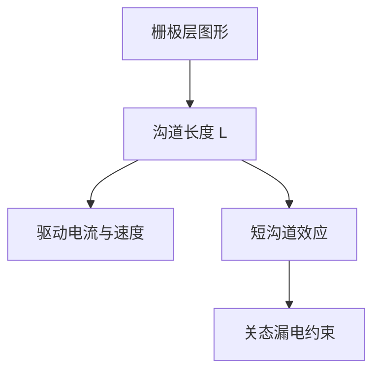

# MOSFET 与栅长

MOSFET 用栅电极控制沟道是否导通；栅长曾是节点尺度的首要标尺，也是必须用图形化单独画出来的关键尺寸。

<footer>—— 据 Sze &amp; Ng, Physics of Semiconductor Devices 对 MOSFET 结构与短沟道效应的整理</footer>

[上一课](/litho/scalar-diffraction-bound)收束了电磁与几何光学的建模层次。新课程「器件与图形化的由来」从这里开始：为什么晶圆上要做图形？因为晶体管不是整块硅，而是按设计图案掺杂、沉积与蚀刻出来的。本课钉 MOSFET 与栅长 $L$。不重写投影物镜，也不把抗蚀剂与照明提前讲完。

## 问题

光学课建立了波、透镜与标量近似的边界。晶圆上最终要的是开关：栅压控制源漏电流。若没有「栅长 = 沟道长度的尺度」这一条，后面所有「必须印准某一层」都没有器件对象。缺口是器件侧：MOSFET 是什么，$L$ 为何曾是节点名里的数字，以及为何这一层图形不能省。

没有空间上的选择——哪里是栅、哪里是源漏、哪里是隔离——整片硅无法变成彼此独立的晶体管。图形化的第一动机就是把这一根栅画在指定位置、指定长度。

### 栅长不是光刻胶里的线宽口诀

$L$ 是栅电极下沟道的有效长度，由栅图形、侧壁、扩散与蚀刻偏差共同决定。光刻画出的是栅层临界尺寸，它与 $L$ 强相关，但不在本课等同。后课工艺偏差会把这条缝拉开；本课只要「必须有一根被图形化的栅」。

默认 n 沟道增强型 MOSFET。栅长 $L$：源漏之间被栅覆盖的沟道长度。阈值 $V_{\mathrm{th}}$ 由氧化层、掺杂与短沟道效应共同定，本课不把阈值公式推完。

## 方法

结构：重掺杂源/漏、栅氧化层加栅电极、电极下的沟道。$V_{\mathrm{GS}}>V_{\mathrm{th}}$ 时反型层连通源漏。驱动电流随 $L$ 缩短而增大，延迟下降；但 $L$ 太短则短沟道效应：阈值滚降、漏致势垒降低、亚阈值斜率变差，关态漏电上升。于是 $L$ 是速度与漏电的共同标尺。

短沟道并不是「再短一点就坏了」的模糊警告：当 $L$ 落到与耗尽区尺度可比，栅对沟道中部的控制被漏端抢走。图形化若把 $L$ 印偏，漏电与阈值一起漂，电路时序和功耗一起坏。这就是栅层被当成关键层的器件理由。本课不把二维泊松方程解出来，只把对象钉在 $L$。

节点名曾直接指栅长的名义值。光刻要印的，正是定义栅极图案的那一层。后课 [节点名不再等于栅长](/litho/node-vs-gate-length) 再说明命名与物理量如何脱钩。本课先承认：曾经，印准 $L$ 就是在印准节点。

阈值电压还依赖氧化层厚度与沟道掺杂，那些主要不是横向图形。本课横向对象是 $L$ 与 $W$；纵向薄膜是另一套工艺，不在「为何要图形」的第一动机里。

## 机制

图形化把「导电的沟道该有多长」写成空间上的一条边。没有这一层，源漏会连成一片，或沟道长度由偶然扩散决定，无法做亿级重复的逻辑。栅层因此是前道最敏感层之一：$L$ 的偏差直接改开关比与功耗。下一课 [CMOS 反相器为什么成对](/litho/cmos-inverter-pair) 说明还需要第二种沟道、第二套分区图形，而不是只印一根栅。

本课不进入如何用衍射把这根线印出来。光学前置已经声明标量与矢量的边界；成像主线在器件课之后才从光程重开。这里只回答：对象是栅。

栅宽（垂直于沟道方向的宽度 $W$）同样由图形化定义，它进入驱动电流的另一因子。本课强调 $L$，因为短沟道效应与节点史都钉在长度上；$W$ 是并联多少沟道的问题，版图上同样是多边形，只是通常不是那条「最细、最怕」的尺。隔离到栅的距离、源漏着陆区，都是同一层或相邻层必须画出来的配套图形。

## 边界

本课不展开 FinFET 或环栅的三维沟道：平面 MOSFET 足够建立「栅长 ↔ 必须图形化」。也不写离子注入、退火与高介电金属栅的工艺清单。分辨公式、胶对比度、离轴照明都不在本课。

三维沟道把「$L$」改成鳍厚、纳米线直径等新尺子，图形化动机不变：导电通道的长度与宽度仍要被图案定义。后课默认：逻辑开关是 MOSFET；栅长 $L$ 是关键横向尺寸；栅层必须被图形化。下一课只补互补对。

## 小结

- MOSFET 用栅控沟道；栅长 $L$ 权衡驱动与短沟道漏电。
- 光刻栅极层的图形与 $L$ 强相关；节点名曾指 $L$。
- 图形化的第一动机：在空间上单独画出这根栅。
- 成像、胶与照明不在本课；下一课解释为何还要成对的 p 管。
- 出处：Sze &amp; Ng, *Physics of Semiconductor Devices*。
