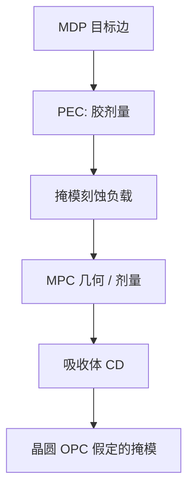

# 掩模工艺修正 MPC

OPC 修的是晶圆空中像；MPC 修的是版上从胶到吸收体的偏置——两套模型，一张掩模。

<footer>—— 对照 mask process correction 与 e-beam / 掩模刻蚀偏置的产线通称</footer>

[上一课](/litho/fracturing)把多边形收成可写的炮。缺口是写出、显影、刻铬/刻吸收体之后，版上 CD 仍不等于数据边：掩模刻蚀有负载，侧壁有倾角，电子雾化有残差。本课钉 MPC（mask process correction）。曲线数据量，留给[下一课](/litho/curvilinear-data-volume）。

## 问题

[PEC](/litho/ebeam-mask-pec) 调的是写剂量，让胶上有效能量更均匀。胶边到金属边还有刻蚀偏置、微观负载和清洗损失。若把这些全塞进 PEC 核，换一套掩模干法配方时剂量模型一起坏。MPC 的对象是**掩模工艺**的几何或剂量补偿：让最终吸收体 CD 贴近 MDP 目标，而不是贴近胶边。

缺口是与晶圆 [刻蚀进 OPC](/litho/etch-in-opc) 同构、但层不同。把 MPC 叫做「版厂 OPC」，会与客户 OPC 抢名：客户 OPC 假定掩模已经是目标尺寸；MPC 负责让这个假定大致成立。

### 几何 MPC 与剂量 MPC

短程偏置可以用扩缩多边形（几何 MPC）；中远程负载可以用剂量微调或第二层密度图。过用几何会制造新 jog、与 MRC 打架；过用剂量会与 PEC 双计数。工程上按空间频率拆：纳米级边移给几何或短程剂量，微米级负载给密度核。

EUV 厚吸收体与高 Z 层的刻蚀偏置不同于二元铬。DUV 铬的 MPC 表不能贴到 Ta 基吸收体上。

## 方法

校准：密集/孤立、通过节距、二维拐角的掩模 CD-SEM 或 AFM，ADI（掩模胶）与 AEI（吸收体）成对。模型进 MDP，在 fracturing 之前或之后应用——之后应用要能改炮尺寸或剂量。签核看的是 AEI 对目标，不是胶边。

与 MEF 的衔接：晶圆看到的是 MPC 之后的残差乘 MEF。MPC 做过头会出现过校正振荡，密区过瘦，同样进 [mask CDU](/litho/mask-cdu）。

## 机制

掩模干法刻蚀的横向偏置随开口率变：密区聚合物多、过刻少，孤立线更瘦（或按化学相反）。这与晶圆 RIE 负载同类，尺度在掩模纳米到微米。MPC 核是这张负荷图的逆。侧壁倾角改变有效透射/反射边缘，进入掩模 3D；二维 MPC 若只修顶 CD，AIMS 仍会报打印差——那是后课鉴定的对象，本课先承认偏置有三维残差。

## 边界

MPC 不消除空白缺陷，不替代 pellicle。它只把掩模工艺的系统偏置收进数据。换胶、换刻蚀腔、换吸收体等于新 MPC。客户 OPC 版本必须与「MPC 后的掩模」绑定，否则窗口数字是另一张版。

后课默认：曼哈顿路径上工艺偏置有人修；曲线层的数据量会先问文件与栅格是否还撑得住这条链。

## 小结

- MPC 补偿掩模显影/刻蚀偏置；PEC 补偿电子剂量；OPC 补偿晶圆成像。
- 短程几何与长程密度核要拆开，避免与 PEC 双计数。
- 签核在吸收体 CD；残差经 MEF 进晶圆。
- 出处：mask process correction 产线通称；掩模刻蚀负载的公开讨论。
