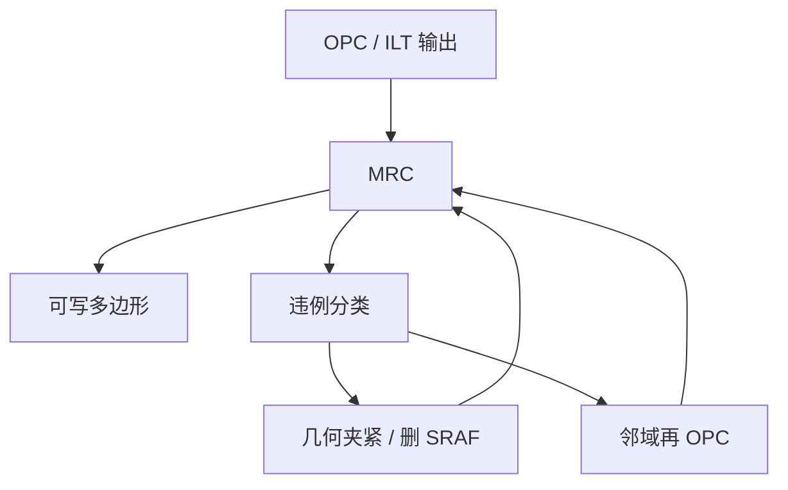

# MRC 修复

检查出违例还不是一张可写的版；修复必须把几何拉回掩模厂合同，同时尽量少吐回已经收住的工艺窗。

<footer>—— 对照掩模厂（mask shop）对 MRC 违例清理与可写性修复的工程通称</footer>

[上一课](/litho/mask-rule-check)把可写集合写成宽度、间距、面积、jog、尖角。缺口是 OPC/ILT 仍然会撞上这个集合：检查器标红之后，谁来改多边形、怎么改才不把 PV-band 送掉。本课钉 MRC 修复。曲线规则留给 [曲线 MRC](/litho/curvilinear-mrc)，本课停在曼哈顿/多边形。

## 问题

模型循环最小化 EPE，MRC 是硬约束。若只在结束时过滤，一夜之间出现成千上万窄缝、尖刺、过短 jog、面积过小的 SRAF。手工修全芯片不可能。必须有自动修复：合并碎片、拉宽/拉缝、删或并助条、倒角、清除针尖。每一步都在改掩模频谱，上一课的窗口可能吐回去。

掩模厂的合同是写入、蚀刻、检测都能过，不是「光学上看着能印」。修复若只图检查器变绿，AEI 热区会回来。问题是带约束的投影，不是美工。

### 修复优先级不是随便的

主图形宽度/间距违例优先于助条：主图形关系到电学连通。SRAF 过密往往直接删或外移。尖角和微 jog 多半是碎片过碎的伪影，合并比继续迭代更稳。面积过小的孔或衬线可能是真的光学需要，删了要再跑局部 OPC，不能只删。

MRC 绿了不等于 mask shop 收下。写入机的剂量图、吸收体蚀刻还有自己的热点。修复输出仍要过一次制造规则，而不是只过设计侧检查器。

## 方法

典型流水：OPC/ILT → MRC → 分类违例 → 规则或模型修复 → 局部再 OPC → 再 MRC，直到清零或人工热区。规则修复快：最小宽度往外推、最小间距往里挤、短 jog 拉直。模型修复在违例邻域重跑带 MRC 惩罚的 OPC，保留窗口。

与其事后修，不如迭代内投影：每步移动后夹紧到合法集合。PW-OPC 的工艺点代价加上 MRC 惩罚，比先炸后修更少振荡。计算预算在热区用模型修，规则区用几何夹紧。

### 掩模厂回环

有些违例只有写出版、量了 CD 才知道（蚀刻偏置、写入模糊）。shop 回注到 OPC 团队，修复规则升级。这是日历项，不是软件按钮。曲线写入会把违例语言改成曲率，但「先投影再签核」的结构不变。

## 机制

几何夹紧改变的是高频：尖刺、窄缝对应掩模频谱的高频，透镜本会滤掉一部分，所以有时夹紧对空中像伤害不大——这是修复能成立的物理理由。但 SRAF 宽度刚好卡在打印阈值上时，夹紧会让助条在角点印出或失效，PV-band 先坏。因此修复后必须在原工艺点上重评带，而不是只跑 MRC。

碎片过短是违例工厂：优化爱用短碎片贴拐角，MRC 恨短 jog。修复合并碎片，等于回到更粗的自由度，窗口可能略放，但可写。这是和 ILT 正则化同一方向的投影。

不要把「fixup 脚本」当成第二套 OPC。它没有独立的物理模型，只有合法集合。签核仍是成像 + 胶 + 刻蚀。

## 边界

本课不写多束机的炮表，也不把曲线曲率规则提前展开。不要发明某 mask shop 的内部规则编号。后课默认：说到 TAPOUT，OPC 收敛与 MRC 清零是同一里程碑的两半。

随机缺陷、空白版坑不是 MRC 能修的。

修复日志要进变更：哪类违例用规则、哪类强制再 OPC。否则窗口回退无法追溯。

## 小结

- MRC 违例必须自动拉回可写集合，不能靠全芯片手修。
- 夹紧改高频；对 SRAF 可能伤 PV-band，修后要重评工艺点。
- 主图形优先于助条；短 jog 宜合并碎片。
- 迭代内投影比结束时一次性修更稳。
- 出处：掩模厂 MRC 与可写性修复的工程通称。
