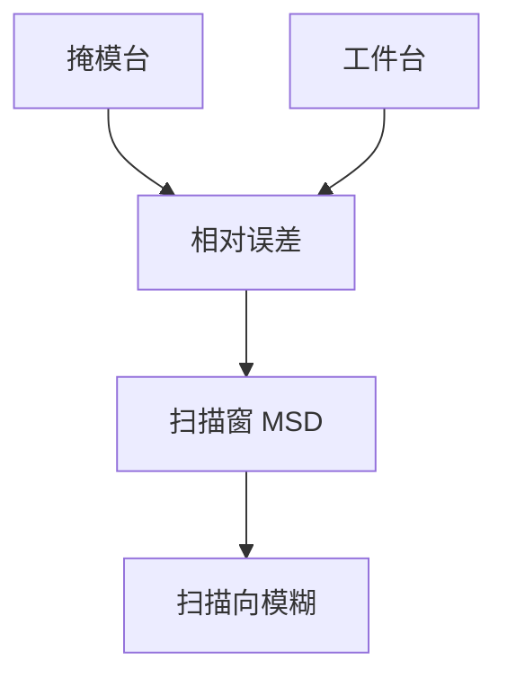

# MSD 同步误差

扫描要求掩模台与工件台按倍率同步。MSD 是相对位置误差的运动标准差：它糊边，像一架振动的狭缝。

<footer>—— 对照 moving standard deviation 同步误差；[狭缝扫描平均](/litho/slit-scan-average)</footer>

[上一课](/litho/stage-acceleration-throughput)把加速写进产能。缺口是匀速扫描段两台是否锁住。本课钉 MSD，不重写套刻向量。

## 问题

投影倍率把掩模运动与晶圆运动绑在一起。相对误差随时间变，积分到像上是沿扫描向的模糊，NILS 掉、LER 升。编码器各报各的「很准」，相对不准一样废。

## 方法

伺服用相对误差作被控量。指标 MSD（moving standard deviation）在扫描窗上算。降 MSD：更硬的控制、更低加速度残振、更好的位置计量。与剂量扫描平均不同：剂量平均强度，MSD 平均的是位置噪声。

High-NA 半场拼接对同步更苛刻：两场接缝处 MSD 会变成可见错位。见 High-NA 课，本课只钉指标。

## 机制

像面位移 $\approx$ 相对台误差 / 倍率关系。时间上的抖动被狭缝驻留时间卷积，等效低通模糊。高频抖更伤边缘。

## 边界

下一课温控：热使尺和空气变，MSD 和干涉仪一起漂。

## 小结

- MSD 是两台相对误差的扫描统计，直接糊边。
- 单台精度好不等于同步好。
- 出处：狭缝课；扫描同步通识。
