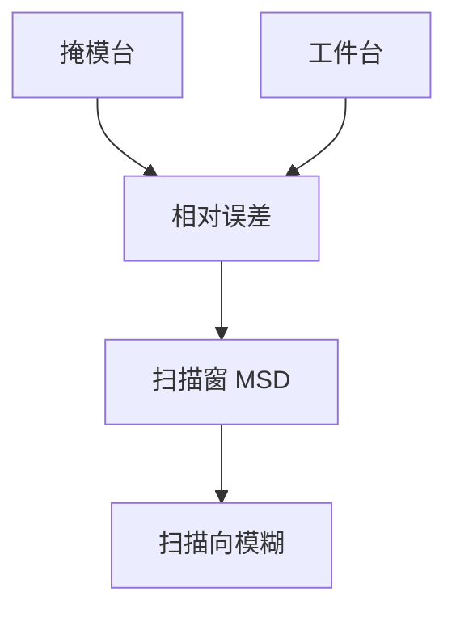

# MSD 同步误差

扫描要求掩模台与工件台按倍率同步。MSD 是相对位置误差的运动标准差：它糊边，像一架振动的狭缝。

<footer>—— 对照 moving standard deviation 同步误差；[狭缝扫描平均](/litho/slit-scan-average)</footer>

[上一课](/litho/stage-acceleration-throughput)把加速写进产能。缺口是匀速扫描段两台是否锁住。本课钉 MSD，不重写套刻向量。先把量级钉住：套刻预算留给同步误差的份额通常只有几纳米，而这要求掩模台按 4 倍速度跑完全场仍然守住——晶圆面几纳米，掩模面就是几十纳米。

## 问题

投影倍率把掩模运动与晶圆运动绑在一起。相对误差随时间变，积分到像上是沿扫描向的模糊，NILS 掉、LER 升。编码器各报各的「很准」，相对不准一样废。

展开：狭缝驻留是毫秒量级，MSD 在这个长度的滑窗上取标准差，等于给相对误差做了一次带通——比窗慢的漂移被平均掉，进套刻账；比窗快的抖动留在窗内，变成模糊。MSD 挑中的频段恰好在伺服最容易漏的地方。后果分两路：密集图形沿扫描向对比下降、[NILS](/litho/nils-ils) 掉、剂量裕度变窄；辅助特征本来就弱，模糊后 [SRAF](/litho/sraf-assist) 印刷阈值漂，CDU 沿扫描向先坏。单台编码器再准也没用——「相对」误差只有在两把尺互相参照时才可见。

## 方法

伺服用相对误差作被控量。指标 MSD（moving standard deviation）在扫描窗上算。降 MSD：更硬的控制、更低加速度残振、更好的位置计量。与剂量扫描平均不同：剂量平均强度，MSD 平均的是位置噪声。

工程抓手按频段排：低频靠 4:1 速度前馈的配比精度，高频靠编码器栅尺质量与安装、气浮或磁浮刚度，基础隔振把地面与真空泵的振动挡在外面（[振动隔离](/litho/vibration-isolation)）；加速段的残振必须在进入匀速段前收敛——那是上一课的账，但收敛不好会漏进 MSD。计量侧不靠机械感觉：套刻监测片上的光栅标记在扫描中分两次采样狭缝不同时刻的像，衍射式套刻读出（[DBO](/litho/yieldstar-dbo)）给出位移分布的宽度，就是可量产读数的 MSD。指标进 [套刻预算](/litho/overlay-budget)与 CDU 周报，按方向分别记账——扫描向与非扫描向的灵敏度不同。

```mermaid
flowchart TD
  RT["掩模台"] --> REL["相对误差"]
  WF["工件台"] --> REL
  REL --> MSD["扫描窗 MSD"]
  MSD --> BLUR["扫描向模糊"]
```

High-NA 半场拼接对同步更苛刻：两场接缝处 MSD 会变成可见错位。见 High-NA 课，本课只钉指标。

## 机制

像面位移 $\approx$ 相对台误差 / 倍率关系。时间上的抖动被狭缝驻留时间卷积，等效低通模糊。高频抖更伤边缘。

把这句话写全：曝光期间像面上每一点接收的是狭缝扫过期间误差分布的加权积分，空中像沿扫描向与误差核卷积，核的宽度就是模糊量，MSD 是它的一阶代理。频域看，滑窗平均压制低频、放过与驻留时间相当及更高的频率，所以伺服带宽必须盖住狭缝驻留频段，否则「平均指标正常、边缘照样糊」。步进机没有扫描就没有这个误差通道，振动只表现为整场模糊（[步进与扫描](/litho/stepper-vs-scanner)）；掩模一侧还要留意装夹与同步标记的贡献，别把掩模面误差全记到晶圆台头上。

## 边界

下一课温控：热使尺和空气变，MSD 和干涉仪一起漂。另外 MSD 只计随机分量：均值的同步偏差走套刻模型与对准账，不在这里重复记账。

## 小结

- MSD 是两台相对误差的扫描统计，直接糊边。
- 单台精度好不等于同步好，相对误差要互参才能见。
- 滑窗把它做成带通：慢漂移进套刻账，快抖动留在本课。
- 出处：狭缝课；扫描同步通识。
