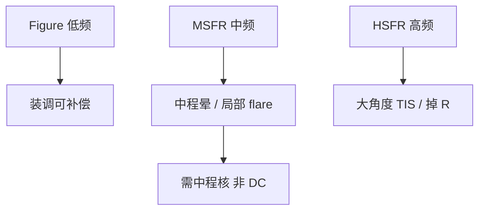

# 中频粗糙 MSFR

MSFR 夹在面形与高频抛光之间：空间波长从毫米落到微米。它既不像 Zernike 那样好补偿，也不会全部进大角度 TIS。

<footer>—— 据 Zeiss 对 MSFR 分频；Gullikson 散射与小角度晕</footer>

[上一课](/litho/mirror-figure-error)把低频面形收进波前。缺口是中间那一档：mid-spatial frequency roughness（MSFR）。抛光和镀膜最容易在这里留下「既不像像差、又不像雾」的晕。能量预算如何被镜面张数再乘一次，留给[下一课](/litho/reflectivity-mirror-count)。

## 问题

面形可以用刚体装调和少量能动补偿。高频主要掉峰值 $R$、喂大角度散射。MSFR 对应的散射角把能量送到邻近视场点：局部 flare、条纹状对比损失、以及与图形密度相关的中程底座。Kirk 全场积分会把它和高频 TIS 混在一个百分数里，OPC 若只用 DC flare，会修错空间尺度。

缺口是给这档频率单独建桶，而不是再用一个 RMS。收集镜溅射坑的相关长度往往落在中频；投影镜则看抛光纹和镀膜复制。功率清洗课的不可逆项，很大一块以 MSFR 的形式进入投影链。

分频边界没有国际法定值，工程上按「可补偿像差 / 中程晕 / 大角度 TIS」切。写规格必须同时写空间波长窗口，不能只写「MSFR $\lt$ x nm」。

## 方法

计量：白光或 EUV 散射、子孔径干涉、原子力显微镜，覆盖不同空间频段，拼成 PSD。规格按频带积分的 RMS 或按 PSD 包络。镀膜后复测：多层会滤波或复制基底 MSFR，相关界面让中频散射增强。

计算光刻：把中程核从长程 flare 里拆出来，核宽度对应 MSFR 散射角在硅片上的尺度（数十到数百微米量级，随 NA 与光学布局变）。换光瞳时照射足迹变，有效 MSFR 贡献会变，SMO 要重评估，不能只重算标称 TCC。

### 抛光纹的各向异性

离子束或机械抛光常留下优势方向。MSFR 因此不是各向同性晕：某一方向的中程底座更强，密集线与垂直线的 PV-band 差会像「照明不对称」。先查镜子 PSD 的方位，再改极子。收集镜溅射坑较随机，投影镜抛光纹较定向，两面的中程核形状不同。

## 机制

散射角 $\theta_s \sim \lambda f$，其中 $f$ 是表面空间频率。13.5 nm 下，毫米⁻¹ 到微米⁻¹ 的 $f$ 把光送到视场内可观的距离，却仍可能落在光瞳里被当成「像的一部分」。于是 MSFR 表现为像质退化而不是纯粹杂散：NILS 掉、孤立线和密集线的偏置差加大。这与 [EUV flare](/litho/euv-flare-ml) 课的「中频把能量送到几十到几百微米」是同一物理，本课把它标成镜子出厂与运行必须单独管的频段。

氢致起泡、帽层粗化会在运行中抬 MSFR。收集镜更明显；投影镜一旦中频变差，通常没有原位「抛光」，只能防污染和控热。

不要把 MSFR 写成「比 figure 差一点的抛光」。补偿手段不同：一边是刚体，一边几乎只能在制造阶段杀掉。

## 边界

本课不把六镜透过率乘积算完，下一课才把 $R^N$ 写成功率预算。不重写 Kirk 实验步骤。MSFR 规格必须带空间频率窗口，一个 RMS 会把面形和高频误并进同一桶。出处：Zeiss MSFR；Gullikson PSD–散射；Naulleau；Bakshi 光学公差。

## 小结

- MSFR 是中频高度误差，产生中程晕，装调补不掉。
- 规格必须带空间频率窗口；运行污染会抬这一档。
- 下一课：在面形和粗糙都已被分段之后，反射率与镜数如何规定光源。
- 出处：Zeiss；Gullikson；Naulleau；Bakshi。
