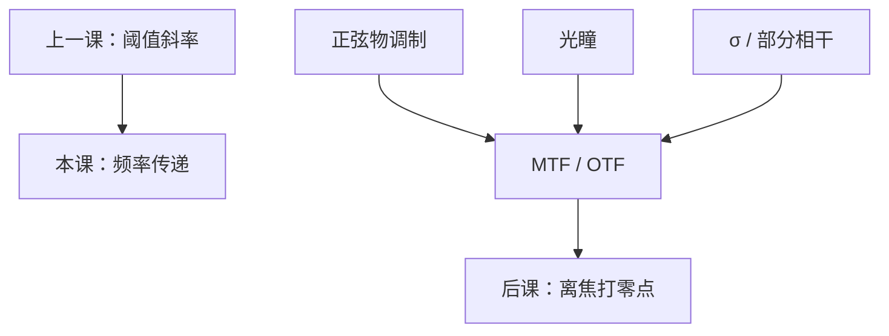

# MTF

NILS 问一条边在阈值处有多陡；调制传递函数问：正弦物的调制度随空间频率怎样被光学系统吃掉。

<footer>—— Goodman, Introduction to Fourier Optics 的 OTF / MTF；光刻读法见 Mack</footer>

[上一课](/litho/nils-ils)把工艺灵敏度钉在阈值处的 $\mathrm{ILS}/\mathrm{NILS}$。缺口是：**还没有一条「频率 → 还剩多少调制」的传递曲线**。NILS 依赖具体图形与阈值；MTF 先对正弦物说话。离焦如何沿轴毁掉调制，留给[焦深](/litho/depth-of-focus)。不要把 MTF 写成产线 $k_1$，也不要引用未公开的镜头验收 MTF 表。

## 问题

对比度 $C$ 对密栅是一个数，对「所有节距」不是一条函数。线性（非相干）系统里，物调制度乘光学传递函数（OTF）得到像调制度；MTF 是其模。光刻照明是部分相干，严格传递是 Hopkins 的双线性核，不是单条 MTF——但单条 MTF 仍是读「高频先死」的最短语言。缺口因此是这条频率轴上的传递，而不是再乘一次目标 CD。

上一课已经说明 $C$ 与 NILS 不可互换。本课补的差是：正弦传递与阈值斜率也不可互换。同一套空中像，可以 MTF 看起来还行，切在缓坡上则 NILS 已经死。

### 相干、非相干、部分相干三条截止

完全相干：复振幅的传递就是光瞳，截止 $\mathrm{NA}/\lambda$，MTF 作为强度传递不是线性的。完全非相干：MTF 是光瞳的自相关，截止 $2\mathrm{NA}/\lambda$，在截止处降到零。部分相干落在中间，有效截止与 $\sigma$ 有关：$\sigma$ 越大，越接近非相干的那条自相关。Mack 用这组图衔接空中像；定量工艺仍回到 NILS 与 TCC。

显微镜习惯把 MTF 画到对比刚可分辨；光刻要的是阈值处还能切规格。把「MTF=0.3」直接叫成可印，等于又发明了一个没有胶的 $k_1$。

## 方法

非相干点扩散的傅里叶变换（归一到零频为 1）即 OTF；MTF $=|\mathrm{OTF}|$。圆孔无像差时，MTF 随频率近似线性下降到 $2\mathrm{NA}/\lambda$。离焦给 OTF 乘相位因子，MTF 出现零点与对比反转——后课焦深把零点沿 $z$ 移动。像差同样压 MTF，尤其靠近截止的密图形。

光刻实践：用线栅对比度对节距扫一条「有效 MTF」，照明一换曲线就换。它是诊断图，不是 Hopkins 的替代。报曲线必须声明 $\sigma$、偏振与是否矢量。

### 与 NILS 的分工

正弦物的 MTF 在某个频率高，只说明该频率的亮暗差还在；边沿位置由所有频率叠加后的局部斜率决定。孤立线的频谱很宽，NILS 吃的是整条加权，不是单点 MTF。设计规则里用 NILS 设门槛，用 MTF 解释「为什么密节距先糊」。

OTF 可以是负的（对比反转），MTF 取绝对值会丢掉符号。光刻里反转意味着空中像的峰谷对调，阈值模型会切出完全错误的线宽。

## 机制

非相干成像是强度卷积，频率域相乘，高频对应光瞳里相距很远的两点的相关，自相关面积变小，MTF 下降。相干成像是场卷积，强度再取模方，不存在单条 MTF。部分相干把许多互不相干的源点各自做相干成像再加强度，有效传递介于两者之间——这与[部分相干](/litho/partial-coherence)课的 $\sigma$ 是同一机制的频率语言。

切趾改光瞳自相关，因而改非相干 MTF；像差主要改相位，MTF 掉、还可能出旁瓣。本课不展开 Zernike；只承认 $P$ 的相位已经能进 OTF。

### 后课默认的接口

说到「光学还剩多少调制」，正弦语言用 MTF，边与窗口用 NILS，完整计算用 TCC。下一课把离焦写成二次相位，MTF$(f;z)$ 与 NILS$(z)$ 一起掉。不要在焦深公式里用 MTF 零点冒充 $k_2$。

## 边界

MTF 不含胶扩散、不含 SEM 偏置。矢量成像改的是进入 OTF 的那张 $I$，定义不变。禁止把某代投影物镜的「衍射极限 MTF」写成未公开验收数；Goodman 的圆孔曲线与 Mack 的光刻读法已经够用。二维图形没有单条 MTF 能概括拐角。

## 小结

- MTF 是正弦物调制度随频率的传递；NILS 是阈值处的边斜率。
- 非相干截止 $2\mathrm{NA}/\lambda$，相干截止 $\mathrm{NA}/\lambda$，部分相干居中。
- 离焦与像差压 MTF，并可造成对比反转。
- 光刻定量仍以 NILS / TCC 为准，MTF 是读高频先死的短语言。
- 轴向窗口下一课。
- 出处：Goodman, *Introduction to Fourier Optics*；Mack, *Fundamental Principles of Optical Lithography*。
