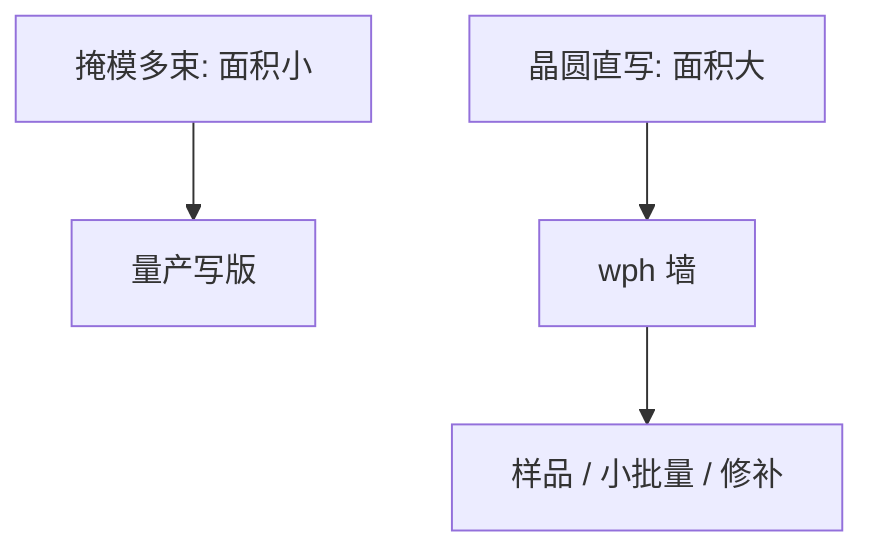

# 多束电子束直写

掩模多束已经量产；晶圆直写仍撞面积×剂量墙。无掩模对逻辑全片是另一道产能物理，不是把写版机放大。

<footer>—— 对照 MAPPER/IMS 一类晶圆多束直写尝试与掩模多束成功的公开对照</footer>

[上一课](/litho/3d-nand-litho-shift)结束节点经济课序。缺口是：能否绕过掩模。本课钉多束电子束直写（晶圆）。干涉光刻作为周期图形的另一条路，留给[下一课](/litho/interference-lithography）。

## 问题

[多束写掩模](/litho/multibeam-mask-writer) 成功，因为 6 寸版面积有限、一张版服务许多晶圆。晶圆直写要把每片都写满，面积大两到三个数量级，即使十万束，wph 仍难跟扫描机比。MAPPER 等项目展示过原理与部分产线故事，量产逻辑全片未取代光学。用途残留：研制、小批量、个性化、修补、对准标记、某些封装。

缺口是**面积墙**，不是束斑能不能细。把掩模多束的成功直接写成晶圆无掩模量产，单位错了。

### 与 PEC 的关系

晶圆直写仍要电子 PEC，邻近核与衬底有关，和光学 OPC 不同。混合流程（光学粗 + 电子修）是可能工程，不是本课重点。

无掩模的价值在掩模成本摊不薄的时候（样品、多品种），与交叉课的「量大摊销」相反。

## 方法

比较：写时间 ∝ 面积 × 剂量 / 总电流。扫描机：一场光学并行。只有当品种极多、面积极小或分辨率光学达不到时，直写胜。规划不要用直写去填 EUV 槽位缺口——量级不对。

## 机制

光学投影一次性把掩模场印到晶圆；直写是串行（尽管多束并行度高）。并行度必须赶上场像素数才有同等 wph，这正是掩模多束够用、晶圆不够的原因。

## 边界

不宣布直写永远失败。源电流与胶灵敏度的未来改善可能移动墙，仍须过面积算术。不写某已停项目的内部规格。

后课默认：全片无掩模电子束不是先进逻辑的主路径；下一课干涉法用光子的并行性印周期结构。

## 小结

- 晶圆多束直写撞面积×剂量墙；掩模多束因面积小而量产。
- 适合小批量与研制，不适合填 EUV 产能缺口。
- 并行度必须比上场像素数。
- 出处：晶圆多束直写与掩模多束的公开对照。
