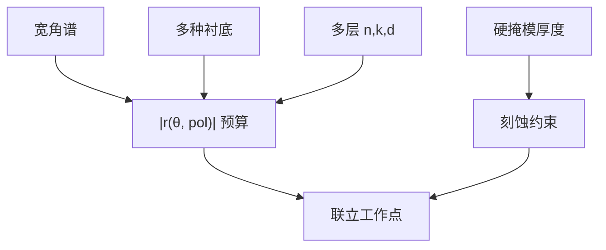

# 多层底部抗反射

单层 BARC 只能在有限的角度和衬底上把 $r$ 赶到零附近；高 NA 的角谱宽、衬底种类多，要用两层以上把导纳匹配做宽。

<footer>—— 分层减反见 Born &amp; Wolf；光刻 SiARC / 双层 BARC 的工艺读法见 Mack、Levinson</footer>

[上一课](/litho/tarc)收了顶头。缺口是：单层有机 BARC 靠吸收吃反射，在**宽角、多衬底**上往往留残 $r$，浸没矢量课已经要求对角谱积分。本课钉多层底部抗反射（无机 SiARC、有机+无机、双 BARC）。形貌台阶上的局域反射留给[下一课](/litho/topography-reflection)。不重写主干 BARC 课的侧壁波纹叙事，只补层结构。

## 问题

单层减反：厚度与 $n,k$ 三个自由度，对一个 $\lambda$、一个 $\theta$、一个衬底可以近零。光瞳里 $\theta$ 从 0 到 $\arcsin(\mathrm{NA}/n)$，衬底从介质到金属变，单层零点变成「某个角很好、边缘光线仍亮」。残 $r$ 进驻波与 swing，EPE 随场角和图案取向变——看起来像照明问题。

多层：增加界面，用干涉加吸收在角谱上做宽带匹配。典型产线语言：有机 BARC + 含硅无机层（SiON / SiARC），无机层兼硬掩模，有机层调相位与吸收。双有机层则两套 $n,k,d$。缺口是承认**底部减反是角谱设计**，不是涂一层「黑胶」。

### 硬掩模不是副产品

高 NA、薄胶时，光学 BARC 往往不够当刻蚀掩模。多层里的无机层承担转印，光学厚度仍进 $r$ 的矩阵。改硬掩模厚度等于改减反，不能只按刻蚀选择比选 $d$。上一课胶厚与 BARC 联立，这里变成胶厚与**两层以上**联立。

SiARC 开口刻蚀多一步，缺陷与偏置进 AEI EPE。光学最优若要求极薄无机层，刻蚀会否决。工作点是光学 $|r(\theta)|$ 与转印的交。

## 方法

对目标衬底集合与角谱，优化各层 $n,k,d$，使加权平均 $|r|^2$ 低于预算，并约束刻蚀厚度。s/p 分开看：浸没密线的 TE 权重高，平均不要用非偏振正入射偷懒。换金属层必须重优化，抄介质层的双 BARC 会在金属上回到大摆动。

验证：变胶厚的 swing 振幅、变 NA / $\sigma$ 的残驻波、以及不同衬底垫上的 CD。若只有一种测试垫合格，多层匹配不够宽。

### 与矢量 TCC 的接口

薄膜矩阵对每个源点、每个偏振给出胶内沉积权重，进矢量 Abbe / TCC。多层 BARC 改的是这张权重，不改光瞳截止。OPC 换 BARC 栈等于换光学模型，旧 SOCS 核作废——与换照明同级，不是「轨道小事」。

## 机制

每层贡献相移与吸收。吸收把从衬底回来的振幅在往返中吃掉；干涉把残余赶到与下层反射反相。宽带靠层间色散和厚度把零点错开，使角谱上没有共同的亮带。单层高 $k$ 也能吃光，但可能在胶底留下过暗、剖面脚、或开口刻蚀窗口差；多层把「吃光」和「相位」分给不同层。

## 边界

本课不给某节点的层数与纳米厚度。EUV 下「BARC」常变成 underlayer / 硬掩模吸收层，机制在末课。禁止编造国产 BARC 的 $n,k$ 表。也不要把多层 BARC 写成 RET：它不抬 NILS 的光学截止，只把假的 $z$ 调制拿掉，让横向 NILS 接近无衬底计算。

## 小结

- 单层 BARC 对宽角、多衬底自由度不够。
- 多层用干涉+吸收做角谱匹配，无机层常兼硬掩模。
- 厚度联立胶、光学与刻蚀；换衬底必须重优化。
- 换栈 = 换 TCC 权重，OPC 核作废。
- 下一课：平面分层在台阶上失效。
- 出处：Born &amp; Wolf；Mack；Levinson。
