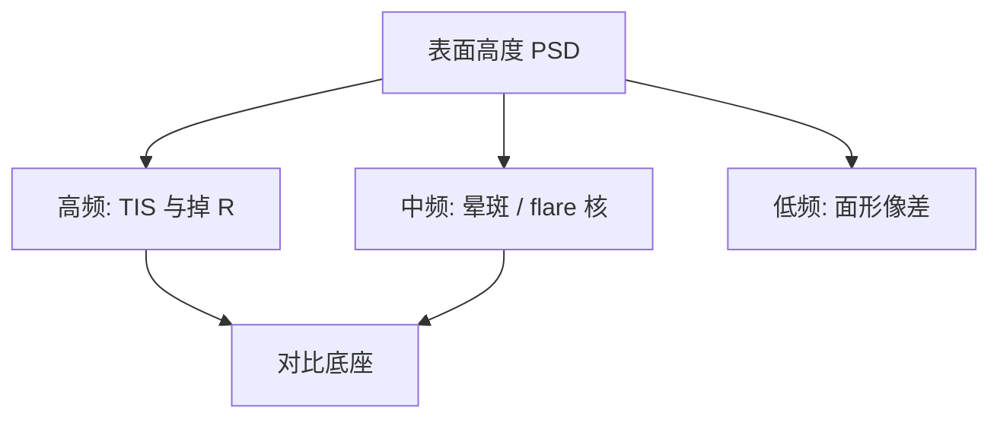

# 多层膜粗糙与散射

峰值反射率报的是镜面那一束；埃级界面粗糙把带内光打进错误角度，对比以 flare 底座的形式付钱。

<footer>—— 据 Gullikson / Naulleau 对 EUV 散射与 TIS；Mack 对 flare 的定义</footer>

[上一课](/litho/collector-cleaning)把收集镜上洗得动的锡清掉。缺口是洗不动的和从来就镀在膜里的：多层界面粗糙。它不挡平均功率那么显眼，却把正确波长送进错误方向。[EUV flare](/litho/euv-flare-ml) 已经用成像语言写过底座；本课从等离子体到镜面这条课序，把粗糙写成光学表面的空间频谱。低频面形留给[下一课](/litho/mirror-figure-error)。

## 问题

清洗恢复的是可反应污染物的光学厚度。界面互扩散、沉积颗粒、溅射坑和抛光残留，是多层作为体光栅的相位误差。13.5 nm 下，同样埃级高度的散射截面远大于 193 nm。总积分散射（TIS）从每一面镜子进入光瞳外和视场外，六面投影相乘，暗区被垫高。

缺口不是再定义 flare，而是：粗糙在哪一段空间频率上、如何同时吃反射率并喂散射。只盯峰值 $R$，会放过「镜子仍亮、对比已死」。

带外漏光是错误波长；本课的散射是带内走错角度。剂量环加功率补得了平均 $R$，补不了 TIS 核。

## 方法

把表面高度谱按空间波长分段：低频面形（figure）改波前与像差；中频（后课 MSFR）改小角度晕和局部杂散；高频改大角度 TIS 和峰值 $R$。多层还要加界面互相关：钼硅界若复制基底粗糙，等效粗糙沿深度相干叠加，散射比单界面更狠。Gullikson 等用 EUV 散射仪把功率谱密度（PSD）连到带内散射；Naulleau 把掩模和光学的中高频一起写进 LER 预算。

工艺旋钮在镀膜：离子束或磁控的能量、温度、阻挡层，压互扩散；基底抛光压高频。收集镜的径向周期渐变必须在粗糙之上仍然对准布拉格角，否则散射和失谐一起出现。

### 收集镜与投影镜不要共用一个 TIS 数

收集镜离等离子体近，溅射坑主导中高频，主要改 IF 功率和填充。投影镜在干净腔里，抛光与镀膜复制主导，直接进空中像 flare。把收集镜变暗写成 POB 对比损失，会去洗错一面镜子。分层计量：IF 侧看功率与光瞳，硅片侧看 Kirk 或等价暗垫。

## 机制

标量估计里，小粗糙度的 TIS 随 $(4\pi\sigma\cos\theta/\lambda)^2$ 走。λ 缩小一个数量级，σ 必须一起缩小，否则 TIS 不可接受——这是蔡司要把 EUV 基底做到原子量级光滑的原因，不是「光学工匠癖」。多层的每一界面都贡献；帽层氧化或氢致起泡再加一层时变粗糙，清洗课的不可逆项在这里变成散射合同。

散射光仍是 13.5 nm，胶会曝光。OPC 可以卷积一个密度相关的 flare 核，前提是核稳定。收集镜随寿命变糙，核会走，全场 CD 指纹跟着走。因此粗糙既是出厂规格，也是运行规格。

Zeiss 公开强调面形、MSFR、HSFR 分频管理。不要用一个 RMS 纳米数打天下——不同频段进不同的像质桶。

## 边界

本课不把低频面形的 Zernike 拟合写完，那是下一课。不重写 Kirk 测试步骤。出处：Gullikson EUV scatter；Naulleau 掩模/光学粗糙；Mack flare；Zeiss EUV 光学分频；Bakshi 多层界面。

## 小结

- 多层粗糙同时降低峰值 $R$ 并增加带内 TIS，短波把埃级高度放大成对比税。
- 空间频谱必须分段；清洗恢复不了溅射造成的中高频。
- 下一课专攻低频：镜面形状误差。
- 出处：Gullikson、Naulleau、Mack、Zeiss、Bakshi。
