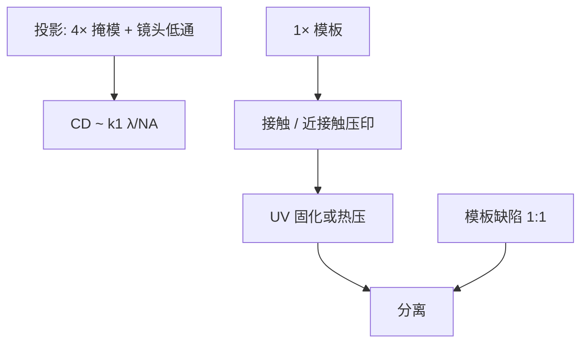

# 纳米压印对照

纳米压印没有投影物镜，也没有 $k_1\lambda/\mathrm{NA}$ 那一截光学低通。它把 1× 模板压进抗蚀剂，分辨率跟模板走，套刻、缺陷和寿命另开一张账单。

<footer>—— 对照 Chou 的纳米压印实验，以及 Canon NIL 公开机型相对投影光刻的定位</footer>

[上一课](/litho/dsa-dpt)用热力学周期补光刻节距，导向仍是投影写的。缺口是另一条非投影路：纳米压印（NIL）——模板与晶圆接触或近接触，把图形复印进聚合物。本课对照它**不是**扫描投影。HBM 与混合键合从下一课起换封装互连，不再把压印当先进逻辑的默认替代。

## 问题

投影光刻的截止在镜头光瞳；再密的掩模频谱也进不去。Chou 等人把亚 25 nm 的孔槽压进聚合物，绕开的就是这截低通：模板上有的空间频率，胶里原则上都能留下，只要填充和分离不毁图形。问题立刻换成模板：1×、与晶圆同尺寸量级的图形密度，缺陷直接 1:1 打印，没有 4× 缩比把掩模 CD 放宽。

Canon 公开的 NIL 机型把这条路写成存储等重复图形的选项：吞吐、套刻和缺陷要在没有物镜的前提下另做。把它写成「便宜的 EUV」，会漏掉 1× 模板厂、对准策略和接触缺陷。

### 1× 不是 4× 的简化版

投影掩模 4×，掩模 CD 更松，掩模误差因子另算。NIL 模板与晶圆同倍，模板 LER、颗粒和损伤直接进晶圆。写模板仍要电子束，只是写一次、压许多次。寿命、清洗和检验是 NIL 的掩模厂，不是光学 pellicle 那一套。

步进压印一场一场来，场拼接与投影扫描的场拼接物理不同：一个是模板接触对齐，一个是物镜像场。

## 方法

热压印把聚合物加热过玻璃化再压；紫外压印（UV-NIL）在低黏度单体里压，紫外固化再分离，更接近室温对准。Canon 公开材料把晶圆级步进 NIL 写成与扫描机并列的图形化工具：对准仍要做，但传感器看到的是模板与晶圆标记，不是掩模台与 4× 镜头。套刻预算里接触力和变形是新项。

缺陷：气泡、未填满、分离拉丝、模板上的永久性颗粒。重复图形（NAND 等）比逻辑二维随机布线更吃得消，因为缺陷抽样和冗余不同。本课不写未公开的 Canon wph 去和 NXE 比产能；对照的是成像原理，不是报价单。

### 与 DSA 的差别

DSA 的最终节距可以比导向图更密，热力学选 $L_0$。NIL 的最终节距就是模板节距，没有「自组装倍频」，除非模板本身已经用 DSA 或电子束写出密图。两者都常被放进「下一代光刻」目录，机制正交：一个是相分离，一个是流变填充。

## 机制

光学链在 NIL 里收缩成对准与固化波长（UV-NIL 的曝光只为交联，不当成像物镜）。分辨率极限变成模板制造、聚合物分子体积和分离损伤。套刻：接触后的剪切与热膨胀会把已对准的标记再挪一次，必须在力控和温度上收。这与扫描机的镜头畸变、工件台编码器不是同一组热源——后两课才写投影机里的掩模/晶圆热，不要把压印力混进去。

投影的工艺窗在剂量–焦点；NIL 的窗在压力、填充时间和分离速度。焦深这个词在压印里几乎没有对应物，残胶厚度才是。

「没有光学极限」不等于没有极限。模板电子束写入、检验和损伤决定能印多密、能印多久。

## 边界

不要把 NIL 写成已经替换逻辑 EUV。公开对照是原理与存储类重复图形的试点/量产叙述，按厂商当时文本读。不要发明国产压印机的片/小时。本课不重写电子束直写——那是模板怎么来，不是晶圆每片都直写。

投影光刻的计算 OPC 对 NIL 变成模板数据准备和残胶均匀性，模型族不同。不要用 TCC 去「优化」压印接触孔。

出处：S. Y. Chou, P. R. Krauss, P. J. Renstrom 的纳米压印开创实验（Appl. Phys. Lett. / *Science*）；Canon NIL 公开产品与原理对照。不编造与 EUV 的产能对赌表。

## 小结

- NIL 是 1× 模板复印，不是投影成像，不适用 $k_1\lambda/\mathrm{NA}$ 作为主方程。
- 缺陷与套刻跟模板寿命、接触力走，不跟镜头 NA 走。
- 与 DSA 同属非投影互补，机制分别是填充复印与相分离。
- 重复图形比随机逻辑更适合这条对照。
- 封装互连下一课，本课停在晶圆图形化对照。
- 出处：Chou；Canon NIL 公开材料。
