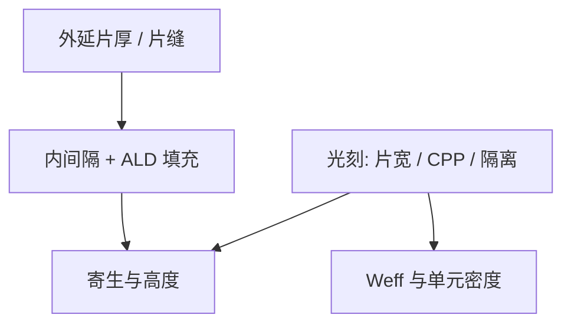

# nanosheet 间距

GAA 把有效宽度交给片宽和片数；片与片之间的垂直间距是填充窗口，横向节距仍是光刻合同。

<footer>—— 对照 imec 对 nanosheet / GAA 几何与间距的公开展望</footer>

[上一课](/litho/finfet-gaa)把沟道从三面鳍换成四面纳米片，并点名释放刻蚀与内间隔。缺口是几何里那几段「间距」各由谁决定：哪些是外延/刻蚀，哪些仍是光刻 CD。本课钉 nanosheet 间距。背面供电如何改布线，留给[下一课](/litho/backside-power)。

## 问题

FinFET 的鳍节距是前道光刻加多重图形的硬节距。GAA 纳米片把**垂直**方向的片厚、片间距交给外延超晶格和释放，片与片之间要留给内间隔和功函数金属的填充缝。间距太小，[ALD](/litho/ald-ale) 填不进、阈值分裂；太大，堆叠高度涨，后段介质与寄生一起坏。imec 公开讨论把这组垂直几何写成器件截面预算，而不是又一层 EUV。

横向仍要光刻：片宽（几乎连续可调的 Weff）、器件隔离、假栅/替换栅节距（CPP）、接触。上一课的静电学故事若没有横向节距，单元高度下不来。缺口是把「间距」拆开，避免把所有纳米都写成光刻。

### 片宽不是鳍节距的换皮

鳍宽被量化，且与鳍节距耦合。纳米片宽度在浅槽前由设计画，密隔离与宽驱动可以在同一高度下并存。限制它的是光刻与隔离填充，以及释放后片的机械下垂。横向最小间距仍服从 $k_1\lambda/\mathrm{NA}$ 与多重图形，GAA 并不赠送一层免费分辨率。

Nanosheet、MBCFET、RibbonFET 的公开片数、片厚不同。写间距用截面角色（片厚、片缝、CPP、隔离），不要把产品名换算成唯一纳米表。

## 方法

垂直：Si/SiGe 周期决定片厚与牺牲层厚；释放后的空腔 = 片缝。内间隔从空腔里「吃掉」一部分横向栅漏电容空间，剩余才是金属填充窗。这串步骤的变差是 ALE/选择性刻蚀变差，不是扫描机剂量。

横向：片宽 OPC 按隔离环境修；CPP 与鳍/片阵列节距仍走前道 EUV 或多重 DUV。接触孔与通孔见接触课。DTCO 用片宽档换驱动，用垂直片数换电流密度，用 CPP 换密度——三个旋钮来源不同。

### imec 截面里的光刻可读点

公开截面强调：片缝给 WK 金属；forksheet 用介电墙再削 N/P 间距——墙的位置又回到横向光刻与刻蚀。读 imec 图时先标：哪条尺寸是外延周期，哪条是光刻 CD。本课只训练这张读法。

## 机制

自然长度吃片厚；寄生电容吃片缝和内间隔；密度吃 CPP 与隔离。光刻能直接动的是后两者的横向部分。垂直片缝若为填充让路而加大，芯片高度涨，BEOL 地形变难，[后道 EUV](/litho/beol-euv) 的焦深更紧。所以器件课的间距会反馈到后道光刻，不是单向的。

片下垂与粘连：释放后片是梁，间距与片宽决定刚度。过宽的片在过大空腔下更易变形，变成良率而不是 OPC 问题。

不要把实验室 CFET 的垂直 N/P 间距写进当前 nanosheet 量产间距表。CFET 是后续课的拓扑。

## 边界

本课不重写 FinFET 静电学推导，也不给未公开的片缝纳米规格。不要发明 imec 某张幻灯片上的精确 nm 当作标准。片数（公开讨论常见三至四片）是垂直电流档，与横向隔离节距独立：加片不加平面脚印，但加高度。后课默认：GAA 间距要问垂直还是横向、工艺还是光刻。

引用 imec GAA / nanosheet 公开技术论述。

片宽连续可调，仍受 MRC 与隔离规则离散化。库不会真的按 1 nm 一档无限枚举。

## 小结

- 垂直片厚/片缝主要是外延与释放；横向片宽、CPP、隔离仍是光刻。
- 片缝是 WK 金属与内间隔的填充窗，太小填不满，太大高度与寄生涨。
- GAA 不取消前道节距缩放。
- 器件高度会反馈后道地形与焦深。
- forksheet 的介电墙把 N/P 横向间距再交给光刻与刻蚀。
- 片下垂与粘连是释放后的机械问题，不是 OPC 能修的边。
- 出处：imec nanosheet / GAA 公开展望。
