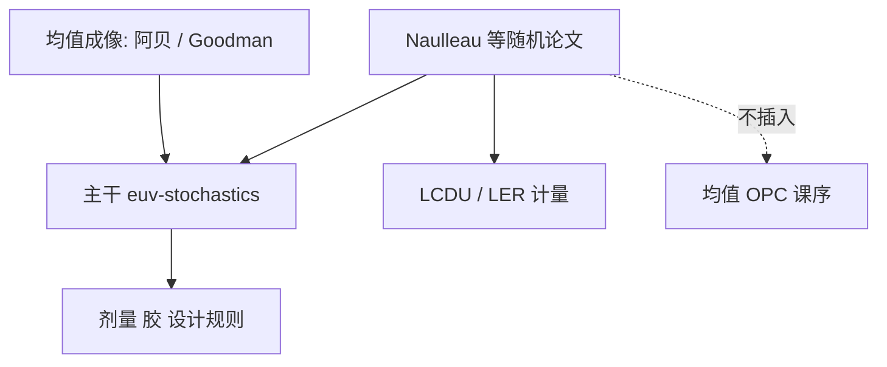

# Naulleau 随机效应

EUV 的随机不只是「胶不理想」：光子计数、二次电子和材料团簇把均值空中像变成缺陷分布；文献把这条尾巴写成可测的 LCDU 与失效概率。

<footer>—— 对照 Patrick P. Naulleau 等对 EUV 随机效应、LER 与光子噪声的公开论文（SPIE / JM3 等）</footer>

附录对照，不插入主干。[上一课](/litho/goodman-fourier-optics)对照了标量傅里叶成像。本篇对照 Naulleau 等关于 EUV 随机效应的公开论文：主干 [随机效应与光子散粒噪声](/litho/euv-stochastics) 已按课序把 92 eV 光子、泊松尾和剂量–胶折中写进产线；论文则是计量、实验与模型如何把这条尾巴钉死。这里只对照，不插入光源或 OPC 主干，也不把某次会议的剂量数字写成厂内规格。

## 问题

主干随机课从 NXE 剂量合同出发：光子数少，接触孔里几十到几百个光子，$\sqrt{N}/N$ 变成 LCDU、断线、缺孔；还叠酸发生剂与分子团簇。缺口是文献：谁在实验上把「均值 OPC 修不掉的尾巴」从胶噪声、掩模噪声和光子噪声里拆开。Naulleau（LBNL/CXRO 传统）的公开工作是这条线上被反复引用的实验与综述之一。

Goodman 给均值场成像；随机论文给的是围绕均值场的涨落。两篇附录不要合成一章「成像总论」。

### 与主干 euv-stochastics 的分工

主干写工厂要换的量：剂量、胶厚、设计规则、检测。论文对照写：散粒噪声如何进 LER 功率谱、如何与二次电子模糊耦合、哪些实验把光子项从材料项分开。数字以论文当时的胶与机台为准，不回填成 NXE 出厂规格。

不要给这些论文发明 arXiv 编号。引用用作者、会议/期刊（SPIE Advanced Lithography、JM3 等）和主题即可。

## 方法

读论文时盯三个可迁移点：（1）剂量缩放：失败率对光子数的斜率是否像泊松；（2）模糊核：二次电子把空间相关写进 LER，不是白噪声；（3）计量：SEM 本身的噪声要与真 LER 分开。主干课已经用这些结论当前提；附录标明出处，避免把「业界都知道」写成无引用物理。

与计算光刻：均值 OPC / PW-OPC 不收泊松尾。论文若讨论随机感知设计或剂量下限，那是对主干边界段的文献支持，不是新的 OPC 循环。

### 不要把实验室胶当量产胶

Naulleau 等工作常用计量胶或特定平台。迁移到量产 CAR / 金属氧化物胶时，定量预因子会变，机制（光子 + 材料离散）仍在。附录禁止把某张 log-fail vs dose 图的截距写成课标常数。

## 机制

均值空中像由阿贝/Hopkins 给出；每个像素的显影是离散事件。光子泊松、PAG 离散、聚合物或金属团簇，三者在 EUV 能量下都醒目。Naulleau 等的公开论述强调：只加剂量可以压光子项，材料项要换胶化学；模糊可以降 LER 高频，也伤分辨率。这与主干「剂量、胶、设计规则一起收」同构，论文提供实验语法。

掩模三维与吸收体噪声也是随机源之一，但主文通常把光子+胶放在中心。吸收体材料课的缺陷是均值相位/振幅；随机论文的尾巴是重复曝光仍会跳的那一类。

CXRO 的 EUV 工具史与 ASML 量产机不是同一台。对照机制，不要对照 wph。

## 边界

本课不重写泊松公式，也不插入 OPC 课序当「随机 OPC」新叶。不要罗列未核实的论文标题全集，更不要编造卷期。光子散粒预算课若引用剂量下限，应回到这组实验语法，而不是另造一条与主干冲突的噪声公式。后课默认：随机效应的产线语言在主干；需要实验出处时指向 Naulleau 等公开论文。

与 Bakshi 书、业界综述的关系：书与综述给全景；本附录点名一条实验传统。

随机缺失孔不是 MRC 能修的，也不是热点 ILT 能保证的。论文与主干在这条边界上一致。

## 小结

- Naulleau 等公开论文对照的是 EUV 随机的实验与计量，不是另一套产线课序。
- 主干 euv-stochastics 已收剂量–胶–规则；附录只标明文献传统。
- 均值傅里叶成像（Goodman / 阿贝）不包含这条泊松尾。
- 不编 arXiv、不把实验室截距当厂内规格。
- 模糊可降 LER 高频，也伤分辨率；与主干剂量–胶折中同构。
- 出处：Naulleau 等 EUV stochastics / LER / shot noise 公开论文；主干随机效应课。
