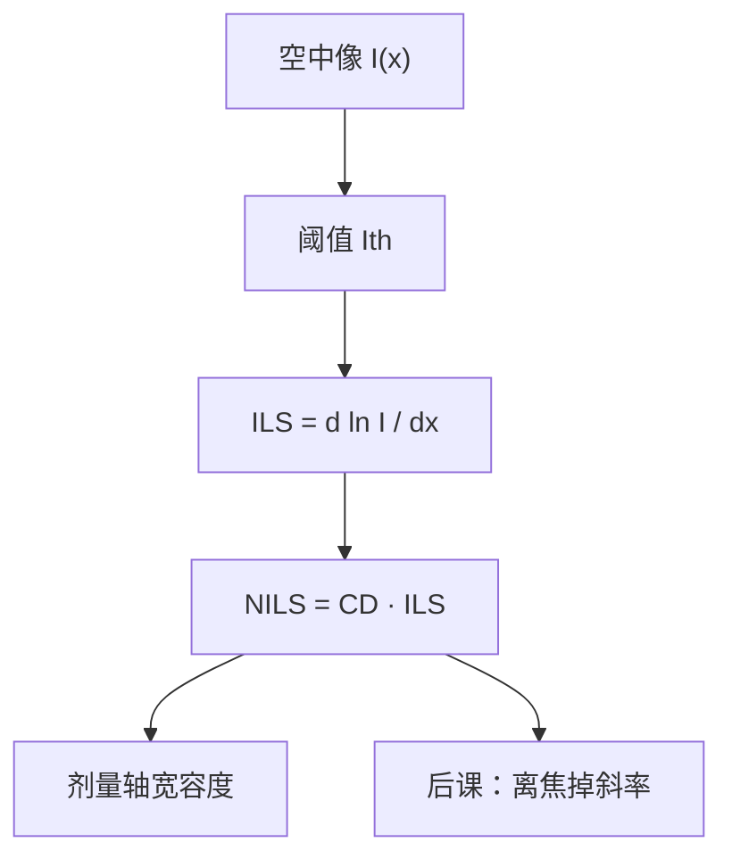

# NILS 与 ILS

对比度只问亮暗差了多少；阈值处的对数斜率才问：剂量一漂，边会横着走多远。

<footer>—— 据 Mack, Fundamental Principles of Optical Lithography 对 ILS / NILS 的定义整理</footer>

[上一课](/litho/aerial-image-contrast)把 TCC 的输出命名为空中像 $I(x,y)$，并用线栅对比度 $C=(I_\mathrm{max}-I_\mathrm{min})/(I_\mathrm{max}+I_\mathrm{min})$ 读调制深浅。缺口是：孤立线、孔、二维拐角没有一对全局的 $I_\mathrm{max}/I_\mathrm{min}$，工艺真正怕的是**阈值等高线**对剂量的灵敏度。本课把影像对数斜率（ILS）与归一化影像对数斜率（NILS）钉在阈值处。焦深如何沿轴毁掉这条斜率，留给[焦深](/litho/depth-of-focus)。不要从瑞利 CD 起笔：这里还没有 $k_1$，只有空中像的局部导数。

## 问题

对比度 $C$ 对密栅好用，对「一条边」不够。阈值模型里，边的位置满足 $I(x)=I_\mathrm{th}$。剂量一变，$I$ 整体升降（相对阈值移动），边沿 $x$ 方向逃走的多少，取决于该点有多陡。缺口因此是在阈值处定义斜率，而不是再报一次 $C$。

上一课已经写出 NILS 的式子，当作对比度的同伴。本课要补的差是：ILS 与 NILS 不是两个名字叫同一件事，以及为什么必须取对数、必须乘上目标 CD。

### 先 ILS，再乘宽度

影像对数斜率

$$
\mathrm{ILS}=\frac{d\ln I}{dx}\Big|_{\mathrm{th}}=\frac{1}{I}\frac{dI}{dx}\Big|_{\mathrm{th}}.
$$

除以 $I$ 之后，整体乘一个剂量因子不改变 ILS——这正是「相对剂量误差」的自然变量。未归一的 $dI/dx$ 随绝对强度标尺变，换模拟器单位就会改数。NILS 把 ILS 乘到目标线宽上：

$$
\mathrm{NILS}=\mathrm{CD}\cdot\mathrm{ILS}.
$$

不同 CD 的边可以比较：同样的相对剂量误差，NILS 大则相对 CD 误差小。

阈值必须声明：正胶常用「清掉区域的强度下限」所对应的那条等高线。换 $I_\mathrm{th}$ 等于换读斜率的位置，NILS 会变。不要和胶的 $\gamma$ 混名。

## 方法

在最佳焦距取垂直于边的剖线，找到 $I=I_\mathrm{th}$ 的点，算 $d\ln I/dx$，再乘目标 CD。密栅两条边都要看；不对称照明或像差下两边 NILS 可以不同。孔类取径向最差点。Mack 把 NILS 当空中像与工艺窗口之间的桥梁：还没有完整胶模型时，先问 NILS 够不够撑住剂量轴。

对比度 $C$ 与 NILS 相关但不可互换。余弦型两束成像，$C$ 高通常 ILS 也高；三束加上零级偏置，$I_\mathrm{min}$ 抬高，$C$ 掉，阈值若落在缓坡上，NILS 掉得更厉害。只报 $C=70\%$ 而不报阈值处斜率，会漏掉「切在哪」。

### 剂量灵敏度的读法

相对剂量变化 $\Delta E/E$ 使相对阈值反向移动。两边对称时，相对 CD 误差与 $\Delta E/E$ 之比反比于 NILS（系数 2 来自两条边，教科书按是否用半宽会略有出入）。因此曝光宽容度与 NILS 同向变化——定量窗口是后课 E–D 的题目，本课只把光学预言钉在斜率上。

模拟器里的 ILS 有时被写成 $dI/dx$ 而不取对数。对表必须看定义。Mack 的产线用语里，ILS 是对数斜率，NILS 是其无量纲化。

## 机制

空中像在边附近近似一段斜坡。绝对坡度 $dI/dx$ 决定「强度涨一点，边走多远」；除以当地 $I$，改成对数，对应剂量乘法。乘 CD 之后，问的是相对尺寸而不是纳米每焦耳——产线规格通常是目标 CD 的百分比。

低调制（零级偏置大、一级刚进瞳）让斜坡变缓，NILS 先死，剂量一漂就并线或断线。这与上一课「$C$ 掉则切不出线」是同一机制的边缘版本，对孤立线和二维图形更诚实。

### 后课默认的接口

说到空中像好不好印，密栅可报 $C$，边与窗口预言报 NILS。离焦课把 $\mathrm{NILS}(z)$ 画成峰；胶课再把光学 NILS 与扩散核相乘。不要在焦深公式里把 $k_2$ 和 NILS 混成一个符号。

## 边界

NILS 是光学（加指定平面约定）的量，不含酸扩散、不含 SEM 偏置。阈值模型只是接口；真显影曲线会让「有效切点」偏离 $I_\mathrm{th}$，预言与硅片差一截。也不存在对所有层通用的「NILS>2 即可量产」：规格带、图形类别、计量噪声都会改门槛。本课不引用未公开的机台验收 NILS 表。

矢量成像改的是 $I$ 本身，ILS/NILS 的定义不变。

## 小结

- ILS 是阈值处 $d\ln I/dx$；NILS 再乘目标 CD，便于跨尺寸比较。
- 对比度 $C$ 读调制；NILS 读边对剂量的灵敏度。
- 相对 CD 误差随相对剂量误差涨、随 NILS 降。
- 必须声明阈值位置；ILS 不要和 $dI/dx$ 混用。
- 离焦如何毁掉 NILS，下一课。
- 出处：Mack, *Fundamental Principles of Optical Lithography*。
