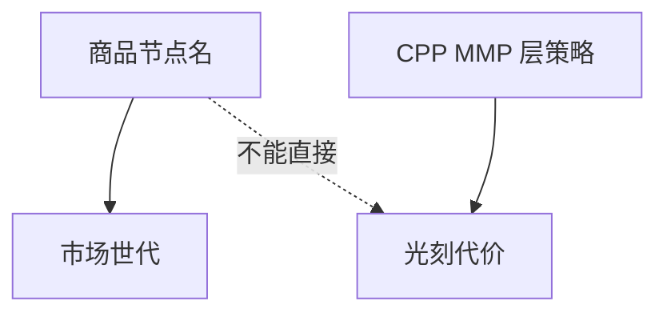

# 节点命名与实际尺寸

商品名「7 nm」「18A」不是栅长，也不是金属半节距；比较工艺要用 CPP、MMP 和密度，而不是广告数字。

<footer>—— 对照代工节点命名与实际几何脱节的公开讨论（ISSCC / WikiChip 一类对照传统）</footer>

[上一课](/litho/failure-analysis-tem-fib)把图形化失效收到 FIB/TEM 剖面，「集成、控制与良率」在那里封口。本课起「路线图、经济与替代」：良率账已经能对到几何，缺口变成节点名是不是物理量。真正该比的格子，留给[下一课](/litho/cpp-mmp)。

## 问题

历史上节点名曾近乎栅长。多重图形与 FinFET 之后，名字变成密度与市场世代的标签：不同厂的「7 nm」鳍节距、金属节距、是否 EUV，都可以不同。光刻代价必须按层类型计，不能按商品名计。[DUV 多重代价](/litho/duv-multipattern-cost) 已警告过这一点；本课把它收成路线图语言。

缺口是**名字不是物理量**，不是再分析一次 TEM。把「我们进了 3 nm」写成 NA 或波长变了，常常只是库与分解变了。

### 本课不重推瑞利

分辨率仍由 $λ$、NA、$k_1$ 与分解决定。节点名不出现在这些符号里。后课 CPP/MMP 才是可写入公式的量。

比较两家「同名节点」而不列 CPP/MMP/EUV 层数，是市场比较，不是光刻比较。

## 方法

阅读路线图与新闻时：把节点名翻译成（公开的）节距、层数、曝光策略。内部 DTCO 用节距，不用名字。IRDS 后课用物理路线，也仍会提到行业世代名——要能翻译。

## 机制

命名脱节的原因是：密度可由助推器、轨道高度、EUV 减层共同提高，不必按比例缩所有节距。名字跟世代走，节距跟可印集合走，两条轴。

## 边界

不编造某厂未公开的节距。不贬低工程，只钉语言。本课不列完整对照表（会过时）。

后课默认：讨论尺寸用 CPP/MMP；下一课定义这两根尺子。

## 小结

- 节点名是世代标签，不是栅长或半节距。
- 光刻比较必须落到节距与层策略。
- 密度可由架构助推，不必与名字成比例。
- 出处：IEEE IRDS Lithography（节点名 ≠ 最小半节距）；Moore, *Electronics* 38(8) (1965)；代工命名与几何脱节的公开对照。
