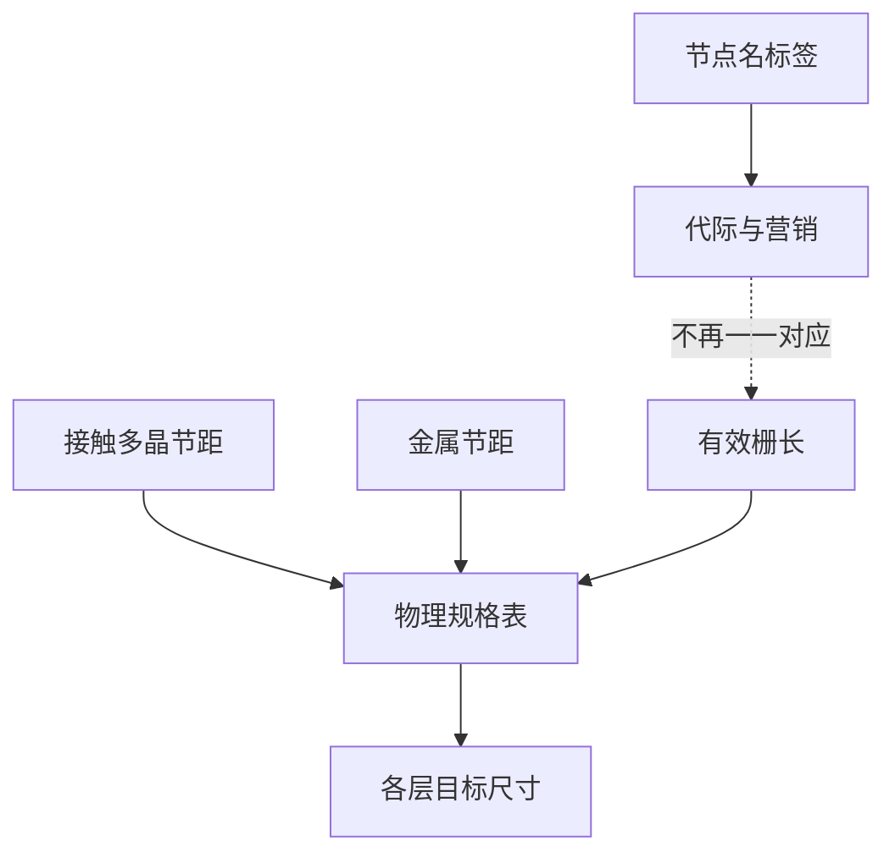

# 节点名不再等于栅长

工艺节点标签曾是栅长名义值；后来数字与物理栅长、甚至与最小图形尺寸脱钩，变成代际与路线图的综合标签。

<footer>—— 据 Mack, Fundamental Principles of Optical Lithography 对临界尺寸与节点语言的区分整理</footer>

[上一课](/litho/interconnect-halfpitch)把互连半节距与金属层引进规格。缺口是：为何口头上的「3 nm 节点」栅长不是 3 nm？读路线图与各层目标尺寸时，若把节点名当物理栅长，会系统性误判要画多细。名字是序号，表格才是尺子。

## 问题

[MOSFET 与栅长](/litho/mosfet-gate-length) 曾经就是节点核心：名字里的纳米数，大约就是要印的栅。鳍式器件之后，有效沟道长度与栅图形的关系更绕；名字仍按大约 0.7 倍一代代往下叫，但数字不再对应某一单层的物理尺寸。缺口是命名史与物理量的分离，不是再定义一次半节距。名字是序号，表格才是尺子，不能把代际标签代入某一层 CD。

### 节点名不是光刻目标的输入

光刻工程师看的是各层目标临界尺寸、节距、套刻预算，写在设计规则里。把「7 nm」代入某一公式当 $\mathrm{CD}$，会得到与产线无关的数。节点名可以当谈话标签；计算与验收必须换成具体层的 $W$、$p$ 与套刻。

平面时代「28 nm 节点」的多晶硅临界尺寸仍在三十纳米量级。鳍式时代「5 nm 节点」的接触多晶节距与金属节距是另一组更大的数。具体数字随厂家设计规则而变，本课只钉「不要 1:1 换算」。

## 方法

节点名 ≈ 代际标签：综合接触多晶节距、金属节距、SRAM 单元面积、性能与功耗档。物理规格是一张表，不是一个数。三者必须分开：营销节点、有效栅长、最小金属宽度。查表，不要猜。

历史上名字跟着栅长走，是因为那一代最小图形差不多就是栅。互连层数变多、多重图形化出现之后，最小节距可能在金属而不在栅；鳍式器件的「栅长」甚至不再是平面上那条多晶硅的宽度。名字若仍按 0.7 倍往下叫，就只能当序号。路线图表格（各层 $p$、$W$、套刻）才是图形化输入。

图形化动机在脱钩之后仍然清楚：要缩小的是表上那些节距与孔，不是名字里的整数。名字继续缩小，是为了标记「下一代」；光刻是否跟得上，看的是表，不是名字。

ITRS/IRDS 一类路线图表格按层给出 pitch 与 overlay，从不把节点名当作可代入公式的 CD。Mack 讨论临界尺寸时对象也是具体层，不是代际绰号。

## 机制

脱钩之后，对外只报下一代节点，对内按层分配图形化难度。有的层先碰到单次曝光极限，有的层仍宽松。这解释了为何不能从节点名反推「这一代所有层都一样细」。下一课 [接触孔、通孔与线](/litho/contact-via-line) 会说明孔层与线层甚至不在同一张难度表上。

同一代标签下，不同产品线的金属节距与单元面积也可以不同。逻辑、SRAM、模拟 IP 并不共享一张「节点 = 某纳米」的表。Foundry 对外一个名字，对内多套设计规则：这正是脱钩的日常形态。读新闻时把两家「同名节点」的栅长拿来比，会比错对象。

本课不把成像公式请回来填这个名。光学前置已经结束；成像主线在本课程末才从光程重开。这里只防止用错尺子：要印多细，问该层节距；名字只负责说「这是第几代谈话」。

## 边界

本课不引用某一家代工厂的具体设计规则数值。不写某代技术何时导入新波长。鳍片、环栅的器件截面属于器件附录，本课只要「名字 ≠ $L$」。

SRAM 单元面积常被拿来「证明」节点进步，它是接触、栅、金属多层图形的乘积，更不能还原成单一栅长。名字继续叫小，表格里三项可以一项先动、两项后动。后课默认：节点名是标签；光刻目标来自各层节距与临界尺寸。下一课补竖直方向的孔与线的差别。

## 小结

- 节点名不再等于物理栅长，也不等于最小线宽。
- 光刻看各层 CD、节距与套刻，查规则手册而不是看名字。
- 脱钩后「下一代」仍要缩小表上的节距，只是尺子换成了表。
- 不要把节点数字代入成像公式当临界尺寸。
- SRAM 面积与金属节距是表上的独立项，不能还原成单一 $L$；同名节点也不可直接比栅长。
- 出处：Mack, *Fundamental Principles of Optical Lithography*；Sze &amp; Ng, *Physics of Semiconductor Devices*。
