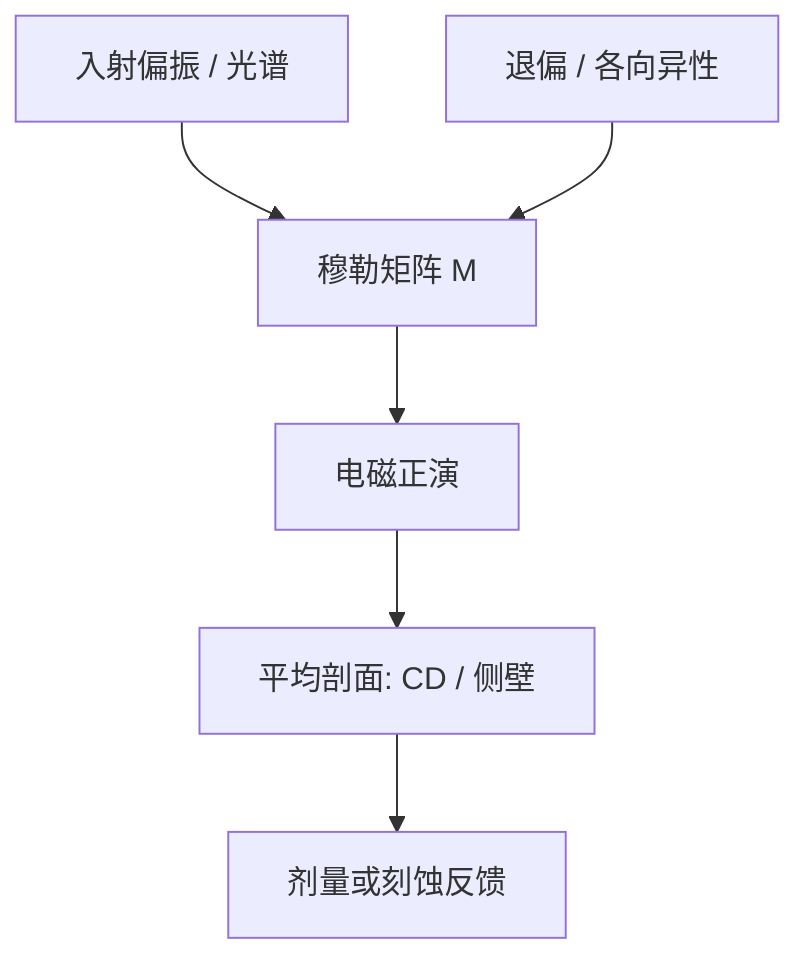

# OCD 与穆勒矩阵

常规散射测量读的是强度或椭偏谱；穆勒矩阵把偏振变换全记下来，剖面的各向异性和退偏才进模型，而不是被平均进一个标量 CD。

<footer>—— 据光学计量通称与 KLA 对散射测量 / 椭偏 OCD 的公开原理整理</footer>

[上一课](/litho/cd-sem-shrink)（SEM 收缩与充电）。把 CD 分成 SEM 局部与 OCD 平均剖面，并停在「光谱拟合堆栈」。缺口是偏振：周期光栅对入射偏振的响应不是一张反射率曲线能写完的，侧壁、沟槽底部圆角、线边缘粗糙都会把偏振态搅乱。本课把 OCD 扩到穆勒矩阵。位置差怎么读，仍留给[套刻标记](/litho/overlay-marks)，不要在这里把叠栅位移当成剖面参数。

## 问题

标量或常规椭偏 OCD 用少量偏振通道拟合 CD、侧壁角、膜厚。多解常见：CD 变胖与侧壁变陡可以走同一条谱。二维逻辑、高深宽比沟槽、金属栅的各向异性更重，强度谱的简并变本加厉。缺口是增加独立观测量，而不是再买一台 SEM 去「校准一次永远准」。

穆勒矩阵 $M$ 把入射斯托克斯矢量映到出射：$S_\mathrm{out}=M S_\mathrm{in}$。$4\times 4$ 的元素编码二向色、双折射和退偏。光栅的三维剖面正是这些元素的函数。KLA 一类工具的公开原理仍是光谱散射 + 电磁正演 + 回归；穆勒是通道变多，不是换了一种与 OCD 无关的物理。

### 退偏不是噪声地板

线边缘粗糙、底层晶粒、光照光斑内的剖面涨落会让出射光部分退偏。常规椭偏若把退偏当模型误差，会把粗糙「拟合」进 CD。穆勒矩阵的退偏块把这部分分开——仍是光斑平均，但不再偷偷改宽度。它替代不了 SEM 看单根线，只是不让平均粗糙污染平均 CD。

穆勒 OCD 仍然看不见随机缺孔。光斑是微米到几十微米，泊松尾部在 SEM 审查里。偏振通道再多，统计量还是平均值。

## 方法

硬件：极化调制的宽谱入射，测全穆勒或其中对剖面敏感的子集，相对晶圆沟槽取向旋转平面。模型：严格电磁（RCWA 一类）生成库或在线求解，参数含 CD、侧壁、圆角、膜厚、可选各向异性。与 SEM 做相关得到偏置；工艺漂了重做，和上一课完全一样。

通道多，过拟合也多。参数必须用设计与工艺先验钉住：随意放开底部 CD 与顶 CD 和膜厚，穆勒也会给一套「很美」的假剖面。库要按叠层分，换 BARC / EUV 底层等于换库。光照方位相对栅取向至少要声明；旋转 90° 等于换一套各向异性，不能把水平和垂直金属垫混进同一个回归。

### 进控制环的仍然是平均量

APC 要的是稳定、可重复的平均 CD 或侧壁，用穆勒是为了让这个平均数少被简并绑架。场内 CDU 指纹仍靠垫的空间采样，穆勒不自动给出整场图。形貌（侧壁角）比强度 OCD 更信一点，仍要声明模型。

换照明或换节距等于换衍射级权重，库要按产品层分，不能一张「通用金属库」打天下。

## 机制

周期结构的衍射级携带偏振相关相位。梯形侧壁让有效光程沿深度变，表现为椭偏角随波长转动；底部未刻尽或底脚则改零级与高阶的能量比。穆勒非对角元对「左右侧壁不对称」敏感——这正是刻蚀风和套刻标记不对称的亲戚，但本课拟合的是 CD 剖面，不是层间位移。把不对称全写进 overlay，会把 OCD 能看见的刻蚀风漏掉。

材料色散误差仍然是一阶：金属在紫外的光学常数不准，穆勒元素集体偏，回归把债推给 CD。光学常数表过期时，看起来像 EL 变了，其实是库废了。上一课已经警告过，偏振通道不能豁免。

不要把 scatterometry 理解成显微镜看线宽，也不要把穆勒理解成「更贵的显微镜」。它是远场衍射反问题，对节距和材料色散敏感。

## 边界

本课不讲某型号的通道数或未公开的库算法，也不把穆勒写成可以替代套刻或缺陷检测。非周期热点、SRAM 二维拐角，周期假设失败，还是 SEM。掩模上的 OCD 是另一条链。

后课默认：说到 OCD，可以是强度/椭偏，也可以是穆勒扩展；简并要用偏振信息减，不能靠把 SEM 相关做一次就宣布物理相等。位置计量从标记课重新起笔。

报 OCD CD 必须写：穆勒还是常规椭偏、库版本、叠层、与 SEM 的偏置日期。通道升级而库未升级，等于换尺子不换刻度。

## 小结

- 穆勒矩阵把 OCD 从少数偏振通道扩成完整偏振变换。
- 目的是减轻 CD–侧壁简并、分开退偏，不是看见单根 LER。
- 仍是光斑平均；缺孔与热点仍归 SEM。
- 换底层或色散表必须重建库。
- 出处：光学散射计量通称；KLA 对 OCD / 光谱椭偏的公开原理。
