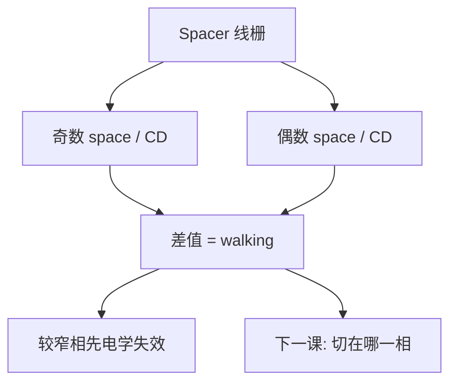

# 奇偶节距

侧墙劈开之后，相邻两个间隔不是同一个随机变量：奇数位与偶数位要分开报，电学才能看见周期被「走」了没有。

<footer>—— 据 SADP 计量对 odd–even pitch / odd–even space 的通称整理</footer>

[上一课](/litho/pitch-walking)把芯轴侧与间隙侧不等写成节距漂移。缺口是把「两种间隔」收成计量与电学都认的奇偶节距语言，而不是再推一遍 $W_m$ 与 $t$。切断掩模留给[下一课](/litho/cut-mask-dpt）。

## 问题

Pitch walking 给出机制：mandrel CD、薄膜、回刻脚型让 core space 与 gap space 分裂。产线签核时要的是可重复的指标：沿栅交替的奇数间隔与偶数间隔（odd/even space），或由它们构成的奇偶节距。只报平均 pitch、平均 CD，交替误差被平均掉——上一课已经警告过。本课把那条警告写成必须分相位抽样的计量。

LELE 的 overlay 也会造成一宽一窄，但相位跟套刻指纹走；SADP 的奇偶跟芯轴网格走，空间上锁在 mandrel 周期上。两种图要能分开，切线课才不会把切偏和 walking 混成一个 CDU。

### 奇偶是相位，不是另一种设计规则

设计上目标 space 往往画成同一个数。奇偶是制造后的两个总体。电学上，鳍宽、金属 RC、击穿，会对较窄的那一相先失效。平均合格、一相出界，阵列仍是坏的。

CD-SEM 若总在同一种 space 上落测量框（例如总对准到某标记相位），会系统盲掉另一相。食谱必须显式标 odd/even，或报 walking 差。

## 方法

计量：沿密集栅连续量相邻 space，分成奇偶两列，报均值、方差、以及差值（walking）。AEI 与 ADI 都要，因为回刻和硬掩模转移会改两相的差。OCD 光斑若盖住多个周期，得到的是平均剖面，奇偶简并可藏进「平均 CD」——应用 AFM 或 SEM 拆相，或用对奇偶敏感的模型（上一课穆勒若当平均器，这里要小心）。

电学：梳状电阻、电容对、击穿，按奇偶位分开。DTCO 有时故意把较关键的器件放在更稳的那一相，这是设计对计量的承认，不是光学 RET。

### 与 CDU 分行

CDU 常报线宽。奇偶节距报的是间隔。线宽两相也可以分裂（spacer 厚度两侧略不同），应另列 odd/even CD，不要与 space 混在一个 $3\sigma$ 里。

## 机制

理想 SADP：core space 由 mandrel CD 减掉两倍脚型一类几何决定，gap space 由 mandrel 节距减去 mandrel CD 再减薄膜项决定。两个表达式对 $W_m$ 的导数符号相反——mandrel 偏胖，一相变窄、一相变宽，平均值可以几乎不动。这就是「平均节距合格仍 walking」。薄膜 $t$ 的全局偏主要改线宽，对奇偶差的影响路径不同，要靠分项实验拆。

相位在晶圆上锁死于芯轴栅。扫描机 overlay 改的是整栅相对前层的位置，不交换奇偶标签；切层套刻则会让切缝滑向某一相的线，下一课的欠切/过切会对奇偶线有不同致命度——若 walking 已让两相线宽不同。

SAQP 有更多相（四种间隔），「奇偶」是双重时的语言。四重要把四类 space 分列，不要只用奇数/偶数两个桶硬套。

## 边界

不编允许的纳米 walking 规格。不把 LELE 的 odd-even 与 SADP 的 odd-even 合成一个 APC 旋钮：一个拧套刻，一个拧 mandrel CD 与薄膜。下一课切断掩模的对准对象是这套已经带相位的线栅。

平均 pitch 仍要报：它约束密度与设计网格。奇偶是额外的两列，不是替代。切断课会把切缝对准其中一相：walking 大时，同一 overlay 规格在窄相上先欠切或先碰邻线，所以本课的分相表是下一课的输入，不是可选附录。

## 小结

- 奇偶节距/间隔是 SADP 计量必须分列的两相，平均会掩盖 walking。
- 抽样相位不能总落在同一 space 上；OCD 平均可能看不见分裂。
- 电学先打较窄相；线宽奇偶与 space 奇偶要分行。
- SAQP 相数更多，不要只用两个桶。
- 切层对准的是带相位的栅，下一课。
- 平均 pitch 仍要报；奇偶是额外两列，不是替代。
- 出处：SADP 计量对 odd–even space 与 pitch walking 的通称。
